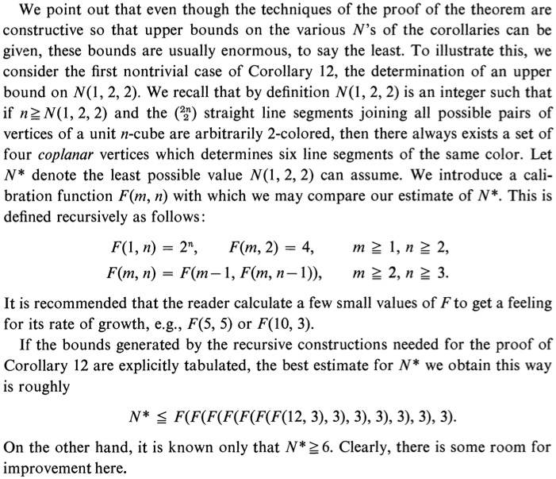
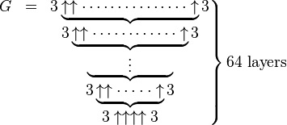
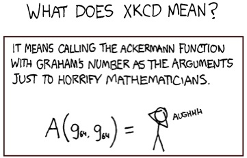
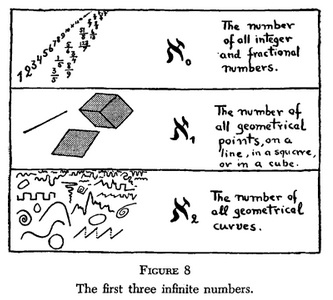

<a id="large-numbers"></a>

# Large Numbers

Author: Robert P. Munafo

Fetched (UTC): 2026-04-29T20:05:17Z

Source pages:
- [https://www.mrob.com/pub/math/largenum.html](https://www.mrob.com/pub/math/largenum.html)
- [https://www.mrob.com/pub/math/largenum-2.html](https://www.mrob.com/pub/math/largenum-2.html)
- [https://www.mrob.com/pub/math/largenum-3.html](https://www.mrob.com/pub/math/largenum-3.html)
- [https://www.mrob.com/pub/math/largenum-4.html](https://www.mrob.com/pub/math/largenum-4.html)
- [https://www.mrob.com/pub/math/largenum-5.html](https://www.mrob.com/pub/math/largenum-5.html)
- [https://www.mrob.com/pub/math/largenum-6.html](https://www.mrob.com/pub/math/largenum-6.html)
- [https://www.mrob.com/pub/math/largenum-7.html](https://www.mrob.com/pub/math/largenum-7.html)
- [https://www.mrob.com/pub/math/largenum-8.html](https://www.mrob.com/pub/math/largenum-8.html)
- [https://www.mrob.com/pub/math/largenum-9.html](https://www.mrob.com/pub/math/largenum-9.html)
- [https://www.mrob.com/pub/math/largenum-10.html](https://www.mrob.com/pub/math/largenum-10.html)
- [https://www.mrob.com/pub/math/largenum-11.html](https://www.mrob.com/pub/math/largenum-11.html)

License note: the source pages identify the work as copyright 1996-2025 Robert P. Munafo and licensed under the Creative Commons Attribution-NonCommercial 4.0 International License.

Mirrored images: `Large-Numbers-assets`

---

<!-- Source page: https://www.mrob.com/pub/math/largenum.html -->

*The earlier parts of this article are very well summarised*

*by Adam Townsend in the wonderful article in UCL's*

*[chalkdust magazine](http://chalkdustmagazine.com/blog/names-large-numbers/)*

This page begins with million, billion, etc., proceeds through Googolplex and Skewes' numbers (organised into "classes" based on the height of the power-tower involved), then moves on through "tetration", the Moser and the ["Graham-Rothschild number"](#graham), on to lesser-known hierarchies of recursive functions, the theory of computation, transfinite numbers and infinities. If it's a number and it's large, it's probably here.

## Contents

[Author's Introduction](#intro)

[Class 0 Numbers *(like 3)*](#classes)

[Class 1 Numbers](#class1) *(like 100)*

[Class 2 Numbers *(like **googol**)*](#class2)

[The *-illion* Names](#chuquet)

[Conway-Wechsler Extension](#conway-wechsler)

[Knuth -yllion System](#yllion)

[Class 3 Numbers](#class3) *(like **googolplex**)*

[Class 4 Numbers](#class4)

[Skewes' Number](#skewes)

[Higher Classes](#class5)

[The Quality of *Uncomputably Larger*](#uncomparable)

[Power Towers](#powertower)

[Inventing New Operators and Functions](#invention)

[Function Hierarchies](#func_hierarchies)

[Why Function Hierarchies Require a Transfinite Ordinal Index](#fh_need_ordinals)

[Why There are Competing Function Hierarchies](#fh_non_definitive)

[Beyond Exponents: *hyper4* (Tetration)](#hyper4)

[Extension to reals](#real_extension)

[A "logarithm" for *hyper4*](#hyperlogarithm)

[Hyperfactorial and Superfactorial](#hyperfact)

[Higher *hyper* Operators](#hyper5)

The "[Generalised Hyper](#hyper_gen)" Function

[Bowers' Array Notation (3-element Subset)](#bowers_array)

[Knuth's Up-arrow Notation](#knuth_arrow)

[A Partial Ordering for Knuth Up-Arrows](#knup_po)

[A Partial Ordering for the Hyper Function](#hyper_po)

[Composed Up-Arrow Notation](#composed_arrows)

[Steinhaus-Moser-Ackermann Notation/Functions](#sm_not)

[Ackermann's Function](#ackermann)

[The Mega and the Moser](#mega_moser)

[The Fast Growing Hierarchy](#fgh_finite)

[Goodstein Sequences](#goodstein)

**The various "Graham's number"s** :

[The "Graham-Rothschild Number"](#graham)

[The "Graham-Gardner Number"](#graham_gardner)

[The "Graham-Conway Number"](#graham_conway)

[Goodstein Sequences (strong)](#goods_strong)

[Friedman Block Subsequence Length](#friedman)

[Superclasses](#superclass)

[Conway's Chained Arrow Notation](#conway)

[A Partial Ordering](#cwch_po) for short Conway chains

**More Bowers Constructions** :

[Bowers' Extended Operators](#bowers_ext)

[Bowers' Array Notation (4-element Subset)](#bowers_4elem)

[Bowers Arrays with 5 or More Elements](#bowers_5elem)

[Generalised Invention of Recursive Functions](#generalised_invention)

[Formal Grammars](#grammars)

[TREE{3}](#kruskal_tree_function)

[Friedman's SSCG()](#friedman_sscg)

[The Lin-Rado/Goucher/Rayo/Wojowu Method](#bb_schema)

[Lin-Rado Busy Beaver Function](#beaver)

[Beyond BB Function](#beyond)

[Oracle Turing Machines](#oracle)

[Declarative Computation and Combinatory Logic](#comb_logic)

[Adam Goucher's Ξ(*n*)](#goucher)

[Computation by Formal Logic and Set Theory](#set_theory)

[Peano Arithmetic](#peano)

[The von Neumann Construction](#vn_const)

[Forming Predicates](#predicates)

[Not So Fast!](#not_so_fast)

[Rayo's Calculus](#rayo_calc)

[Formulas](#rayo_formulas)

[Direct Declaration of the Existence of a Number](#direct_st_num_exist)

[Doing Maths in First-Order-Logic and Set Theory](#folst_maths)

[Truth and Uniqueness](#truth_uniq)

[Rayo's Number](#rayo)

[Variable Assignments](#var_assign)

[Gödel-Coding](#rayo_goedel)

[Rayo-nameability](#rayo_nameable)

[Rayo's Number](#rayo_num)

[BIG FOOT](#big_foot)

[The Frontier](#frontier)

[Transfinite and Infinite Numbers](#infinite)

[Ordinal Infinities](#omega)

[The First Cardinal Infinity: Aleph-Null](#aleph0)

[The Ordinal "Countable" Infinities](#countable)

[Epsilon-Null](#epsilon_null)

[All Ordinals Countable by Reordering](#omega_limit)

[Aleph-One](#aleph1)

[The Continuum](#continuum)

[The Continuum Hypothesis](#CH)

[The Power Sets of the Continuum](#contin_powersets)

[Inaccessible Infinities](#inaccessible)

[Footnotes](#footnotes)

[Bibliography and other References](#biblio)

[Other Links](#links)

---

<a id="intro"></a>

## Author's Introduction

Large numbers have interested me [almost all my life](https://www.mrob.com/pub/math/ln-notes1.html#personal).

This page covers all the huge numbers I have seen discussed in books and web pages, and it actually does so in numerical order, as near as I can tell (see the [uncomparable](#uncomparable) and [superclass 5](#superclass_5) discussions).

One important thing to notice is that all discussions like this ultimately lead to difficult and unsolved problems in the [theory of algorithms and computation](#beyond). This page ends with [Turing machines](#beaver) just before crossing over to the [transfinite](#infinite) numbers. If you want to learn something about the theory of algorithms and computation, get two or more fairly knowledgeable people to compete at describing the highest number they can, and then *stand back!*. One such competition (detailed [in a footnote](#fn_25)) took only a few days to move beyond the range of everything discussed in the first two-thirds of this webpage, and then spent another few *years* discussing formal proofs.

To counteract the forces of [Munafo's Laws of Mathematics](https://www.mrob.com/pub/math/munafos_laws.html), this page tries to explain most everything with minimal reliance on earlier sources. If you see room for improvement, let me know!

<a id="classes"></a>

<a id="classes_word"></a>

## Classes

First of all, I'm going to define what I call "classes" of numbers. I use the word in a particular way, related specifically to large numbers and based on similar concepts used by others. In particular, I was strongly influenced by the "levels of perceptual realities" in Douglas Hofstadter's article *On Number Numbness* [\[44\]](#fn_hofstadter1982), [\[46\]](#fn_hofstadter1985). To delineate boundaries between adjacent classes I have chosen the arbitrary breakpoints 6 (and its consecutive "*plexes*" 10<sup>6</sup>, 10<sup>10<sup>6</sup></sup>, etc.); this choice of 6 is partly based on well-researched results regarding how perception and cognition regarding numbers and quantities. Quoting Hofstadter[\[44\]](#fn_hofstadter1982):

> *[...]If [the] numbers [have] millions or billions of digits, the numerals themselves (the colossal strings of digits) would cease to be visualizable, and your perceptual reality would be forced to take another leap upward in abstraction — to the number that counts the digits in the number that counts the digits in the number that counts the objects concerned.[...]*

It is a powerful and basic concept but usually goes unsaid. I think you'll agree that something like this makes sense (though perhaps you might choose different and equally arbitrary point to separate that which is [subitisable](https://en.wiktionary.org/wiki/subitize) from the merely [quotidian](https://en.wiktionary.org/wiki/quotidian)). In addition to these distinctions that relate to perception and cognition, the categories correspond to computational abilities, such as whether it is possible for your computer to store enough digits to resolve the effect of adding 1, whether it is possible to resolve the effect of multiplying by 2, and so on. Almost all numbers that are easy to make simple statements about (such as which of two numbers is [larger](#uncomparable)) can be put into the class system.

All numbers that anyone ever has to deal with in any practical application `(`unless you count abstract mathematics and nerdy one-upmanship contests as practical `:-)` are members of one of the first four classes. Two, a hundred, [googol](https://www.mrob.com/pub/num/n-e100_1-googol-googolplex.html#googol), and [googolplex](https://www.mrob.com/pub/num/n-e100_1-googol-googolplex.html#googolplex) are examples from classes 0 through 3, respectively.

<a id="class0"></a>

## Class-0 Numbers

<a id="subitise"></a>(the concept of **subitising**)

Class-0 numbers are those that are small enough to have an immediate intuitive or perceptual impact. Perceiving such a number is called [*subitising*](https://en.wiktionary.org/wiki/subitize), and for most purposes the limit has been shown to be somewhere from 5 to 9 (see Jevons[\[28\]](#fn_jevons1871), Kaufman[\[34\]](#fn_kaufman1949), and Miller [\[36\]](#fn_miller1956)). I'll be a bit conservative here and place the limit at six. So, the numbers 1 through 6 are class 0.

Experiments with animals, when properly set up and conducted, demonstrate an ability to identify numbers of objects and exhibit different behavior based on whether the number of objects is equal to some specific value — for example, pressing a lever only when five objects are present. Such experiments also show that the animal's ability to perform the feat falls off sharply between 4 and 8: the task can almost always be performed reliably when the number is 4, and can seldom be performed reliably when the number is 8 (with intermediate results in-between).

In the days of anthropological research by scientists from Europe who were encountering other cultures for the first time, it was believed in some cases that a group of people had words for a few of the smaller numbers (say, up to three) but not beyond that. Due to a misunderstanding of the difference between having a word for a number and being able to perceive and understand precise quantities, this led to some myths that the people in such cultures couldn't count any higher than three or some other small number. Such a belief or myth reflects an awareness of the need for some additional abstraction or understanding to deal with an amount greater than what is subitizable.

One way to see this phenomenon for yourself is to use flash cards (or a computer program set up to simulate flash cards) that present pictures of objects that can be counted and placed in random arrangements — but look at the picture only long enough to see it, and not long enough to do any type of counting. It is not allowed to use regular arrangements like grids, or any other distinguishing attributes such as multiple colours or shapes. After the picture is hidden, try to answer how many objects there were. You then try to count the number of objects in your mental image of the picture you've just seen. If the number of objects is a class 0 number, you'll usually be able to give the right answer. As you increase the numbers of objects, your counts will be less and less likely to be correct. Obviously, this gives a rather fuzzy definition of "class 0", but the value you get will almost always be consistent with Miller's result of "seven plus or minus two". [\[36\]](#fn_miller1956)

<a id="class1"></a>

## Class-1 Numbers

Class-1 numbers are those that are small enough to be perceived as a bunch of objects seen directly by the human eye. What I mean by "seen directly" is that it is possible to see the number as a set of separate, distinct objects in a single scene (no time limit, but the observer and the objects cannot move). [100](https://www.mrob.com/pub/math/numbers-9.html#hundred) is a class-1 number because it is possible to see 100 objects (goats for example) in a single scene. The limit for class-1 numbers will vary depending on the use of colours, etc. and the quality of one's vision, but for black dots on white background most people would probably be able to see around a [million](https://www.mrob.com/pub/math/numbers-15.html#million), 1,000,000 or 10<sup>6</sup>. You can just barely put 1,000,000 dots on a large piece of paper and stand at a distance such that you can perceive each individual dot as a distinct dot, and at the same time be within viewing distance of the other 999,999 dots. (I have actually done this, just for fun!) As with Class-0 the definition is fuzzy, some people have better vision and could manage 10,000,000 dots or even more.

The earliest conscious communication of numbers between humans was probably limited to class-0 and very low class-1 numbers, because of simple physical methods of counting (like fingers and toes). The first written number systems consisted of tally marks and extended into the class-1 range. (Methods involving objects or symbols that each count for 5, 10 or larger values, came later, see below.)

Class-1 numbers include all of the [quotidian](https://en.wiktionary.org/wiki/quotidian) (everyday) quantities bigger than the subitizable, and because they occur so often, people can comfortably handle or perceive them due to experience and familiarity. For values in class 1, it is easy to distinguish the magnitude of the value just by looking at it. Most people have realised that, if they walk into a room with 85 people, although they can't tell it's exactly 85, they know right away it's somewhere around 75 to 100. No thought or calculation is necessary. This is an immediate perception of magnitude, and the ability extends to numbers up into the thousands and tens of thousands, with less percentage accuracy as the amounts increase. A person in a stadium with 10,000 people will have a fuzzier magnitude perception (they might guess anywhere from 3,000 to 30,000). By the time we get to numbers like 10<sup>8</sup> (the number of blades of grass in an acre) a person is probably about as likely to believe "10 million" (10<sup>7</sup>) as "a trillion" (10<sup>12</sup>) unless they take the time to do some calculations ([Fermi estimation](http://en.wikipedia.org/wiki/Fermi_problem) would be adequate).

Class-1 numbers also include most types of things that people aggregate or count with the passage of time. If you have kept count of how many times you have done something (e.g. jogging) or the number of things in a collection (e.g. stamps) it probably numbers in the class 1 range. The actual act of counting usually wears out before exceeding class 1, partly because of the difficulty of accurately remembering the digits. (Supposing you need to remember the number from one day to the next — no written or other aids, keeping count of the number of *days* you have jogged this year is much easier than keeping count of how many *steps* you have taken this year — once that number gets into 6 or 7 digits mistakes are very likely for most people).

Symbolic representations of numbers soon became common. The earlier systems were just tally-marks with lots of different symbols, like one symbol to represent 1's and another to represent 10's, etc. Roman numerals are the most-used example of this. Often, different types of physical objects (like round and flat stones) were used for counting. Many examples are described in [\[51\]](#fn_ifrah1999). With symbolic systems it became easy for people to express, write, and do arithmetic with numbers throughout the class-1 range. Such representation systems usually reached their limit right around 1,000,000 for the same reasons that class-0 perceptive abilities are limited to 6: it is difficult to keep track of lots of different types of symbols/objects at once, and 5 or 6 types of symbols/objects is a practical limit — but the limit also existed because there was little need to deal with larger numbers. As in modern times, larger units were used when smaller ones were inconvenient — one does need to worry about the last few centimetres when considering a distance of 123.4 km.

<a id="class2"></a>

## Class-2 Numbers

Class-2 numbers are those that can be represented in exact form using decimal place-value notation (or another small integer base, like base 2, 16 or 60). Typically this depends on how the digits are recorded and what you need to do with them. Since I used 6 as the upper limit of [class 0](#class0), and 10<sup>6</sup> = 1000000 for the upper limit of [class 1](#class1), I'll just continue the pattern and say that the class-2 numbers go from 10<sup>6</sup> to about 10<sup>1000000</sup>.

Place-value notation was popularised in the Arabic culture (but came from India, and perhaps from China before that, again see [\[51\]](#fn_ifrah1999)). It opened up the range of class-2 numbers to anyone who wanted to use them. It was no longer necessary to come up with new symbols for each successive power of 10. Generalizations in arithmetic rules were obvious: adding 2000+7000 was not only analogous to adding 2+7, it was essentially the same thing. Handling huge numbers became easy. To make an exact calculation about thousands of objects, only a handful of objects (the digits) need to be manipulated.

<a id="googol"></a>[Googol](https://www.mrob.com/pub/math/numbers-19.html#googol) is a class-2 number, as are the various large prime numbers used in cryptography, all of the known [Perfect numbers](https://www.mrob.com/pub/math/ln-notes1.html#perfect) (until 1997!), the [Fermat numbers](https://www.mrob.com/pub/math/ln-notes1.html#fermat) with known factorization, etc. All of the large physical constants like [6.02×10<sup>23</sup> (Avogadro's number)](https://www.mrob.com/pub/math/numbers-18.html#avogadro) and 10<sup>80</sup> (the number of protons in the universe) are class-2. So are most of the numbers with names ending in *-illion*, like [*vigintillion* (10<sup>63</sup>)](https://www.mrob.com/pub/math/numbers-19.html#vigintillion), [*centillion* (10<sup>303</sup>)](https://www.mrob.com/pub/math/numbers-20.html#centillion), and on up to the somewhat contrived [*milli-millillion* (10<sup>3000003</sup>)](https://www.mrob.com/pub/math/numbers-20.html#milli_millillion) (which, by my admittedly arbitrary [decision](#class2_limit), is a bit beyond the class-2 range).

<a id="chuquet"></a>

### The Big Number Names of Nicolas Chuquet

<a id="latin_names"></a>(number names based on **Latin**)

The word *million* comes from around 1270[<sup>2</sup>](#fn_2), and entered the English language around 1370[<sup>6</sup>](#fn_6). The names [*billion*](https://www.mrob.com/pub/math/numbers-16.html#billion), [*trillion*](https://www.mrob.com/pub/math/numbers-17.html#trillion), and so on up to *nonillion*, plus the general idea of continuing with Latin-derived prefixes all first appear in the late 15<sup>th</sup> century, in writing by [Nicolas Chuquet](http://en.wikipedia.org/wiki/Nicolas_Chuquet), a French mathematician living in [Lyon](http://en.wikipedia.org/wiki/Lyon) from 1480 until his death in 1488. (There were also the longer forms *bymillion* and *trimillion* used as early as 1475 by Jehan Adam, but these never caught on). Follow this link for more details: [Origins of the Chuquet number names](https://www.mrob.com/pub/math/ln-notes1-2.html#chuquet_origins).

### Peletier's Proposal and the Short Scale

In 1549 Jacques Peletier repeated the suggestion that *billion* should be one million million = 10<sup>12</sup>, and *trillion* for 10<sup>18</sup> and so on. He also introduced[<sup>1</sup>](#fn_1),[<sup>2</sup>](#fn_2) the use of *milliart*, *billiart* and so on to represent the skipped-over powers of 1000, like 10<sup>9</sup> and 10<sup>15</sup>.

<a id="long_vs_short"></a>The **long scale** is [Chuquet's original](https://www.mrob.com/pub/math/ln-notes1-2.html#chuquet_origins) system, and has digits grouped 6 at a time, thus *trillion* is a million times larger than *billion*. This is the "*billion*=10<sup>12</sup> system". Peletier's names for 10<sup>(6*N*+3)</sup> (in the English spelling, *milliard*=10<sup>9</sup>, *billiard*=10<sup>15</sup>, etc.) are compatible with this system.

The use of number-names during the following few centuries eventually led to widespread usage of *billion* to mean 10<sup>9</sup>, *trillion* for 10<sup>12</sup>, and similar redefinitions of the higher names. These definitions are the **short scale** or "*billion*=10<sup>9</sup> system". Follow this link for more on the [history of short vs. long scale](https://www.mrob.com/pub/math/ln-notes1-2.html#short_long_history). Here is a related video by Numberphile: [How big is a billion?](http://www.youtube.com/v/C-52AI_ojyQ?rel=0).

### Zillions: Big-Number Words as a Hyperbolic Adjective

While the confusion between short and long scale was becoming well-established, the big-number words ending in *-illion* were also becoming popular for the purpose of espressing an excessively or unimaginably large, or even infinite, quantity. This is a type of usage that was already common for *hundreds*, *thousands*, *myriads* and *millions*. For example, OED's [\[47\]](#fn_oed1991) HUNDRED heading **2 a.** begins: "*Often used indefinitely or hyperbolically for a large number: cf. <u>thousand</u>. (With various constructions, as in [heading] **I**.)*", and then gives nine quotations dating from 1300 AD to 1885. In the following table I show the first documented use of each number-name in both the literal sense and in this "superlative" sense.

(It should be noted that *zillion* more generally can refer to far larger things. For example, Howard DeLong[\[39\]](#fn_delong1970) used the term "zillion" to refer to an iterated [Ackermann](#ackermann) function of some other really large number *c*<sub>1</sub>.[\[59\]](#fn_bird2008c1)

<a id="standard_names"></a>

### Standard Accepted Names and SI Prefixes

This table shows all positive powers of ten that have authoritatively accepted names in English (by [\[47\]](#fn_oed1991)) up to [Chuquet's highest name](https://www.mrob.com/pub/math/ln-notes1-2.html#chuquet_origins) *nonillion*. The numeric values here follow the *billion*=10<sup>9</sup> system ("short scale"). I am also including a few other non-powers of 10 that have names in English, but leaving out many base-20 constructions and other names less than 100, about which you can read plenty in [\[51\]](#fn_ifrah1999). I include all former and current official [SI prefixes](https://www.mrob.com/pub/math/ln-notes1-3.html#metric) because they are quasi-"words" that have a purely numerical meaning. The dates of first literal and superlative usage are largely from OED [\[47\]](#fn_oed1991) but are augmented as indicated in the footnotes.

**The Standard Names and SI Prefixes**

<table><tr><td width="20px"></td><td><table border="1" cellspacing="0" cellpadding="2" hspace="30px">
<tr><td>
 <span class="i">N</span></td><td> <span class="i">N</span> in Latin <sup><a href="#fn_3">3</a></sup>,<sup><a href="#fn_18">18</a></sup>
      </td><td>10<sup>3<span class="i">N</span>+3</sup></td><td>name for 10<sup>3<span class="i">N</span>+3</sup>        </td><td>first<br>
literal<br>
usage <a href="#fn_oed1991">[47]</a>
                                           </td><td>first<br>
superlative<br>
usage <a href="#fn_oed1991">[47]</a>
                                  </td><td> <a href="https://www.mrob.com/pub/math/ln-notes1-3.html#metric">SI prefix(es)</a><sup><a href="#fn_20">20</a></sup>
</td></tr><tr><td>
  </td><td>       </td><td>10<sup>1</sup> </td><td><a href="https://www.mrob.com/pub/math/numbers-3.html#ten">ten</a>          </td><td>       </td><td>
                                                       </td><td> deca- or deka- (da,dk)
</td></tr><tr><td>
  </td><td>       </td><td>10<sup>2</sup> </td><td><a href="https://www.mrob.com/pub/math/numbers-9.html#hundred">hundred</a>  </td><td>950 AD </td><td> 1300      </td><td> hecto- (h)
</td></tr><tr><td>
  </td><td>       </td><td>10×12</td><td><a href="https://www.mrob.com/pub/math/numbers-9.html#lb120">great hundred</a> </td><td>1533 </td><td>
</td></tr><tr><td>
  </td><td>       </td><td>12<sup>2</sup> </td><td><a href="https://www.mrob.com/pub/math/numbers-10.html#lb144">gross</a>      </td><td>1411   </td><td>
</td></tr><tr><td>
 0</td><td>       </td><td>10<sup>3</sup> </td><td><a href="https://www.mrob.com/pub/math/numbers-12.html#thousand">thousand</a></td><td>971 AD </td><td> 1000      </td><td> kilo- (k)
</td></tr><tr><td>
  </td><td>       </td><td>2<sup>10</sup> </td><td><a href="https://www.mrob.com/pub/math/numbers-13.html#kibi">1024</a>        </td><td>       </td><td>           </td><td> kibi- (ki)
</td></tr><tr><td>
  </td><td>       </td><td>12<sup>3</sup> </td><td><a href="https://www.mrob.com/pub/math/numbers-13.html#lc1728">great gross</a></td><td>1640 </td><td>
</td></tr><tr><td>
  </td><td>       </td><td>10<sup>4</sup> </td><td><a href="https://www.mrob.com/pub/math/numbers-14.html#myriad">myriad</a>    </td><td>1555   </td><td> 1555   </td><td> <span class="i">myria- (my)</span>
</td></tr><tr><td>
 1</td><td>unus   </td><td>10<sup>6</sup> </td><td><a href="https://www.mrob.com/pub/math/numbers-15.html#million">million</a>  </td><td>1370   </td><td> 1362       </td><td> Mega- (M)
</td></tr><tr><td>
  </td><td>       </td><td>2<sup>20</sup> </td><td><a href="https://www.mrob.com/pub/math/numbers-15.html#mebi">1048576</a>     </td><td>        </td><td>          </td><td> Mebi- (Mi)
</td></tr><tr><td>
 2</td><td>duo    </td><td>10<sup>9</sup> </td><td> great million,<br>
milliard,<br>
<a href="https://www.mrob.com/pub/math/numbers-16.html#billion">billion</a>
                             </td><td>1625,<br>
1793,<br>
1690<sup><a href="#fn_21">21</a></sup> </td><td> ?,<br>
1823<sup><a href="#fn_22">22</a></sup>,<br>
?
                                                       </td><td> <span class="i">kilomega-</span>, Giga- (G)
</td></tr><tr><td>
  </td><td>       </td><td>2<sup>30</sup> </td><td>1073741824                  </td><td>        </td><td>          </td><td> Gibi- (Gi)
</td></tr><tr><td>
 3</td><td>tres   </td><td>10<sup>12</sup></td><td><a href="https://www.mrob.com/pub/math/numbers-17.html#trillion">trillion</a></td><td>1690<sup><a href="#fn_21">21</a></sup></td><td>1847<sup><a href="#fn_23">23</a></sup>
                                                       </td><td> <span class="i">megamega-</span>, Tera- (T)
</td></tr><tr><td>
  </td><td>       </td><td>2<sup>40</sup> </td><td>1099511627776               </td><td>        </td><td>          </td><td> Tebi- (Ti)
</td></tr><tr><td>
 4</td><td>quatuor</td><td>10<sup>15</sup></td><td>quadrillion                 </td><td>1674<sup><a href="#fn_21">21</a></sup></td><td>1855<sup><a href="#fn_23">23</a></sup></td><td>Peta- (P)
</td></tr><tr><td>
  </td><td>       </td><td>2<sup>50</sup> </td><td>1125899906842624            </td><td>        </td><td>          </td><td> Pebi- (Pi)
</td></tr><tr><td>
 5</td><td>quinque</td><td>10<sup>18</sup></td><td>quintillion                 </td><td>1674<sup><a href="#fn_21">21</a></sup></td><td>1855<sup><a href="#fn_23">23</a></sup></td><td> Exa- (E)
</td></tr><tr><td>
  </td><td>       </td><td>2<sup>60</sup> </td><td>1152921504606846976         </td><td>        </td><td>          </td><td> Exbi- (Ei)
</td></tr><tr><td>
<a name="sextillion">
</a> 6</td><td>sex    </td><td>10<sup>21</sup></td><td>sextillion                  </td><td>1690<sup><a href="#fn_21">21</a></sup></td><td>1855<sup><a href="#fn_23">23</a></sup>
                                                                   </td><td> Zetta- (Z)
</td></tr><tr><td>
  </td><td>       </td><td>2<sup>70</sup> </td><td>1180591620717411303424      </td><td>        </td><td>          </td><td> Zebi- (Zi)
</td></tr><tr><td>
 7</td><td>septem </td><td>10<sup>24</sup></td><td>septillion                  </td><td>1690<sup><a href="#fn_21">21</a></sup></td><td> ?      </td><td> Yotta- (Y)
</td></tr><tr><td>
  </td><td>       </td><td>2<sup>80</sup> </td><td>1208925819614629174706176   </td><td>        </td><td>          </td><td> Yobi- (Yi)
</td></tr><tr><td>
<a name="octillion">
</a> 8</td><td>octo   </td><td>10<sup>27</sup></td><td>octillion                   </td><td>1690<sup><a href="#fn_21">21</a></sup></td><td>1855<sup><a href="#fn_23">23</a></sup> </td><td> Ronna- (R)
</td></tr><tr><td>
 9</td><td>novem  </td><td>10<sup>30</sup></td><td>nonillion                   </td><td>1690<sup><a href="#fn_21">21</a></sup></td><td> ?     </td><td> Quetta- (Q)
 </td></tr></table></td></tr></table>

<a id="standard_33_63"></a>[Chuquet left it to others](https://www.mrob.com/pub/math/ln-notes1-2.html#chuquet_origins) to work out the details of extending the names beyond *nonillion*. Although there is much discrepancy between the actual number-names in Latin and the *-illion* names Chuquet listed, it was nevertheless understood that Latin number-names were to be used to extend the names as needed. Using Latin for prefixes goes smoothly as far as *vigintillion*. The following names are found in many dictionaries[<sup>19</sup>](#fn_19); *vigintillion* and *centillion* are a little more common than the others. Some popular non-dictionary sources have made reference to *millillion* and *milli-millillion* (mostly due to [Henkle/Brooks](https://www.mrob.com/pub/math/ln-notes1-2.html#henkle), and Borgmann [\[38\]](#fn_borgmann1968)).

**Larger Standard Names Beyond Chuquet's *Nonillion***

<table border="1" cellspacing="0" cellpadding="2">
<tr><td>
 <span class="i">N</span></td><td> <span class="i">N</span> in Latin <sup><a href="#fn_3">3</a></sup>,<sup><a href="#fn_18">18</a></sup></td><td>10<sup>3<span class="i">N</span>+3</sup></td><td>name for 10<sup>3<span class="i">N</span>+3</sup>
</td></tr><tr><td>
  10</td><td> decem                    </td><td> 10<sup>33</sup>   </td><td><a href="https://www.mrob.com/pub/math/numbers-18.html#decillion">decillion</a>
</td></tr><tr><td>
  11</td><td> undecim                  </td><td> 10<sup>36</sup>   </td><td>undecillion
</td></tr><tr><td>
  12</td><td> duodecim                 </td><td> 10<sup>39</sup>   </td><td>duodecillion
</td></tr><tr><td>
  13</td><td> tredecim                 </td><td> 10<sup>42</sup>   </td><td>tredecillion
</td></tr><tr><td>
  14</td><td> quattuordecim            </td><td> 10<sup>45</sup>   </td><td>quattuordecillion
</td></tr><tr><td>
  15</td><td> quindecim                </td><td> 10<sup>48</sup>   </td><td>quindecillion, quinquadecillion
</td></tr><tr><td>
  16</td><td> se(x)decim               </td><td> 10<sup>51</sup>   </td><td>sexdecillion, sedecillion
</td></tr><tr><td>
  17</td><td> septemdecim              </td><td> 10<sup>54</sup>   </td><td>septendecillion
</td></tr><tr><td>
  18</td><td> <span class="i">duodeviginti</span><sup><a href="#fn_24">24</a></sup>     </td><td> 10<sup>57</sup>   </td><td>octodecillion
</td></tr><tr><td>
  19</td><td> <span class="i">undeviginti</span><sup><a href="#fn_24">24</a></sup>      </td><td> 10<sup>60</sup>   </td><td>novemdecillion, novendecillion
</td></tr><tr><td>
  20</td><td> viginti                  </td><td> 10<sup>63</sup>  </td><td><a href="https://www.mrob.com/pub/math/numbers-19.html#vigintillion">vigintillion</a>
</td></tr><tr><td>
    </td><td>                          </td><td> 10<sup>100</sup>
                         </td><td> <a href="https://www.mrob.com/pub/num/n-e100_1-googol-googolplex.html#googol"><span class="i">"googol"</span></a> = ten duotrigintillion
</td></tr><tr><td>
 100</td><td> centum                   </td><td> 10<sup>303</sup>  </td><td><a href="https://www.mrob.com/pub/math/numbers-20.html#centillion">centillion</a>
</td></tr><tr><td>
 1000 </td><td> mille                  </td><td> 10<sup>3003</sup> </td><td><a href="https://www.mrob.com/pub/math/numbers-20.html#millillion">millillion</a>
</td></tr><tr><td>
1000000 </td><td> decies centena milia </td><td> 10<sup>3000003</sup>
                                 </td><td> <a href="https://www.mrob.com/pub/math/numbers-20.html#milli_millillion">milli-millillion</a>
</td></tr><tr><td>
        </td><td>               </td><td> 10<sup>10<sup>100</sup></sup> </td><td> <a href="https://www.mrob.com/pub/num/n-e100_1-googol-googolplex.html#googolplex"><span class="i">"googolplex"</span></a>
</td></tr></table>

<a id="conway-wechsler"></a>

### The Conway-Wechsler System

[Chuquet's names](https://www.mrob.com/pub/math/ln-notes1-2.html#chuquet_origins) are notable for:

- being well-researched,

  being faithful to Latin within limits of utility,

  retaining the meaning of existing widely-used names,

  being proposed by a respected well-known mathematician

The [Henkle/Brooks](https://www.mrob.com/pub/math/ln-notes1-2.html#henkle) names of the late 19<sup>th</sup> century fall short of that mark on one or two counts.

Today it is useful to consider systems proposed by those other than "*a respected well-known mathematician*". The vast majority of huge numbers in use by the general population are in [incremental games](https://www.mrob.com/pub/math/ln-notes1-3.html#incremental_games) and similar recreations. Most of the work in extending the frontiers of practical computation with large numbers has been done in software libraries that facilitate such games. Therefore, we should not aspire to the four advantages of Chuquet I just listed, but instead something more like this:

> In order for a system of words (names) to be useful by a set of people (perhaps sharing a specific field of application, or having cultural links such as a shared language), a system of words/names should do well by the following measures:

- The words/names meet a need, i.e. they refer to things that need to be discussed, and do not already have names fitting the other criteria listed here. *(for example, most of the "[ad-hoc Googolisms](https://www.mrob.com/pub/math/ln-notes1-3.html#adhoc_googolism)", which name numbers that are too long to write out, name things that are so big they are never mentioned outside of large numbers discussions, and even then are cited only in examples of the use of fast-growing functions, in articles written by the inventor of the specific word/name.)*

- The words/names have etymological structure that aids in learning or remembering their meaning. *(for example, the use of Greek number roots in the [Knuth -yllion System](#yllion).)*

- The words/names fit a pattern that facilitates extension or interpolation when needed *(for example, the common use of -illion to mean "power of 1000", -plex to mean "10 to the power of", and especially the patterns of syllables evident in the mid-19<sup>th</sup> century systems of [Noble Heath](https://www.mrob.com/pub/num/1856-heath.html) and [W. D. Henkle](https://www.mrob.com/pub/num/1860-henkle.html). By contrast, "ad-hoc Googolisms" mentioned earlier give no way to create compatible names for arbitrary values; [incremental games](https://www.mrob.com/pub/math/ln-notes1-3.html#incremental_games) instead use notations such as [power towers](#powertower) and [up-arrows](#knuth_arrow), or symbolic expressions from [function hierarchies](#func_hierarchies).)*

- All the little decisions have been considered carefully enough to find the "best" option, so that the choice made is not arbitary *(for example, the choice of "zepto" over "septo" in the [SI Prefixes](https://www.mrob.com/pub/math/ln-notes1-3.html#si_prefixes) broadens their usefulness to a greater number of languages).*

The only modern-day system with equivalent qualifications is the one worked out by Conway and Wechsler, and described in [\[48\]](#fn_conway1995), then refined slightly by Miakinen. It extends the Chuquet names arbitrarily far, and surpasses Henkle/Brooks and the other [ad-hoc systems](https://www.mrob.com/pub/math/ln-notes1-2.html#adhoc_chuquet) by having better spelling, greater consistency, and avoiding hyphens. It was developed by [John Horton Conway](http://en.wikipedia.org/wiki/John_Horton_Conway) and Allan Wechsler after significant research into Latin[<sup>5</sup>](#fn_5) and careful consideration of all the rules for combining syllables (called "assimilation" or "liaison"). Olivier Miakinen[<sup>4</sup>](#fn_4),[<sup>9</sup>](#fn_9) refined it to fix a few minor problems, as described below.

The system is based on the short scale (*billion*=10<sup>9</sup>) but the names could easily be used in a long scale system. A number name is built out of pieces representing powers of 10<sup>3</sup>, 10<sup>30</sup> and 10<sup>300</sup> as shown by this table:

<table border="1" cellspacing="0" cellpadding="2">
<tr><td>
      </td><td> 1's         </td><td> 10's                </td><td> 100's
</td></tr><tr><td>
    0 </td><td> -           </td><td> -                   </td><td> -
</td></tr><tr><td>
    1 </td><td> un          </td><td> <sup>n</sup>  deci          </td><td> <sup>nx</sup> centi
</td></tr><tr><td>
    2 </td><td> duo         </td><td> <sup>ms</sup> viginti       </td><td> <sup>n</sup>  ducenti
</td></tr><tr><td>
    3 </td><td> tre <sup>*</sup>   </td><td> <sup>ns</sup> triginta      </td><td> <sup>ns</sup> trecenti
</td></tr><tr><td>
    4 </td><td> quattuor    </td><td> <sup>ns</sup> quadraginta   </td><td> <sup>ns</sup> quadringenti
</td></tr><tr><td>
    5 </td><td> <span class="b"><span class="i">quin</span></span>    </td><td> <sup>ns</sup> quinquaginta  </td><td> <sup>ns</sup> quingenti
</td></tr><tr><td>
    6 </td><td> se <sup>sx</sup>    </td><td> <sup>n</sup>  sexaginta     </td><td> <sup>n</sup>  sescenti
</td></tr><tr><td>
    7 </td><td> septe <sup>mn</sup> </td><td> <sup>n</sup>  septuaginta   </td><td> <sup>n</sup>  septingenti
</td></tr><tr><td>
    8 </td><td> octo        </td><td> <sup>mx</sup> octoginta     </td><td> <sup>mx</sup> octingenti
</td></tr><tr><td>
    9 </td><td> nove <sup>mn</sup>  </td><td>      nonaginta      </td><td>      nongenti
   </td></tr></table>

The rules are:

- Take the power of 10 you're naming and subtract 3.

- Divide by 3. If the remainder is 0, 1 or 2, put *one*, *ten* or *one**hundred* at the beginning of your name (respectively).

- For a quotient less than 10, use the standard names *thousand*, *million*, *billion* and so on through *nonillion*. Otherwise:

- Break the quotient up into 1's, 10's and 100's. Find the appropriate name segments for each piece in the table. *(NOTE: The original Conway-Wechsler system specifies **quinqua** for 5, and Miakinen suggests **quin**.)*

- String the segments together, inserting an extra letter if the letter shown as a superscript at the end of one segment matches a letter in parentheses at the beginning of the next. For example: septe<sup>mn</sup> + <sup>ms</sup>viginti = septe***m***viginti because both superscripts contain an **m**; but se<sup>sx</sup> + <sup>n</sup>ducenti = seducenti with no added letter because there is no matching letter in "<sup>sx</sup>" and "{n}". Another example: se<sup>sx</sup> + <sup>ns</sup>quingenti = se***s***quingenti.

- For the special case of *tre*, the letter *s* should be inserted if the following part is marked with either an *s* or an *x*.

- Remove a final vowel, if any.

- Add *illion* at the end. You're done.

The 1's column in combination with *deci* in the 10's column seem designed to replicate the names in established usage (shown above, [here](#standard_names) and [here](#standard_33_63)), with three differences. Miakinen comments [<sup>4</sup>](#fn_4) on these, which concern 15, 16, and 19:

<table><tr><td width="20px"></td><td><table border="1" cellspacing="0" cellpadding="2" hspace="30px">
<tr><td>
 <span class="i">N</span></td><td> <span class="i">standard</span>    </td><td> Conway-Wechsler </td><td> Miakinen's opinion
</td></tr><tr><td>
 15 </td><td> quindecillion </td><td> quinquadecillion</td><td> Recommends against C-W as there are
                                        far fewer <span class="i">quinquadecim</span> in Latin than
                                        <span class="i">quindecim</span>
</td></tr><tr><td>
 16 </td><td> sexdecillion  </td><td> sedecillion     </td><td> Agrees with C-W since <span class="i">sedecim</span> is seen
                                        in Latin more than <span class="i">sexdecim</span>
</td></tr><tr><td>
 19 </td><td> novemdecillion</td><td> novendecillion  </td><td> Accepts C-W since both <span class="i">novendecim</span> and
                                        <span class="i">novemdecim</span> appear in Latin about equally
                                        often, and using an <span class="i">n</span> instead of <span class="i">m</span>
                                        brings it in line with <span class="i">septendecillion</span>
 </td></tr></table></td></tr></table>

I agree with Miakinen and thus I have put *quin* in row 5 of the 1's column above, instead of *quinqua*.

Going beyond *vigintillion* into territory newly covered by Conway-Wechsler, some near-ambiguities arise. For example 10<sup>261</sup> is sexoct***o***g***i***ntillion and 10<sup>2421</sup> is sexoct***in***g***e***ntillion. Then there's 10<sup>309</sup> = du***o***centillion while 10<sup>603</sup> = ducentillion; and similarly 10<sup>312</sup> = tre***s***centillion while 10<sup>903</sup> = trecentillion.

This system seems to have been widely adopted, based on the diversity of results I find with online searches in 2022 (including a lot of videos related to [incremental games](https://www.mrob.com/pub/math/ln-notes1-3.html#incremental_games) and who-knows-what else). It seems that the subtleties of spelling (and probably pronunciation) haven't been too much of a concern, as I find more spelling errors that are due to other causes.

<a id="cw_beyond_lp1_c3000"></a>The Conway-Wechsler system extends to arbitrarily high values. After setting out the rules above, the authors continue[<sup>7</sup>](#fn_7):

> *With Allan Wechsler we propose to extend this system indefinitely by combining these according to the convention that "**X**illi**Y**illi**Z**illion" (say) denotes the (1000000**X** + 1000**Y** + **Z**)th zillion, using "nillion" for the zeroth "zillion" when this is needed as a placeholder. So for example the million-and-third zillion is a "millinillitrillion."*

As their example shows, the beginning parts of the standard names such as ***milli**on* and ***trilli**on* are used for the "1" and "003" parts (respectively) of the number 1,000,003, with the placeholder "*nilli*" for the central "000" portion. This is the "1,000,003<sup>rd</sup> zillion", which is 10<sup>3×1000003+3</sup>=10<sup>3000012</sup>. In general, when naming 10<sup>3*N*+3</sup>, the rules above are to be used for each group of 3 digits in the number *N*.

For another example, consider 10<sup>19683</sup>: this is 10<sup>3×6560+3</sup>, so *N*=6560. That breaks up into a "6" part (the standard [*sextillion*](#sextillion)) and a "560" part (*sexagintaquingentillion* by the above table and rules); these are combined to form *sextillisexagintaquingentillion* which is the full Conway-Wechsler name for 10<sup>19683</sup>.

Their name for [googolplex](https://www.mrob.com/pub/num/n-e100_1-googol-googolplex.html#googolplex) is *ten* *trillitrestrigintatrecentilli....trestrigintatrecentilliduotrigintatrecentillion*; with the "...." replaced by 30 additional repetitions of "trestrigintatrecentilli". This name is two words and 3+766 letters long.

See more examples of [Conway-Wechsler number names here](https://www.mrob.com/pub/math/ln-notes1-2.html#cw_table).

There have also been numerous personal or [ad-hoc Chuquet extensions](https://www.mrob.com/pub/math/ln-notes1-2.html#adhoc_chuquet), follow that link for more.

### A Practical Alternative

If the above tables seem a bit much to deal with, here is my modest proposal for a simpler naming system:

- Learn a few of the smaller powers of 1000.

- Beyond that, use "***Ten to the power of...***" followed by the appropriate [class 1](#class1) number.

- [There's no step three!](http://en.wikipedia.org/wiki/IMac).

<!-- Source page: https://www.mrob.com/pub/math/largenum-2.html -->

<a id="yllion"></a>

### The Knuth *-yllion* Notation

[Donald Knuth](http://en.wikipedia.org/wiki/Donald_Knuth) created a system that extends much further than the standard Latin-based system. In the essay *Supernatural Numbers*[\[43\]](#fn_knuth1981) he wrote:

> *When we stop to examine our conventional numbers, it is immediately apparent that these names are "Menschenwerk"; they could have been designed much better. For example, it would be better to forget about thousands entirely, and to make a **[myriad](https://www.mrob.com/pub/math/numbers-14.html#myriad)** (10<sup>4</sup>) the next unit after hundreds.*

So in this system the word "thousand" is not used, and instead everything up to 9999 is named using the traditional names for numbers up to 99 plus "hundred", and no comma is used. For example:

> 127 = One hundred twenty-seven
> 1000 = Ten hundred
> 1356 = Thirteen hundred fifty-six
> 3000 = Thirty hundred
> 4192 = Forty-one hundred ninety-two

10<sup>4</sup> is called "myriad", a name that originally comes from ancient Egypt. It is written 1,0000 — note that the comma is added to separate the lowest *four* digits, not three. Numbers up to 9999,9999 are named like so:

> 1,2345 = One myriad twenty-three hundred forty-five
> 10,0000 = Ten myriad
> 26,0044 = Twenty-six myriad forty-four
> 100,0000 = One hundred myriad
> 1000,0000 = Ten hundred myriad
> 1400,2054 = Fourteen hundred myriad twenty hundred fifty-four
> 4309,8127 = Forty-three hundred nine myriad eighty-one hundred twenty-seven

10<sup>8</sup> is called "myllion" (pronounced "mile-yun") and is written 1;0000,0000. Notice a new punctuation mark is used to represent "myllion". Numbers up to 9999,9999;9999,9999 are named as in these examples:

> 9;0000,0000 = Nine myllion
> 100;0001,0000 = One hundred myllion one myriad
> 2000;0000,1234 = Twenty hundred myllion twelve hundred thirty four
> 4,0006;5020,0100 = Four myriad six myllion fifty hundred twenty myriad one hundred

Then 10<sup>16</sup> is called "byllion", and a new punctuation mark is used. Knuth points out the advantage of avoiding the [long scale vs. short scale](#long_vs_short) confusion. Notice each punctuation mark can be read exactly when it appears so it's easy to read off these numbers in words:

> 1844:6744,0737;0955,1616 = Eighteen hundred forty-four byllion sixty-seven hundred forty-four myriad seven hundred thirty-seven myllion nine hundred fifty-five myriad sixteen hundred sixteen

Each new number name is the square of the previous one — therefore, each new name allows us to name numbers with twice as many digits. This gives us a lot more mileage out of each name. Knuth continues borrowing the traditional names changing "illion" to "yllion" on each one. "vigintyllion" ends up being 10<sup>4194304</sup>, a bit beyond the upper limit of class-2 numbers.

In the same article [\[43\]](#fn_knuth1981), Knuth reports that Hsu Yo (living near the end of the [Han dynasty](http://en.wikipedia.org/wiki/Han_dynasty)) used the names *wan*=10<sup>4</sup>, *i*=10<sup>8</sup>, *chao*=10<sup>16</sup> and *ching*=10<sup>32</sup> as part of a nomenclature system for large numbers. The names descended into the present-day Chinese *wàn*, *yì*, *zhào* and *jing* respectively. Usage of the names *zhào* and *jing* for 10<sup>16</sup> and 10<sup>32</sup> respectively is the "higher degree system" reported by [\[51\]](#fn_ifrah1999), but this usage did not continue into the present (see Wikipedia's [Chinese numerals](http://en.wikipedia.org/wiki/Chinese_numerals) article). The ancient usage corresponds directly to *myirad*, *myllion*, *byllion* and *tryllion* in Knuth's system, including the ordering of words to make the names of arbitrary large numbers. A specific example showing the recursive grouping, with Chinese spelling, phonetic pronunciation and translation into more familiar numeric notation is shown in [\[51\]](#fn_ifrah1999) figure 21.41 (page 278). The Chinese names continue with *gai* which would be 10<sup>64</sup>, all the way up to *zài*=[10<sup>4096</sup>](https://www.mrob.com/pub/math/numbers-20.html#lp1_c4096) (which is Knuth's *decyllion*), but usage of the larger ones has only ever been "theoretical" — no actual usage is known.

<a id="class2_limit"></a>

## Upper Limit of Class 2

As with class-0 and class-1, the limit for class-2 numbers is subjective. I defined class 2 numbers as those that "can be represented in exact form using place-value notation", and this depends on where and how the digits are recorded, which in turn depends on what you want to do with the number. If you just want to store the exact value of a number and not do anything with it, you can keep it on a tape or disk, which has much more capacity — perhaps as much as 10<sup>12</sup> digits. For some simpler algorithms, such as squaring a number and adding together all the digits of the result, the limit might be quite large — say a billion digits.

In the article "A Theorem for Knuth-Arrows" [\[64\]](#fn_saibian2014), Sbiis Saibian defines the same concept by the criterion *its full decimal form can be feasibly be stored in memory*, calling such numbers "trivially large"; anything larger (i.e. [class 3](#class3) and above) is "non-trivially large" or "remote", with additional superlatives for class 4 and higher.

For algorithms involving many intermediate results, lookup tables or auxiliary data, or when many iterations of calculation are needed to get a useful result, the practical limit might be lower — perhaps as few as 1000 or 10000 digits. Perhaps the limit for "class 2" should be anywhere from 10<sup>3</sup> to 10<sup>12</sup> digits, depending on the desired operation. It is convenient to just continue the pattern and specify that "class 2" ends at 1 million digits, i.e. numbers up to 10<sup>1000000</sup> or 10<sup>10<sup>6</sup></sup>. That's what we'll use here and in the following discussion.

<a id="class3"></a>

## Class-3 Numbers

Class-3 numbers are those that can be represented inexactly using scientific notation, to within a given percentage of error. Numbers about the size of [*Googolplex*](https://www.mrob.com/pub/math/numbers-21.html#googolplex) are class-3 numbers, although Googolplex itself can be represented exactly. Class-3 numbers include (almost) all combinatoric enumerations of physical systems (i.e. the number of possible states of a system containing as many particles as the observable universe, see my [*googolplex* notes](https://www.mrob.com/pub/math/ln-notes1.html#googol)). The limit of class-3 numbers depends on the limit of class-2 numbers and the base. As I suggested [above](#class2_limit). For convenience and to continue the pattern (see the [class 2 introduction](#class2)), we'll say that class-3 goes from 10<sup>10<sup>6</sup></sup> to about 10<sup>10<sup>1000000</sup></sup>.

Class-3 numbers are the largest which can effectively be compared to see if they are of comparable magnitude. For example, the following two numbers are class-3 (and are at the low end, as class-3 numbers go) :

> A = 2<sup>79641170620168673833</sup>

> B = 3<sup>50247984153525417450</sup>

Which is larger?

We cannot compute the exact values of these two numbers and compare directly — they have way too many digits to store the values on a computer. That is the nature of class-3 numbers. However, we can represent both in *scientific* *notation* with 10 digits of accuracy. This is accomplished in much the same way that your computer or a scientific calculator would do it. Starting with the logarithm of 2 (or 3), multiply by the exponent, then divide by the logarithm of 10, separating the integer from the fractional part, and use the fractional part to determine the first few digits of the answer. In this case we get:

> A = 5.0760252191 × 10<sup>23974381246463762439</sup>

> B = 5.0760252191 × 10<sup>23974381246463762439</sup>

Now you begin to see the problem. Using 10 decimal places, both values seem to be the same. (We know they are not, because one is a power of 2 and must be even, and the other, being a power of 3 is odd). As it turns out, you need at least 20 decimal places to see that B is slightly larger.

<a id="bowers"></a>

## Bowers' Named Numbers

Jonathan Bowers [<sup>10</sup>](#fn_10), about whom we'll discuss a lot more further below, has invented many names for special numbers in this area: *myrillion*=10<sup>30003</sup>, *micrillion*=10<sup>3000003</sup> (same as Henkle's [milli_millillion](https://www.mrob.com/pub/math/numbers-20.html#milli_millillion)), *killillion*=10<sup>3×10<sup>3000</sup>+3</sup>, *megillion*=10<sup>3×10<sup>3000000</sup>+3</sup>, and likewise with higher [SI prefixes](https://www.mrob.com/pub/math/ln-notes1-3.html#si_prefixes). He then extends the SI prefixes with the one of many ad-hoc naming systems discussed in my [ad-hoc Googolisms](https://www.mrob.com/pub/math/ln-notes1-3.html#adhoc_googolism) article elsewhere. There are also a few [ad-hoc Chuquet extensions](https://www.mrob.com/pub/math/ln-notes1-2.html#adhoc_chuquet) that attempt to reach up into this area.

<a id="class4"></a>

## Class-4 Numbers

Now we move on to Class-4 numbers and higher classes. You may have already seen a pattern here; we'll just continue the pattern:

> class-4 numbers are those numbers that are larger than class-3, and whose logarithm can be represented as a class-3 number.

Now we have another problem as before. Which of the following class-4 numbers is larger?

> C = 2<sup>2<sup>2<sup>83</sup></sup></sup>
> D = 3<sup>3<sup>3<sup>52</sup></sup></sup>

as before we take the logarithm of both but this time we must do it twice, and we find

> ln(ln(C)) = ln(ln(2)) + [ln(2) * 9671406556917033397649408]
> = 6703708186976009930559261.24579...
> ln(ln(D)) = ln(ln(3)) + [ln(3) * 6461081889226673298932241]
> = 7098223961595389530659098.10481...

so D is larger.

<a id="skewes"></a>

## Skewes' Numbers

These numbers occur in the study of prime numbers, and particularly the frequency of occurrence of prime numbers. Gauss' well-known estimate of the number of prime numbers less than N is

```
            oo
            /
            |     1
  Li(n) =   |   -----  du    ~=    u/(ln(u)-1)
            |   ln(u)
            /
           u=2
```

For [all values of n up to 10<sup>22</sup>](https://www.mrob.com/pub/math/ln-notes1.html#skewes) (which is as far as we've been able to compute so far) *Li*(*n*) is an overestimate. Littlewood showed that above some value of *n* it becomes an underestimate, then at an even higher value of *n* it becomes an overestimate again and so on. In 1933 Skewes showed that (if the Riemann Hypothesis is true) the first crossing cannot be greater than e<sup>e<sup>e<sup>79</sup></sup></sup>. This is the first or "Riemann true" Skewes' Number; it is class-4. Converted to base 10, the value is normally approximated as [10<sup>10<sup>10^34</sup></sup>](https://www.mrob.com/pub/math/numbers-22.html#skewes); a more accurate approximation is 10<sup>10<sup>8.852142×10<sup>33</sup></sup></sup> or 10<sup>10<sup>8852142197543270606106100452735038.55</sup></sup>.

Since then, others have improved the estimate dramatically. Conway and Guy (*The Book of Numbers*, page 61) cite the result of Lehman, who in 1966 gave an upper bound of about 10<sup>1167</sup>. According to [Eric W. Weisstein](http://mathworld.wolfram.com/SkewesNumber.html) and [Wikipedia](http://en.wikipedia.org/wiki/Skewes%27_number), in 1987 H. J. J. te Riele reduced the upper bound of the first crossing to [e<sup>e<sup>(27/4)</sup></sup>](https://www.mrob.com/pub/math/numbers-20.html#revised_skewes), a [class 2](#class2) number approximately equal to 8.185×10<sup>370</sup>. In 2000 Bays and Hudson found an actual crossover point using numerical techniques — around 1.39822×10<sup>316</sup>. Most recently, in 2005 Patrick Demichel found a smaller crossover point near [1.397162914×10<sup>316</sup>](https://www.mrob.com/pub/math/numbers-20.html#skewes_actual). In any case, the original Skewes' Number is now just an interesting part of history.

In 1955 Skewes also defined an upper bound if the Riemann Hypothesis is false: [10<sup>10<sup>10<sup>1000</sup></sup></sup>](https://www.mrob.com/pub/math/numbers-22.html#skewes2). This is the "second Skewes' Number"; it is much larger, but still class-4.

<a id="class5"></a>

## Class 5 and Higher

In a similar way, we can define higher classes:

> class-5 numbers are those numbers that are larger than class-4, and whose logarithm can be represented as a class-4 number.

> class-*N* numbers are those numbers that are larger than class *N*-1, and whose logarithm can be represented as a class *N*-1 number.

but as it turns out, these higher classes aren't too useful for representing the large numbers of abstract mathematics. Once we get into the really big numbers like the ones discussed below, exponents are so unwieldy that they are no longer used directly — instead faster-growing functions like the [hyper4](#hyper4) function are used.

Here is a summary of what has been covered so far:

<table><tr><td width="20px"></td><td><table border="1" cellspacing="0" cellpadding="2" hspace="30px">
<tr><td>
  <span class="i">class</span> </td><td> <span class="i">from</span>         </td><td> <span class="i">to</span>  </td><td> <span class="i">distinguishing characteristics</span>
</td></tr><tr><td>
  0 </td><td> 1                </td><td> 6 </td><td>
  unconscious awareness; animal brain
</td></tr><tr><td>
  1 </td><td> 6                </td><td> 1,000,000 = 10<sup>6</sup> </td><td>
  visual acuity; direct familiarity
</td></tr><tr><td>
  2 </td><td> 10<sup>6</sup>           </td><td> 10<sup>1,000,000</sup> = 10<sup>10<sup>6</sup></sup> </td><td>
  exact representation of integers
</td></tr><tr><td>
  3 </td><td> 10<sup>10<sup>6</sup></sup>      </td><td> 10<sup>10<sup>1,000,000</sup></sup> = 10<sup>10<sup>10<sup>6</sup></sup></sup> </td><td>
  <span class="i">X</span> indistinguishable from <span class="i">X</span>+1
</td></tr><tr><td>
  4 </td><td> 10<sup>10<sup>10<sup>6</sup></sup></sup> </td><td> 10<sup>10<sup>10<sup>1,000,000</sup></sup></sup> = 10<sup>10<sup>10<sup>10<sup>6</sup></sup></sup></sup> </td><td>
  <span class="i">X</span> indistinguishable from 2<span class="i">X</span>
</td></tr><tr><td>
  5 </td><td> 10<sup>10<sup>10<sup>10<sup>6</sup></sup></sup></sup> </td><td> 10<sup>10<sup>10<sup>10<sup>1,000,000</sup></sup></sup></sup>
                                           = 10<sup>10<sup>10<sup>10<sup>10<sup>6</sup></sup></sup></sup></sup> </td><td>
  <span class="i">X</span> indistinguishable from <span class="i">X</span><sup>2</sup>
</td></tr><tr><td>
  6 </td><td> 10<sup>10<sup>10<sup>10<sup>10<sup>6</sup></sup></sup></sup></sup> </td><td> 10<sup>10<sup>10<sup>10<sup>10<sup>1,000,000</sup></sup></sup></sup></sup>
                                           = 10<sup>10<sup>10<sup>10<sup>10<sup>10<sup>6</sup></sup></sup></sup></sup></sup> </td><td>
  log(<span class="i">X</span>) indistinguishable from (log(<span class="i">X</span>))<sup>2</sup>
</td></tr><tr><td>
  7 </td><td> 10<sup>10<sup>10<sup>10<sup>10<sup>10<sup>6</sup></sup></sup></sup></sup></sup> </td><td> 10<sup>10<sup>10<sup>10<sup>10<sup>10<sup>1,000,000</sup></sup></sup></sup></sup></sup>
                                      = 10<sup>10<sup>10<sup>10<sup>10<sup>10<sup>10<sup>6</sup></sup></sup></sup></sup></sup></sup> </td><td>
  log(log(<span class="i">X</span>)) indistinguishable from (log(log(<span class="i">X</span>)))<sup>2</sup>
  </td></tr></table></td></tr></table>

<a id="uncomparable"></a>

## *Uncomputably Larger* and *Uncomparable*

At this point it is useful to define the concept of *uncomputably* *larger*.

> **Uncomputably Larger**: *A* is *Uncomputably Larger* than *B* if *A* is larger than *B*, but the difference does not show up when the numbers are expressed in the same system of representation (with a given standard number of digits).

A *system of representation* is any system of digits and/or symbols used to express numbers in a standard form that lends itself well to seeing which is bigger. Two examples are integers with a limited number of digits (like a calculator that overflows above 99999999) and standard scientific notation. There are some other computer-oriented examples on my [Alternative Number Formats](https://www.mrob.com/pub/math/altnum.html) page. Mathematical formulas in general do not count (but they are addressed by the less precise concept of *uncomparable*, see below).

If *A* is a [class 3 number](#class3) number and *K* is [class 2](#class2) or smaller, it is easy to distinguish *A*×*K* from *A*, but hard to distinguish *A*+*K* from *A*. So *A*+*K* is "uncomputably larger" than *A*.

For an example of this, imagine *A* has trillions of digits. If you add some small number to it, only the last few digits will change — and all of the digits would have to be stored and examined to tell the difference. On the other hand, *multiplying* *A* by a small number *N* will change all the digits, and you can distinguish the difference by comparing the logarithm of *A* to that of *A*×*N*

If *A* is a [class 4 number](#class4) and *K* is class 3 or smaller, it is easy to distinguish *A*<sup>*K*</sup> from *A*, but hard to distinguish *A*×*K* from *A*. *A*×*K* is uncomputably larger than *A*.

If *A* is a [class 5 number](#class5) and *K* is class 4 or smaller, it is easy to distinguish *A*<sup>`④`</sup>*K* from *A*, but hard to distinguish *A*<sup>*K*</sup> from *A*. (<sup>`④`</sup> is the [*hyper4* operator](https://www.mrob.com/pub/math/hyper4.html)). *A*<sup>*K*</sup> is uncomputably larger than *A*.

This pattern does not continue with higher operators, because the "class" system is based on exponents. For example, if *A* is a class 10 number and *K* is class 9 or smaller, it is still easy to distinguish *A*<sup>`④`</sup>*K* from *A*, and hard to distinguish *A*<sup>*K*</sup> from *A*.

I also define the term *uncomparable*:

> **Uncomparable**: *A* and *B* are said to be *Uncomparable* if it is unknown how to distinguish which is larger. (This is a made-up word, and is *not* intended to be the antonym of "comparable".)

Notice that this definition depends not only on *A* and *B* but also on one's knowledge and/or ability. As you go to higher and higher operators and functions it becomes quite difficult to determine which values are larger than others (I refer to this later in my discussion of [superclass 5](#superclass_5)). It is easy to see that [Skewes' Number](#skewes) is bigger than *googolplex*, but not nearly so easy to figure out which of [the "Graham-Rothschild number"](#graham) and the [*Moser*](#mega_moser) is bigger.

The *"Graham-Rothschild number"* and the *Moser* are defined with different systems of representation, and the two systems cannot be readily converted into each other. They would be called *uncomparable* until the two systems are studied and a method is developed to show which number is larger. Once such a method was developed, and it was determined which is larger, they are no longer "uncomparable".

To clarify all of this, here are examples of pairs of numbers as classified by the definitions *computably larger* and *uncomparable*:

<table><tr><td width="20px"></td><td><table border="1" cellspacing="0" cellpadding="2" hspace="30px">
<tr><td>
  <span class="b">computably larger</span> <br>
 <span class="s">(using 10 digits in both mantissa and exponent)</span>
                         </td><td> 143 &gt; 127
</td></tr><tr><td>
                         </td><td> 2<sup>79641</sup> &gt; 3<sup>50247</sup>
</td></tr><tr><td>
  <span class="b">uncomputably larger</span> <span class="s">(using 10 digits)</span> <br>

  but <span class="b">computably larger</span> <span class="s">(using 20 or more digits in both mantissa and exponent)</span>
                         </td><td> 3<sup>50247984153525417450</sup> &gt; 2<sup>79641170620168673833</sup>
</td></tr><tr><td>
  <span class="b">uncomputably larger</span> <span class="s">(using ordinary scientific notation)</span> <br>

  yet not <span class="b">uncomparable</span> </td><td> 10<sup>10<sup>100</sup></sup>+1 &gt; 10<sup>10<sup>100</sup></sup>
</td></tr><tr><td>
  <span class="b">uncomparable</span> <br>
 <span class="s">(without some effort)</span>
               </td><td> <a href="#graham">"Graham-Rothschild number"</a> &gt; <a href="#mega_moser"><span class="i">Moser</span></a>
</td></tr><tr><td>
  <span class="b">uncomparable</span> <br>
 <span class="s">(even with extreme effort)</span>
                         </td><td> <a href="#beaver">Busy Beaver functions</a> for two
                           different types of Turing machine
  </td></tr></table></td></tr></table>

<a id="powertower"></a>

## Power Towers

A tower of exponents like e<sup>e<sup>e<sup>79</sup></sup></sup> mentioned above in the discussion of Skewes' numbers is often called a *power tower*. Notice how in the examples of class-3 numbers there are three numbers in the power tower, and in the class-4 examples there are 4 numbers in the power tower. But this isn't necessarily always the case, for example 2<sup>2<sup>2<sup>2</sup></sup></sup>} is a power tower with 4 numbers but its value is 65536, a class-1 number.

**Problem** : Start with the 3-level power tower 2<sup>2<sup>10</sup></sup>. Consider two different ways to make it bigger: Increase the bottom-most number, making it *H*<sup>2<sup>10</sup></sup> where *H* is something really huge like 1000000, or make the power tower higher by making it *S*<sup>2<sup>2<sup>10</sup></sup></sup>, where *S* is something really small like 1.001. Determine which is biggest: the original power tower *X* = 2<sup>2<sup>10</sup></sup>, or the two altered versions, *A* = 1000000<sup>2<sup>10</sup></sup> or *B* = 1.001<sup>2<sup>2<sup>10</sup></sup></sup> ?

First we show that *A* and *B* are both bigger than *X*. *A*>*X* is obvious. For *B* it's less obvious. We're comparing:

> *B* = 1.001<sup>2<sup>2<sup>10</sup></sup></sup> {⋛} 2<sup>2<sup>10</sup></sup> = *X*

Convert both to a power of 2, by taking the log base 2 of 1.001, and repeat. We get:

> *B* = (2<sup>0.001442</sup>)<sup>2<sup>2<sup>10</sup></sup></sup> {⋛} 2<sup>2<sup>10</sup></sup> = *X*

> *B* = 2<sup>(0.001442 × 2<sup>2<sup>10</sup></sup>)</sup> {⋛} 2<sup>2<sup>10</sup></sup> = *X*

> log<sub>2</sub>*B* = 0.001442 × 2<sup>2<sup>10</sup></sup> {⋛} 2<sup>10</sup> = log<sub>2</sub>*X*

> log<sub>2</sub>*B* = 2<sup>(-9.4377 + 2<sup>10</sup>)</sup> {⋛} 2<sup>10</sup> = log<sub>2</sub>*X*

> log<sub>2</sub>(log<sub>2</sub>*B*) = -9.4377 + 2<sup>10</sup> {⋛} 10 = log<sub>2</sub>(log<sub>2</sub>*X*)

log<sub>2</sub>(log<sub>2</sub>*B*) is about 1014.56, much bigger than log<sub>2</sub>(log<sub>2</sub>*X*) which is 10. So *B*>*X*.

Now we need to compare *A* to *B*. Let's rewrite *A* as a power of 1.001:

> *A* = (1.001<sup>(log<sub>1.001</sub>1000000)</sup>)<sup>2<sup>10</sup></sup> = 1.001<sup>(log<sub>1.001</sub>1000000) × (2<sup>10</sup>)</sup>

Then it is a question of which of these is larger: *A'* = log<sub>1.001</sub>1000000 × 2<sup>10</sup> or *B'* = 2<sup>2<sup>10</sup></sup>. Substituting 2<sup>10</sup> = 1024, we're comparing *A'* = (log<sub>1.001</sub>1000000)×1024 to *B'* = 2^1024, so *A'*/*B'* = (log<sub>1.001</sub>1000000)×1024 / 2<sup>1024</sup>. Cancelling powers of 2, we remove 1024 from the numerator and reduce the denominator byt the same amount, leaving 2<sup>1014</sup> in the denominator: *A'*/*B'* = log<sub>1.001</sub>1000000 / 2^1014. log<sub>1.001</sub>1000000 is pretty large (it's a little over 13822) but 2^1014 is much much larger! So *B'* is larger, and therefore *B* is the biggest of our three power towers.

We could have used any "huge" number *H* in place of 1000000 and any "small" number *S* in place of 1.001 and *B* would still be the biggest, as long as *S*>1 and log<sub>*S*</sub>*H* is less than 2<sup>1014</sup>. 2<sup>1014</sup> is about 1.7556×10<sup>305</sup>, a class 2 number. To show how extreme this is, let *H* be a [*googol*](https://www.mrob.com/pub/math/numbers-19.html#googol) and *S* be 1+<sup>1</sup>/<sub>*googol*</sub>. log<sub>*S*</sub>*H* would be ln(10)×100×*googol* = 2.3026×10<sup>102</sup>, still much less than 2<sup>1014</sup>. So even with this really huge *H* and really small *S*, the power tower *S*<sup>2<sup>2<sup>10</sup></sup></sup> is still bigger than *H*<sup>2<sup>10</sup></sup>.

In general, if you have a tower of exponents and you want to make it larger, you'll make it much larger by adding another exponent to the bottom than by increasing the size of the bottom exponent, as long as the tower of exponents has something fairly big at the top and the numbers involved are all class 1 or on the lower end of class 2. This leads to the (somewhat nonintuitive) result that if you're comparing two towers of exponents, you can look at how many exponents are in the tower and know right away which is larger. For example,

> 1.1<sup>1.1<sup>1.1<sup>1000</sup></sup></sup>

is much larger than

> 1000<sup>1000<sup>1000</sup></sup>

and

> 1.1<sup>1.1<sup>1.1<sup>1.1<sup>1.1<sup>1.1<sup>1.1<sup>1000</sup></sup></sup></sup></sup></sup></sup>

(which has 7 levels of exponents with 1000 at the top) is much larger than

> 1000<sup>1000<sup>1000<sup>1000<sup>1000<sup>1000<sup>1000</sup></sup></sup></sup></sup></sup>

(which has 6 levels of exponents).

A similar phenomenon, the [power tower paradox](https://www.mrob.com/pub/math/hyper4.html#power_tower_paradox), causes two power towers to be effectively the same if the numbers at the top are the same, even if the numbers near the bottom are different. For example, 27<sup>10<sup>10<sup>100</sup></sup></sup> is almost exactly the same as 10<sup>10<sup>10<sup>100</sup></sup></sup>

If you're interested in trying some of these out, my [Hypercalc](https://www.mrob.com/pub/perl/hypercalc.html) interactive calculator program can handle everything discussed so far, up to power towers thousands of numbers high.

<!-- Source page: https://www.mrob.com/pub/math/largenum-3.html -->

<a id="invention"></a>

## Inventing New Operators and Functions

The concept of the "classes" described so far does quite well at handling everything that can be done with exponents, which are the most powerful operator known to most people. To proceed further we begin to invent new operators. This practice of inventing new operators continues over and over again as you go to higher and higher large numbers. The new operators overcome the limits of the old operators, limits that are reached as the old notation becomes unwieldy.

For example, class-1 numbers are written in traditional *place-value* notation, which is essentially abbreviated addition and multiplication. For example:

> 3158 = ((3 × 10 + 1) × 10 + 5) × 10 + 8

Although we don't normally think of it that way, the place-value notation avoids the unwieldy use of lots of symbols.

When expressing larger numbers, like [Avogadro's](https://www.mrob.com/pub/math/numbers-18.html#avogadro) number and *googol*, one usually uses exponents and power towers, as discussed above:

> 6.02 × 10<sup>23</sup>, 10<sup>100</sup>, 10<sup>10<sup>100</sup></sup>, 27<sup>256<sup>3125<sup>46656</sup></sup></sup>, etc.

but after a while that becomes unwieldy too. Eventually there are so many exponents that it cannot be written on a page. Then it becomes a good idea to invent a new shorthand, which amounts to defining a new operator. It is also useful to view these "operators" as functions that accept some parameters. For example, multiplication and [tetration](#tetration) are both generally viewed as two-argument functions.

<a id="func_hierarchies"></a>

## Function Hierarchies

Before going on to actual invented operators and functions, it is useful to consider how functions can be meaningfully put into an order. This is important because of the endless effort to invent ways to describe ever-bigger numbers, which makes it necessary to answer questions about which function produces a bigger number.

In some branches of mathematics and computer science one often encounters rates of growth that can be expressed or approximated by a formula — for example, the amount of time to sort a list of *N* items by the [bubble sort](http://en.wikipedia.org/wiki/Bubble``sort) method is proportional to *N*<sup>2</sup>. It is common to express such a rate of growth in terms of its asymptotic behaviour, using of one of the [Bachmann-Landau notation](http://en.wikipedia.org/wiki/Bachmann-Landau``notation)s such as [Big O notation](http://en.wikipedia.org/wiki/Big``O``notation). Usually these are used to put functions into growth categories, such as linear O(*x*), log-linear O(*x* log(*x*)), quadratic O(*x*<sup>2</sup>), exponential O(2<sup>*x*</sup>), self-exponential O(*x<sup>x</sup>*), and so on. Each category includes functions that grow fast enough that they "eventually" exceed any function in any lower category.

The concept of "eventually dominates" is often used, particularly in the types of function hierarchies that are of interest to us here. By the most common usage, eventual dominace is defined like this:

> *g*() eventually dominates *f*() if and only if there is some *m* such that, for any *x*>*m*, *g*(*x*) > *f*(*x*).

By this definition, *g*(*x*) = 2*x* is said to eventually dominate *f*(*x*) = *x*+10, because for large enough arguments (in this case for *x*>10) *g*(*x*) is larger than *f*(*x*).

However, the above definition also means that *g*(*x*) = *x*+1 is said to eventually dominate *f*(*x*) = *x*. For many purposes this is a meaningless distinction, and various solutions are used. "Sbiis Saiban"[<sup>40</sup>](#fn_40) [defines](https://m.sites.google.com/site/largenumbers/home/3-3/asymptotics) a variant called "dominance over translations" which is similar to the above, except that there is the further requirement that you if add a constant *k* to the argument of *f*(), the dominace will happen no matter the value of *k*. This ensures that *x*+1 is not considered to dominate over *x*.

Let's stick with the common definition of eventual dominance, but for now just ignore any variants that differ only by adding a constant, and let's put some functions into an ordering.

The first set of functions can be linear multiples of *x*:

<table><tr><td width="20px"></td><td><table border="1" cellspacing="0" cellpadding="2" hspace="30px">
<tr><td>
   <span class="i">f</span><sub>1</sub> </td><td> <span class="i">f</span><sub>2</sub> </td><td> <span class="i">f</span><sub>3</sub> </td><td> <span class="i">f</span><sub>4</sub> </td><td> <span class="i">f</span><sub>5</sub> </td><td> . . . </td><td> <span class="i">f</span><sub><span class="i">k</span></sub>
</td></tr><tr><td>
     <span class="i">x</span>   </td><td>  2 <span class="i">x</span>  </td><td>  3 <span class="i">x</span>  </td><td>  4 <span class="i">x</span>  </td><td>  5 <span class="i">x</span>  </td><td> . . . </td><td> <span class="i">k</span> <span class="i">x</span>
  </td></tr></table></td></tr></table>

Each of these grows more quickly than the one before it. Note that I have given each function a name by using "*f*" with a subscript. There is a function for each positive integer *k*.

A faster-growing set of functions is the "constant powers" in which a constant base is raised to the power of a varying value of *x*. These functions are commonly said to have an "exponential growth rate". When given integer arguments they include the powers of 2, powers of 3, etc.):

<table><tr><td width="20px"></td><td><table border="1" cellspacing="0" cellpadding="2" hspace="30px">
<tr><td>
   <span class="i">g</span><sub>1</sub> </td><td> <span class="i">g</span><sub>2</sub> </td><td> <span class="i">g</span><sub>3</sub> </td><td> <span class="i">g</span><sub>4</sub> </td><td> <span class="i">g</span><sub>5</sub> </td><td> . . . </td><td> <span class="i">g</span><sub><span class="i">k</span></sub>
</td></tr><tr><td>
   1<sup><span class="i">x</span></sup> </td><td> 2<sup><span class="i">x</span></sup> </td><td> 3<sup><span class="i">x</span></sup> </td><td> 4<sup><span class="i">x</span></sup> </td><td> 5<sup><span class="i">x</span></sup> </td><td> . . . </td><td>  <span class="i">k<sup>x</sup></span>
  </td></tr></table></td></tr></table>

We'll define more later, but let's try to see how all functions can be put into a single ordering. Immediately we encounter an issue.

<a id="fh_need_ordinals"></a>

## Why Function Hierarchies Require a Transfinite Ordinal Index

As you can see, in the previous section we defined two sets of functions, *f*<sub>*k*</sub>() and *g*<sub>*k*</sub>() for positive integer *k*, and *k* can be as large as one wants. To prove useful results about large numbers we want to have all functions be in a single group, say *f<sub>n</sub>*() for some element *n*.

But there are two problems:

- One of the functions in the *g*() group does not eventually dominate the functions in the *f*() group

- Both groups have an infinite number of members.

The first problem is easily addressed, if we simply leave out *g*<sub>1</sub>(*x*) = 1<sup>*x*</sup> = 1 and instead start with *g*<sub>2</sub>().

However the second problem is a bit harder.

We could simply limit the first group to a finite size, say 100 linear functions going from *f*<sub>1</sub>(*x*) = *x* to *f*<sub>100</sub>(*x*) = 100*x*. Then add the *g*() functions with an index starting at 101, or maybe 102 since we're also dropping *g*<sub>1</sub>().

However mathematicians never like to do that. Instead, they solve the problem using [transfinite ordinals](#omega). This is a topic that gets covered far later in this article, but for now we'll just use the Greek letter "omega" ω to represent "infinity", and use the rule that we are allowed to use numbers like ω+1 to mean "infinity plus one".

By using transfinite ordinals, the previous two groups of functions can be combined into one:

*The Munafo Function Hierarchy (first attempt)*

<table><tr><td width="20px"></td><td><table border="1" cellspacing="0" cellpadding="2" hspace="30px">
<tr><td>
   <span class="i">f</span><sub>1</sub> </td><td> <span class="i">f</span><sub>2</sub> </td><td> <span class="i">f</span><sub>3</sub> </td><td> <span class="i">f</span><sub>4</sub> </td><td> <span class="i">f</span><sub>5</sub> </td><td> . . . </td><td> <span class="i">f</span><sub><span class="i">k</span></sub>
</td></tr><tr><td>
     <span class="i">x</span>   </td><td>  2 <span class="i">x</span>  </td><td>  3 <span class="i">x</span>  </td><td>  4 <span class="i">x</span>  </td><td>  5 <span class="i">x</span>  </td><td> . . . </td><td> <span class="i">k</span> <span class="i">x</span>
</td></tr><tr><td>
</td></tr><tr><td>
  <span class="i">f</span><sub>ω+1</sub></td><td><span class="i">f</span><sub>ω+2</sub></td><td><span class="i">f</span><sub>ω+3</sub>
                           </td><td><span class="i">f</span><sub>ω+4</sub></td><td><span class="i">f</span><sub>ω+5</sub></td><td> . . . </td><td> <span class="i">f</span><sub>ω+<span class="i">k</span></sub>
</td></tr><tr><td>
          </td><td> 2<sup><span class="i">x</span></sup> </td><td> 3<sup><span class="i">x</span></sup> </td><td> 4<sup><span class="i">x</span></sup> </td><td> 5<sup><span class="i">x</span></sup> </td><td> . . . </td><td>  <span class="i">k<sup>x</sup></span>
  </td></tr></table></td></tr></table>

Notice we also dealt with the *g*<sub>1</sub>(*x*) = 1 problem by not using the index ω+1.

<a id="fh_non_definitive"></a>

## Why There are Competing Function Hierarchies

Using Cantor ordinals for the index allows us to get quite far in our analysis of definitions of large numbers. However, there is another problem, which recurs a lot in this sort of work: the example above skips some functions.

Suppose we want to add the constant powers (commonly called "polynomial growth rates") starting with quadratic, cubic, etc.:

<table><tr><td width="20px"></td><td><table border="1" cellspacing="0" cellpadding="2" hspace="30px">
<tr><td>
   <span class="i">h</span><sub>1</sub> </td><td> <span class="i">h</span><sub>2</sub> </td><td> <span class="i">h</span><sub>3</sub> </td><td> <span class="i">h</span><sub>4</sub> </td><td> <span class="i">h</span><sub>5</sub> </td><td> . . . </td><td> <span class="i">h</span><sub><span class="i">k</span></sub>
</td></tr><tr><td>
     <span class="i">x</span>   </td><td> <span class="i">x</span><sup>2</sup> </td><td> <span class="i">x</span><sup>3</sup> </td><td> <span class="i">x</span><sup>4</sup> </td><td> <span class="i">x</span><sup>5</sup> </td><td> . . . </td><td>  <span class="i">x<sup>k</sup></span>
  </td></tr></table></td></tr></table>

Most of these fit between the two rows of functions in the earlier table. As before there is a function that does not, this time it is *h*<sub>1</sub>(*x*) = *x*. As before we can leave it out. The rest clearly grow faster than the linear functions, in the sense that they "eventually dominate". For example, *h*<sub>3</sub>(*x*) = *x*<sup>3</sup> is larger than *f*<sub>100</sub>(x) = 100*x* whenever *x*>10. Also, the first of the exponential functions 2<sup>*x*</sup> grows faster than all of these; for example 2<sup>*x*</sup> exceeds *x*<sup>3</sup> when *x* is greater than about 9.94.

However, if we want to include these in our table of functions named by *f<sub>n</sub>*() with a subscript *n*, we cannot simply insert this row into the table as shown above, because there are no avaiable Cantor ordinals between the integer-indexed ones *f<sub>k</sub>*() and the ones with ω in the index *f*<sub>ω+*k*</sub>(). In order to incorporate these polynomial functions, we would need to do something with the indices. Here is one possible solution:

<a id="fh_munafo2"></a>

*The Munafo Function Hierarchy (second attempt)*

<table><tr><td width="20px"></td><td><table border="1" cellspacing="0" cellpadding="2" hspace="30px">
<tr><td>
   <span class="i">f</span><sub>1</sub> </td><td> <span class="i">f</span><sub>2</sub> </td><td> <span class="i">f</span><sub>3</sub> </td><td> <span class="i">f</span><sub>4</sub> </td><td> <span class="i">f</span><sub>5</sub> </td><td> . . . </td><td> <span class="i">f</span><sub><span class="i">k</span></sub>
</td></tr><tr><td>
     <span class="i">x</span>   </td><td>  2 <span class="i">x</span>  </td><td>  3 <span class="i">x</span>  </td><td>  4 <span class="i">x</span>  </td><td>  5 <span class="i">x</span>  </td><td> . . . </td><td> <span class="i">k</span> <span class="i">x</span>
</td></tr><tr><td>
  <span class="i">f</span><sub>ω+1</sub></td><td><span class="i">f</span><sub>ω+2</sub></td><td><span class="i">f</span><sub>ω+3</sub>
                           </td><td><span class="i">f</span><sub>ω+4</sub></td><td><span class="i">f</span><sub>ω+5</sub></td><td> . . . </td><td> <span class="i">f</span><sub>ω+<span class="i">k</span></sub>
</td></tr><tr><td>
           </td><td> <span class="i">x</span><sup>2</sup> </td><td> <span class="i">x</span><sup>3</sup> </td><td> <span class="i">x</span><sup>4</sup> </td><td> <span class="i">x</span><sup>5</sup> </td><td> . . . </td><td>  <span class="i">x<sup>k</sup></span>
</td></tr><tr><td>
  <span class="i">f</span><sub>ω2+1</sub></td><td><span class="i">f</span><sub>ω2+2</sub></td><td><span class="i">f</span><sub>ω2+3</sub>
                           </td><td><span class="i">f</span><sub>ω2+4</sub></td><td><span class="i">f</span><sub>ω2+5</sub></td><td> . . . </td><td> <span class="i">f</span><sub>ω2+<span class="i">k</span></sub>
</td></tr><tr><td>
          </td><td> 2<sup><span class="i">x</span></sup> </td><td> 3<sup><span class="i">x</span></sup> </td><td> 4<sup><span class="i">x</span></sup> </td><td> 5<sup><span class="i">x</span></sup> </td><td> . . . </td><td>  <span class="i">k<sup>x</sup></span>
  </td></tr></table></td></tr></table>

Here we have renumbered the exponential functions starting at ω2. (This is shorthand for ω+ω, and is not written "2ω" because the finite part should be after the ω, just as with "ω+2" and "ω<sup>2</sup>"). This makes enough room to insert the infinite class of polynomial functions, for which we re-use the indices that start with ω.

But, as you can probably guess, the problem of incompleteness has not gone away. More rows of functions can be inserted:

> *h*<sub>*k*</sub>(*x*) = *k* ln(*x*)

> *("k x" row is here)*

> *h*<sub>*k*</sub>(*x*) = *k* *x* + ln(*x*)

> *h*<sub>*k*</sub>(*x*) = *k* *x* ln(*x*)

> *("x<sup>k</sup>" row is here)*

> *h*<sub>*k*</sub>(*x*) = *x<sup>k</sup>* + *x*

> *h*<sub>*k*</sub>(*x*) = *k* *x* *x<sup>k</sup>* = *k* *x*<sup>*k*+1</sup>

> *("k<sup>x</sup>" row is here)*

> *h*<sub>*k*</sub>(*x*) = *k*<sup>2*x*</sup> = (*k<sup>x</sup>*)<sup>2</sup>

It is also possible to insert entire infinite classes of functions between two members of the same row. This one shows what you probably already realised when the notion of *polynomial* was first mentioned: there are infinite sets of polynomial functions between the polynomials we already considered:

> *h*<sub>*k*</sub>(*x*) = *x*<sup>3</sup> + *k* *x* + 7
> (goes between *x*<sup>3</sup> and *x*<sup>4</sup>)

There are also (or course) entire hierarchies of polynomials between each member of the exponential functions:

> *h*<sub>(*j*,*k*)</sub>(*x*) = 2<sup>*x*</sup> + *j* *x*<sup>3</sup> + *k* *x*
> (all between 2<sup>*x*</sup> and 3<sup>*x*</sup>)

These functions might not be as commonly used or as interesting, but they illustrate a principle that applies to hierarchies of functions in general: In order for a hierarchy to be useful, you have to make some precise definitions regarding what functions will be included, and what indices each function will get; and (perhaps less satisfying) you have to accept the fact that any hierarchy will leave out a lot.

This last fact, that there will always be functions left out, leads to the invariant fact that in some cases, it will be difficult to definitively say which of two large number definitions is larger. Often, the best we can do is to say something like "*They both lie between *f*<sub>ω+1</sub>(63) and *f*<sub>ω+1</sub>(64)*".

These function hierarchies will be important later, (you may skip to the [fast growing hierarchy](#fgh) section if you wish), but for now let's return to the well-known popular approaches to expressing large numbers. New symbols adding to the familiar notation can get us pretty far.

<a id="hyper4"></a>

## Beyond Exponents: the [*hyper4* Operator](https://www.mrob.com/pub/math/hyper4.html)

<a id="tetration"></a>(most commonly called "**tetration**")

<a id="powerlogs"></a>(my early name for this was "**powerlog**")

The first new operators used by those seeking large numbers are usually higher *dyadic* operators. A dyadic operator is one that has two arguments — two numbers that it acts on. Usually in notation the operator is placed between the two numbers.

The most common higher dyadic operators follow the pattern set by the well-known three (addition, multiplication and exponentiation). These operators come up a lot in the definitions of large numbers that are to follow.

Following an obvious pattern in the three common operators, the new operator can be defined as shown here:

<table><tr><td width="20px"></td><td><table border="1" cellspacing="0" cellpadding="2" hspace="30px">
<tr><td>
  <span class="i">operation</span></td><td><span class="i">representation</span> </td><td> <span class="i">absolute definition</span> </td><td> <span class="i">inductive definition</span>
</td></tr><tr><td>
  addition  </td><td> a + b   <span class="s">or</span>   a<sup><tt>①</tt></sup>b </td><td>  - </td><td> successor (a + (b-1)) <span class="i">or</span> successor ((a-1) + b)
</td></tr><tr><td>
  multiplication </td><td> a×b   <span class="s">or</span>   a*b   <span class="s">or</span>   a<sup>.</sup>b   <span class="s">or</span>   a<sup><tt>②</tt></sup>b </td><td> a + a + ... + a </td><td> a+(a×(b-1)) <span class="i">or</span> (a×(b-1))+a
</td></tr><tr><td>
  exponentiation </td><td> a<sup>b</sup>   <span class="s">or</span>   a^b   <span class="s">or</span>   a↑b   <span class="s">or</span>   a<sup><tt>③</tt></sup>b </td><td> a × a × ... × a </td><td> a×(a<sup>(b-1)</sup>) <span class="i">or</span> (a<sup>(b-1)</sup>)×a
</td></tr><tr><td>
  <span class="i">hyper4</span> </td><td> a^^b   <span class="s">or</span>   a↑↑b   <span class="s">or</span>   a<sup><tt>④</tt></sup>b </td><td> a^(a^(...^a)) </td><td> a^(a<sup><tt>④</tt></sup>(b-1))
</td></tr><tr><td>
  <span class="i">hyper<sub>4</sub></span> </td><td> a<sub><tt>④</tt></sub>b </td><td> ((a^a)^...)^a </td><td> (a<sub><tt>④</tt></sub>(b-1))^a
  </td></tr></table></td></tr></table>

Note that for the last operator, there are two ways to interpret the absolute and inductive definitions, producing different *hyper4* operators. In common practice, the first one is used because the other one can be reduced to a combination of two exponent operators: a<sub>`④`</sub>b=a<sup>a<sup>(b-1)</sup></sup>, and thus it does not really count as a new operator.

The names *tetration*, *superpower*, and *superdegree* have also been used to refer to the *hyper4* operator. (As a child I used the somewhat misleading name *powerlog* for *hyper<sub>4</sub>*, as in *2 powerlog 5 is 65536*.)

<a id="real_extension"></a>**Extension to reals** : Now, suppose you want to calculate 2<sup>`④`</sup>2.5 or *pi*<sup>`④`</sup>*e*. The above definition isn't too useful because the number after the <sup>`④`</sup> has a fractional part. What we would need is a way to "extend" the *hyper4* operator to real numbers. Unfortunately, this is tough to do in a way that meets the types of standards mathematicians generally want such things to have. I also know of no proof that such extension is impossible. A lot of people have worked on this over the years, and if you're interested, I suggest you check my notes [here](https://www.mrob.com/pub/math/hyper4.html#real-hyper4), and the [Tetration FAQ](#fn_15).

<a id="hyperlogarithm"></a>**A "logarithm" for hyper4** : Another common question about *hyper4* is how to perform the inverse operations — the equivalent of the "hyper4 logarithm" and "hyper4 root". There is no good answer for either one, until the problem of extending *hyper4* to the reals is solved. The "hyper4 root" can be evaluated for fixed integer "root" values using Newton's method. For example, to take the "2nd hyper4 root", use this algorithm:

(given: number X, we want to find R such that R<sup>`④`</sup>2 = X. Note that R<sup>`④`</sup>2 = R<sup>R</sup>.)

<table><tr><td width="20px"></td><td><table border="1" cellspacing="0" cellpadding="2" hspace="30px">
<tr><td>
 step      </td><td> action           </td><td> notes
</td></tr><tr><td>
  1. </td><td> R = ln(X)                </td><td> <span class="i">first approximation of answer</span>
</td></tr><tr><td>
  2. </td><td> Y = R<sup>R</sup>                </td><td> <span class="i">calculate the function</span>
</td></tr><tr><td>
  3. </td><td> dY = Y (1 + ln R)        </td><td> <span class="i">derivative with respect to R</span>
</td></tr><tr><td>
  4. </td><td> new R = old R + (X-Y)/dY </td><td> <span class="i">new approximation by Newton's method</span>
</td></tr><tr><td>
  5. </td><td> go back to step 2        </td><td> <span class="i">repeat until accurate enough</span>
 </td></tr></table></td></tr></table>

The *hyperlogarithm* is intuitively similar to the "class number" (see my description of [classes](#classes) above) along with a fraction indicating how far through the class we are. It is very similar to the [level-index](https://www.mrob.com/pub/math/numbers-22.html#levelindex) representation and to the internal format used by my [hypercalc](https://www.mrob.com/pub/perl/hypercalc.html) program. Here are some hyperlogarithm values (to base 10) using a definition from Trappman's Tetration FAQ[<sup>15</sup>](#fn_15):

> hyperlog(2) ≈ 0.39
> hyperlog(100) ≈ 1.39
> hyperlog(10<sup>100</sup>) ≈ 2.39
> hyperlog(10<sup>10<sup>100</sup></sup>) ≈ 3.39
> ...

Another function conceptually similar to this is the [inverse Ackermann](http://en.wikipedia.org/wiki/Ackermann_function#Inverse) function:

> α(*x) = greatest *n* such that *a1*(*n*) < *x*

where *a1*(*x*) is as defined in the [Ackermann](#ackermann) section below. This inverse function grows more slowly, and is not an inverse of *hyper4*, but rather for the [generalised *hyper* function](#hyper_gen).

<a id="hyper0"></a>**The function "below" addition** : Some people have also developed a *hyper0* function. If you think about it, addition is a shortcut for counting, in much the same way multiplication is shortcut for addition. The following definition for a *hyper0* function was developed by Constantin Rubtsov:

> *a*<sup>`⓪`</sup>*b* = *a* (if *b* = -∞)
> *a*<sup>`⓪`</sup>*b* = *b* (if *a* = -∞)
> *a*<sup>`⓪`</sup>*b* = *a*+2 = *b*+2 (if *a* = *b*)
> *a*<sup>`⓪`</sup>*b* = *a*+1 (if *a* > *b*)
> *a*<sup>`⓪`</sup>*b* = *b*+1 (if *b* > *a*)

This function, appropriately enough, is also the "successor" function used as the primitive computational element in algorithms defined in the Church theory of computation, which includes the original Ackermann function. For more on how this is done see my page on [functional computation](https://www.mrob.com/pub/math/functional-computation.html).

<!-- Source page: https://www.mrob.com/pub/math/largenum-4.html -->

<a id="hyperfact"></a>

## The Hyperfactorial and Superfactorial Operators

These are single-argument functions like the factorial but producing higher values.

N.J.A. Sloane and Simon Plouffe use [*hyperfactorial*](https://www.mrob.com/pub/math/numbers-9.html#hyperfactorial) to refer to the integer values of the *K*-function, a function related to the Riemann Zeta function, the Gamma function, and others. It is

> *H*(*n*) = *n*<sup>*n*</sup> (*n*-1)<sup>*n*-1</sup> ... 3<sup>3</sup> 2<sup>2</sup> 1<sup>1</sup>

For example, *H*(3) = 27×4×1 = [108](https://www.mrob.com/pub/math/numbers-9.html#lb108) and H(5) = [86400000](https://www.mrob.com/pub/math/numbers-16.html#hyperf5). This function does not really grow much faster than the normal factorial function.

In 1995, Pickover defined the *superfactorial* *n*$ (think of the dollar sign as a factorial sign with an S for "super" drawn on top of it) as follows:

> *n*$ = *n*!<sup>*n*!<sup>*n*!<sup><sup>..</sup><sup><sup>..</sup><sup>*n*!</sup></sup></sup></sup></sup>

where there are *n*! repetitions of *n!* on the right hand side. Using the *hyper4* operator, *n*$ is equivalent to:

> *n*$ = *n*! <sup>`④`</sup> *n*!

There are other ways to define a higher version of the factorial, such as [this](https://www.mrob.com/pub/math/numbers-15.html#hyperf2) and [this](https://www.mrob.com/pub/math/numbers-11.html#superf1), and similar definitions with *[hyper4](#hyper4)* in place of exponentiation.

To get an idea how big the hyperfactorial of a pretty normal number can be, read Wayne Baisley's wonderful article "[Quantity Has A Quality All Its Own](http://craptard.wordpress.com/2014/01/09/93/)" (and [bring your towel](https://www.mrob.com/pub/math/numbers-6.html#adams42)).

<a id="bowers_2"></a>

## More Invented Names

Following the examples set by Edward Kasner's "-plex" suffix, and by Steinhaus and Moser ([discussed below](#mega_moser), many inventions of silly-sounding number names, and systems for constructing names from prefixes, suffixes, and syllables, began to propagate more rapidly via the internet.

This cultural phenomenon is not unlike the [Chuquet-like inventions](https://www.mrob.com/pub/math/ln-notes1-2.html#eighteenth_century) of the 19<sup>th</sup> century, and more recent inventions such as those [of Bowers](#bowers) described above. Now however, we look at names that go far beyond the methodical naming of every power of 1000 to far larger quantities that require tetration or much faster-growing functions to express.

[Jonathan Bowers](#bowers), mentioned above, has many names covering this area. For example, in analogy to [googol](https://www.mrob.com/pub/num/n-e100_1-googol-googolplex.html#googol) and [googolplex](https://www.mrob.com/pub/num/n-e100_1-googol-googolplex.html#googolplex) he refers to 10<sup>`④`</sup>100 as *giggol* and 10<sup>`④`</sup>(10<sup>`④`</sup>100) as *giggolplex*.

A 2000 article by Alistair Cockburn[\[52\]](#fn_cockburn2000) discusses a few prefixes to be used in made-up number names, following the example set by Edward Kasner's "-plex" suffix, giving the prefix "fuga-" for the operation *n*<sub>`④`</sub>*n*. In a subsequent discussion[\[55\]](#fn_cockburn2002) on **c2.com**, Stephan Houben pointed out that iterated exponentiation leads to two higher operators, and suggested the prefix "megafuga-" for *n*<sup>`④`</sup>*n* or *n*^^*n*.

That discussion, along with Bowers, seem to have started the vast and onging pastime that has by now continued for over a generation. There are many thousand invented names documented on the [Googology wiki](http://googology.wikia.com/wiki/Googology_Wiki); some are described in my supplemental notes, [here](https://www.mrob.com/pub/math/ln-notes1-3.html#adhoc_googolism) and [here](https://www.mrob.com/pub/math/ln-notes1-3.html#googolisms).

<a id="hyper5"></a>

## Higher *hyper* operators

Of course, the pattern of dyadic operators is easily continued:

<table><tr><td width="20px"></td><td><table border="1" cellspacing="0" cellpadding="2" hspace="30px">
<tr><td>
  <span class="i">operation</span></td><td><span class="i">representation</span> </td><td> <span class="i">absolute definition</span> </td><td> <span class="i">inductive definition</span>
</td></tr><tr><td>
  <span class="i">hyper5</span> </td><td> a^^^b   <span class="s">or</span>   a↑↑↑b   <span class="s">or</span>   a<sup><tt>⑤</tt></sup>b
                               </td><td> a<sup><tt>④</tt></sup>(a<sup><tt>④</tt></sup>( ... <sup><tt>④</tt></sup>a))
                                                       </td><td> a<sup><tt>④</tt></sup>(a<sup><tt>⑤</tt></sup>(b-1))
</td></tr><tr><td>
  <span class="i">hyper6</span> </td><td> a^^^^b   <span class="s">or</span>  a↑↑↑↑b   <span class="s">or</span>   a<sup><tt>⑥</tt></sup>b
                               </td><td> a<sup><tt>⑤</tt></sup>(a<sup><tt>⑤</tt></sup>( ... <sup><tt>⑤</tt></sup>a))
                                                       </td><td> a<sup><tt>⑤</tt></sup>(a<sup><tt>⑥</tt></sup>(b-1))
  </td></tr></table></td></tr></table>

and so on.

<a id="bowers_3"></a>[Bowers](#bowers) has several named numbers in this area, including *trisept*, 7<sup>`⑦`</sup>7; *tridecal*, 10<sup>`⑩`</sup>10; and the halloween-scary-themed *boogol*, a frighteningly large 10<sup>(**100**)</sup>10. Such "[googolisms](https://www.mrob.com/pub/math/ln-notes1-3.html#googolisms)" continue, but from this point on we'll discuss only Bowers' symbolic notation and the definitions related thereto, and not his invented names for specific numbers.

<a id="hyper_gen"></a>

## The First Triadic Operator: The Generalised "Hyper" Function

Since the dyadic operators all fall into a pattern, it is logical to define a *triadic* operator that combines them all. A *triadic* operator is a function that acts on three numbers, just as a dyadic operator acts on two numbers.

This new triadic operator is represented as a function with three arguments, and defined as follows:

```
   hy(a,n,b) = { 1 + b                 for n = 0
               {
               { a + b                 for n = 1
               {
               { a * b                 for n = 2
               {
               { a ^ b                 for n = 3
               {
               { a ^ hy(a,4,b-1)       for n = 4
               {
               { hy(a,n-1,hy(a,n,b-1)) for n > 4
               {
               { a                     for n > 1, b = 1
  
```

the following definition is equivalent:

```
   hy(a,n,b) = { 1 + b                 for n = 0
               {
               { a                     for n = 1, b = 0
               {
               { a                     for n > 1, b = 1
               {
               { hy(a,n-1,hy(a,n,b-1)) for n > 0
  
```

and also note that:

> hy(a,3,b) = a^b = a<sup>b</sup>
> hy(a,4,b) = a^^b
> hy(a,5,b) = a^^^b
> hy(a,6,b) = a^^^^b
> *etc.*

<a id="gen_hyper_n"></a>**Generalising the Hyper Operator for Non-Integer *n***

Previously we looked at efforts to extend [tetration to non-integer values](#real_extension), which in terms of this new "hy(,,)" function means computing hy(*a*,4,*b*) for non-integer values of *b*. Since there is now a third parameter to the function (the middle parameter *n*) it is natural to consider non-integer values of that too. For example, hy(*a*,2.5,*b*) would be a function "between" multiplication and exponentiation.

Gottfried Helms describes an approach to this interesting problem [on Maths StackExchange here](https://math.stackexchange.com/questions/1269643) but not explaining how to compute it. (He does refer vaguely to a "Schröder-mechanism" and refers the reader to the tetration forum, without a specific link, and was possibly thinking of [this discussion](https://math.eretrandre.org/tetrationforum/showthread.php?tid=364) which also relates the problem to the [Hyperoperation#Commutative hyperoperations](http://en.wikipedia.org/wiki/Hyperoperation#Commutative_hyperoperations) of Albert Bennett.)

<a id="folkman"></a>

## Folkman's Number

In the same article introducing the much more famous [Graham's Number](#graham), [Martin Gardner](http://en.wikipedia.org/wiki/Martin_Gardner) described a Ramsey theory problem investigated by Jon Folkman. He developed a proof related to the problem, published posthumously in 1970, from which the upper bound of 2<sup>`⑤`</sup>(2<sup>901</sup>) is implied. This number is huge but much smaller than any of the [variants of Graham's Number](#graham_intro) to be discussed later.

<a id="bowers_array"></a>

## Bowers' Array Notation (3-element Subset)

At this point we return to the work of [Jonathan Bowers](#bowers) to introduce his *array* *notation*. This notation is elegant, powerful, relatively easy to use and covers a greater range than any other discussed on these pages, within the limits of functional formal systems.

We will start by showing a very reduced version of the notation, which uses arrays of only 1, 2, or 3 elements. The rules for converting the notation into a number are:

> **1**. A one-element array [a] is just the number itself. A two-element array [a,b] means a<sup>b</sup>.
> **2**. If rule 1 does not apply, and if there are any trailing 1's, remove them: [a,b,1] = [a,b] = a+b; [a,1,1] = [a] = a.
> **3**. If neither previous rule applies, and the 2nd entry is a 1, remove all but the first element: [a,1,n] = [a] = a.
> **4**. (rule 4 is used only for [longer arrays](#bowers_4elem)).
> **5**. Otherwise replace the array [a,b,n] with [a,[a,b-1,n],n-1], then go back and repeat the rules to expand it further.

With just a little effort you can see that these rules make [a,b,n] equivalent to hy(a,n,b) except for the special case of n=0. Compare the formula of rule 5:

> [a,b,n] = [a,[a,b-1,n],n-1]

with the general case of the definition of the hyper function:

> hy(a,n,b) = hy(a,n-1,hy(a,n,b-1))

They are the same except the order of the arguments is different. Bowers arranges the arguments in order of increasing "growth potential" — the operator has higher growth potential than b, so it goes last.

So, all 3-element Bowers arrays are equivalent to the normal hyper operators. [3,2,2] = 3<sup>`②`</sup>2 = 3×2 = 6; [3,2,3] = 3<sup>`③`</sup>2 = 3<sup>2</sup>, [4,5,6] = 4<sup>`⑥`</sup>5, etc.

<a id="array3_redefined"></a>**Redefined**

The above is how the Bowers array notation was defined when I first learned of it. It treats addition as the first in a series of "hyperoperators", and multiplication as the second.

The use of repeated carats, such as a^^b for [tetration](#hyper4) and a^^^b for [pentation](#hyper5), led to the variant a↑↑b a↑↑↑b, etc. that is called Knuth up-arrow notation and [described fully below](#knuth_arrow). This notation was popularized as early as Martin Gardner's 1977 article introducing [Graham's number](#graham), and came into broad and general usage in the internet era. Counting the carats ^^^ or up-arrows ↑↑↑ is an important part of understanding this notation, and it is less imporatant to think about addition and multiplication being earlier members of a logical series of operations. Thus, and at the request of [Chris Bird](https://www.mrob.com/users/chrisb/index.html), Jonathan Bowers redefined his array notation by changing the meaning of [a,b] from a+b to a<sup>b</sup>:

> **1**. A one-element array [a] is just the number itself. A two-element array [a,b] means a<sup>b</sup> = a↑b.
> **2**. If rule 1 does not apply, and if there are any trailing 1's, remove them: [a,b,1] = [a,b] = a<sup>b</sup>; [a,1,1] = [a] = a.
> **3**. If neither previous rule applies, and the 2nd entry is a 1, remove all but the first element: [a,1,n] = [a] = a.
> **4**. (rule 4 is used only for [longer arrays](#bowers_4elem)).
> **5**. Otherwise replace the array [a,b,n] with [a,[a,b-1,n],n-1], then go back and repeat the rules to expand it further.

We can see now that for a,b,c all greater than 1:

> [a,2,2] = [a,[a,1,2],1] = [a,a,1] = [a,a] = a<sup>a</sup> = a^^2
> [a,3,2] = [a,[a,2,2],1] = [a,a<sup>a</sup>,1] = [a,a<sup>a</sup>] = a<sup>a<sup>a</sup></sup> = a^^3
> [a,4,2] = [a,[a,3,2],1] = [a,a^^3,1] = [a,a^^3] = a<sup>a^^3</sup> = a^^4
> [a,b,2] = a^^b in general
> [a,2,3] = [a,[a,1,3],2] = [a,a,2] = a^^a = a^^^2
> [a,3,3] = [a,[a,2,3],2] = [a,a^^a,2] = a^^(a^^a) = a^^^3
> [a,b,3] = a^^^b in general
> [a,b,n] = a^^^..^b (with n ^s) in general

Thus, by this slightly newer definition [a,b,n] is hy(a,n+2,b). Changing "a+b" to "a<sup>b</sup>" in rule 1 simply boosts the hyperoperation by 2. When expressing it in up-arrow notation, the 3<sup>rd</sup> number in the 3-element array indicates the number of up-arrows rather than the "hyperoperation index".

<a id="knuth_arrow"></a>

## *hyper* operator variant: Knuth's Up-arrow Notation

The use of two or more carets (as in "a^^b" or "a^^^b") resembles a notation defined by Donald Knuth[<sup>17</sup>](#fn_17) in 1976 ("a↑↑b" and "a↑↑↑b" respectively), and is equivalent to the *hyper* operator. Carets are commonly seen in old [ASCII](http://en.wikipedia.org/wiki/ASCII) sources such as mailing lists from the early days of USENET, but Knuth used real arrows: a↑↑b and a↑↑↑b instead of a^^b or a^^^b.

> a↑↑b = hy(a,4,b)
> a↑↑↑b = hy(a,5,b)
> a↑↑↑↑b = hy(a,6,b)
> (etc.)

using the hy() function allows for a more compact representation of really large numbers that would otherwise take a lot of arrows. For example, hy(10,20,256) is equivalent to

> 10↑↑↑↑↑↑↑↑↑↑↑↑↑↑↑↑↑↑↑↑256

and hy(256,625,4096) would be very unwieldy. Bigger numbers like hy(256,4294967296,256) can't be written at all.

This up-arrow notation is used in defining the *Ackermann numbers*

> A(n) = n↑↑↑...↑↑↑n (with *n* up-arrows) = hy(n, n+2, n)

which are related to the Ackermann function described below.

In 2010 Knuth informed me [\[60\]](#fn_knuth2010) that he has found *"the Ackermann-like 'arrow notation' in a 19<sup>th</sup> century encyclopedia."*

<a id="knup_po"></a>**Partial Ordering for Knuth Up-Arrows**

One may speculate on the general problem of determining which is the larger of two values *a*↑↑↑...↑↑↑*b* and *x*↑↑↑...↑↑↑*y*. We can begin to make answer that question for small numbers of up-arrows. In particular (for later discussion) we care about the answer when *a*, *b*, *x* and *y* are positive integers.

First, note that if *a* is 1, *a*↑↑↑...↑↑↑*b* is just a power of 1, which is always 1. Also, if *a* and *b* are 2 then the value of *a*↑↑↑...↑↑↑*b* is 4, regardless of the number of arrows.

With a single arrow *a*↑*b* is the familar exponentiation operation.

> 2<sup>3</sup> is smaller than 3<sup>2</sup>
> 2<sup>4</sup> is the same as 4<sup>2</sup>
> for any other *a* and *b*, if *b* is greater than *a* then *a<sup>b</sup>* is greater than *b<sup>a</sup>*.
> in general, to compare *a<sup>b</sup>* to *c<sup>d</sup>* we can probably calculate both directly, so long as all four numbers are [class 1](#class1).

With two arrows, *a*↑↑*b* is a "power-tower" of height *b*. Using [Hypercalc](https://www.mrob.com/pub/perl/hypercalc.html) it is relatively easy to compile a list of *a*↑↑*b* for all the smaller values of *a* and *b*, and larger values of *a*. Here I'll also show the smaller values of *c*↑*d* that are not expressible as in the form *a*↑↑*b*, to see where they fit in:

> 1↑↑*a* = 1, for all *a*
> 2↑↑1 = 1
> 3↑↑1 = 3
> 2↑↑2 = 2<sup>2</sup> = 4 = 4↑↑1
> 5↑↑1 = 5
> 6↑↑1, 7↑↑1, etc. (*a*↑↑1 = *a*, for all *a*)
> 2<sup>3</sup>
> 3<sup>2</sup>
> 2↑↑3 = 2^(2<sup>2</sup>) = 2<sup>4</sup> = 4<sup>2</sup> = 16
> 5<sup>2</sup>
> 3↑↑2 = 3<sup>3</sup> = 27
> 2<sup>5</sup>
> 6<sup>2</sup>, 7<sup>2</sup>
> 2<sup>6</sup> = 8<sup>2</sup>
> 3<sup>4</sup> = 9<sup>2</sup>
> 10<sup>2</sup>, 11<sup>2</sup>
> 2<sup>7</sup>
> 12<sup>2</sup> through 15<sup>2</sup> and 3<sup>5</sup>
> 4↑↑2 = 4<sup>4</sup> = 2<sup>8</sup> = 256
> 17<sup>2</sup>, etc.; 2<sup>8</sup>, etc.; 3<sup>6</sup>, etc.
> 5↑↑2 = 5<sup>5</sup> = 3125
> 56<sup>2</sup>, etc.; 15<sup>3</sup>, etc.; 2<sup>12</sup>, etc.; 3<sup>8</sup>, etc.
> 6↑↑2 = 6<sup>6</sup> = 36<sup>3</sup> = 216<sup>2</sup> = 46656
> 217<sup>2</sup>, etc.
> 2↑↑4 = 2<sup>16</sup> = 4<sup>8</sup> = 16<sup>4</sup> = 256<sup>2</sup> = 65536
> 7↑↑2 = 7<sup>7</sup> = 823543
> .. 8↑↑2, 9↑↑2, through 11↑↑2
> 3↑↑3 = 3↑(3<sup>3</sup>) = 3<sup>27</sup> = 7625597484987
> 12↑↑2 = 12<sup>12</sup> = 8916100448256
> .. 13↑↑2 through 80↑↑2
> 4↑↑3 = 4↑(4<sup>4</sup>) = 4<sup>256</sup> ~ 1.3408×10<sup>154</sup>
> 81↑↑2 = 81<sup>81</sup> ~ 3.8662×10<sup>154</sup>
> .. 82↑↑2 through 758↑↑2
> 5↑↑3 = 5↑(5<sup>5</sup>) = 5<sup>3125</sup> ~ 1.911×10<sup>2184</sup>
> 759↑↑2 = 759<sup>759</sup> ~ 1.269×10<sup>2186</sup>
> .. 760↑↑2, *etc.*
> 2↑↑5 = 2↑(2↑↑4) = 2<sup>65536</sup> ~ 2.004×10<sup>19728</sup>
> 5298↑↑2 = 5298<sup>5298</sup> ~ 2.214×10<sup>19730</sup>
> .. 5299↑↑2, *etc.*
> 6↑↑3 = 6↑(6<sup>6</sup>) = 6<sup>46656</sup> ~ 2.659×10<sup>36305</sup>
> 7↑↑3 = 7↑(7<sup>7</sup>) ~ 3.76×10<sup>695974</sup>
> .. 8↑↑3 through 11↑↑3
> 3↑↑4 = 3↑(3↑↑3) ~ 1.35×10<sup>3638334640024</sup>
> 12↑↑3 = 12↑(12↑↑2) ~ 5.85×10<sup>9622088391634</sup>
> .. 13↑↑3 through 80↑↑3
> 4↑↑4 = 4↑(4↑↑3) ~ 10<sup>8.0723×10<sup>153</sup></sup>
> .. 81↑↑3 through 758↑↑3
> 5↑↑4 = 5↑(5↑↑3) ~ 10<sup>1.336×10<sup>2184</sup></sup>
> .. 759↑↑3, *etc.*
> 2↑↑6 = 2↑(2↑↑5) ~ 10<sup>6.03×10<sup>19727</sup></sup>
> 6↑↑4 = 6↑(6↑↑3) ~ 10<sup>2.07×10<sup>36305</sup></sup>
> .. 7↑↑4 through 11↑↑4
> 3↑↑5 = 3↑(3↑↑4) ~ 10<sup>6.46×10<sup>3638334640023</sup></sup>
> ...

A pattern emerges: except when *a* is 2 or when *b* is 2, the values of *a*↑↑*b* generally follow the rule:

> If *y* is larger than *b*, *x*↑↑*y* is larger than *a*↑↑*b*.

However there are exceptions for smaller *b* or moderately larger *a*: as 12↑↑2 is larger than 3↑↑3; 81↑↑2 is larger than 4↑↑3, and similar things happen further along in the list.

But even including these smaller *b* or larger *a* cases, a more general pattern is seen, namely that increasing *b* by one always gives a value that is about 10 to the power of whatever we had before: 4↑↑3 ~ 1.3408×10<sup>154</sup>, and 4↑↑4 ~ 10<sup>8.0723×10<sup>153</sup></sup>. This is related to the "[power tower paradox](https://www.mrob.com/pub/math/hyper4.html#power_tower_paradox)".

It is also generally true that if *b* is 3 or more, all of the numbers of the form *a*↑↑*b* are larger than anything of the form *c*↑*d* (with one arrow, and with "reasonably-sized" *c* and *d*). The smallest *c*↑*d* bigger than 3↑↑3 is 12↑12; in order for *c*↑*d* to be bigger than 4↑↑3 you need to go up to 81↑81, and so on.

Now let's make a similar list of *a*↑↑↑*b* examples, and showing how the *a*↑↑*b* values fit in:

> 2↑↑↑2 = 2↑↑2 = 2↑2 = 4
> 2↑↑3, 3↑↑2 through 6↑↑2
> 2↑↑↑3 = 2↑↑2↑↑2 = 2↑↑4 = 2↑2↑2↑2 = 2↑2↑4 = 2↑16 = 65536 = 2↑↑4
> 7↑↑2 through 11↑↑2
> 3↑↑↑2 = 3↑↑3 = 3↑27 = 7625597484987
> 12↑↑2, etc.; 4↑↑3 through 80↑↑3; and 3↑↑4
> 4↑↑↑2 = 4↑↑4 = 4↑4↑4↑4 ~ 10<sup>8.0723×10<sup>153</sup></sup>
> all the rest of the *a*↑↑*b* in the list above
> 5↑↑↑2 = 5↑↑5 = 5↑5↑5↑5↑5 ~ 10<sup>10<sup>1.33574×10<sup>2184</sup></sup></sup>
> 2↑↑↑4 = 2↑↑(2↑↑(2↑↑2)) = 2↑↑(2↑↑4) = 2↑↑16, a tower of height 16 (or 10↑10↑...6.03×10<sup>19727</sup> with eleven 10's at the beginning, which in [Hypercalc](https://www.mrob.com/pub/perl/hypercalc.html) is written "11pt6.03×10<sup>19727</sup>")
> 3↑↑↑3 = 3↑↑(3↑↑3), a tower of height 7625597484987
> 4↑↑↑3 = 4↑↑(4↑↑4), a tower of height 10<sup>8.0723×10<sup>153</sup></sup>
> 5↑↑↑3 = 5↑↑(5↑↑5), a tower of height 10<sup>10<sup>1.33574×10<sup>2184</sup></sup></sup>
> 6↑↑↑3 = 6↑↑(6↑↑6), a tower of height 3pt2.0692×10<sup>36305</sup>
> 7↑↑↑3 = 7↑↑(7↑↑7), a tower of height 4pt3.177×10<sup>695974</sup>
> 8↑↑↑3 = 8↑↑(8↑↑8), a tower of height 5pt5.43×10<sup>15151335</sup>
> 9↑↑↑3 = 9↑↑(9↑↑9), a tower of height 6pt4.09×10<sup>369693099</sup>
> 10↑↑↑3 = 10↑↑(10↑↑10), a tower of height 7pt10<sup>10000000000</sup>
> .. 8↑↑↑3 through 13↑↑↑3
> 2↑↑↑5 = 2↑↑(2↑↑↑4), a tower of height 2↑↑16 ~ 11pt6.03×10<sup>19727</sup>
> 14↑↑↑3 = 14↑↑(14↑↑14), a tower of height 12pt1.2735782×10<sup>16</sup>
> .. 15↑↑↑3 through 7625597484980↑↑↑3 and (perhaps 7625597484981↑↑↑3)
> 3↑↑↑4 = 3↑↑(3↑↑↑3), a tower of height 3↑↑↑3 ~ 7625597484984pt3638334640023.8
> 4↑↑↑4 = 4↑↑(4↑↑↑3), a tower of height 4↑↑↑3
> .. 5↑↑↑4 through 13↑↑↑4
> 2↑↑↑6 = 2↑↑(2↑↑↑5), a tower of height 2↑↑↑5
> .. 14↑↑↑4 through 7625597484980↑↑↑4 ...

Once again a pattern emerges: except when *a* is 2, the ordering is determined first by *b* and then *a*. It shouldn't be hard to believe that the same thing happens again for *a*↑↑↑↑*b*, *a*↑↑↑↑↑*b*, and so on for larger numbers of arrows. The exception when *a* is 2 really continues all the way, for example:

> 2↑↑↑↑3 = 2↑↑↑(2↑↑↑2) = 2↑↑↑4, a tower of height 16,
> but 3↑↑↑↑2 = 3↑↑↑3 = 3↑↑(3↑↑3) = 3↑↑(3↑3↑3) = 3↑↑(3↑27), a tower of height 3<sup>27</sup>, which is much larger

And so we have the:

<a id="hyper_po"></a>

### General Rule for Partial Ordering of the *hyper* Operator:

> If *a*, *b*, *c*, *x*, *y* and *z* are all "of reasonable size", then with *few exceptions*, when comparing hy(*a*,*b*,*c*) to hy(*x*,*y*,*z*):
> the one with more up-arrows (*b* versus *y*) is larger;
> when *b* = *y* (same number of up-arrorws), the one with the larger number on the right (*c* versus *z*) is larger;
> when *b*=*y* and *c*=*z*, the one with the larger number on the left (*a* versus *x*) is larger.

**Detailed Rules for Partial Ordering of the *hyper* Operator:**

> When comparing hy(*a*,*b*,*c*) to hy(*x*,*y*,*z*):
> if *a* = *x* = 1, they are equal,
> if *a* is 1 and *x* is larger, then hy(*x*,*y*,*z*) is larger
> if *x* is 1 and *a* is larger, then hy(*a*,*b*,*c*) is larger
> if *a* = *c* = *x* = *z* = 2, they are equal,
> if *y* is larger than *b*, then hy(*x*,*y*,*z*) is larger
> if *b* is larger than *y*, then hy(*a*,*b*,*c*) is larger
> if *b* and *y* (the number of up-arrows) is the same, and if *a* and *x* are both larger than 2, then hy(*a*,*b*,*c*) is larger if *c* is larger than *z*, or hy(*x*,*y*,*z*) is larger if *z* is larger than *c*

<a id="bowers_knuth"></a>

## Bowers Notation for Knuth Up-Arrows

Jonathan Bowers, who began his array notation with a 3-element array [equivalent to the generalised hyper function](#bowers_array), also introduced a notation that is popular for abbreviating a lot of Knuth up-arrows. For example, the "2↑↑↑↑↑↑↑↑↑↑↑↑3" that begins the process of describing the [Graham-Rothschild Number](#graham) has 12 up-arrows and is equivalent to hy(2,14,3). Bowers abbreviates this "2{12}3"; the sequence of "operators" {1}, {2}, {3} represents ↑, ↑↑, ↑↑↑, and so on. As we saw earlier, 2{12}3 is [2,3,12] using a [3-element array](#array3_redefined):

> *a{c}b = {a,b,c}, where c=1,2,3,4,5 etc represents adding, multiplying, exponentiation, tetration, pentation, etc. (After Bird's suggestion, I decided to let a{1}b = a^b instead of a+b to match the modified array notation, so the results are different now).*

The number inside the { } can itself be an expression involving operations such as *a*↑*b*, or another use of the { } abbreviation for a lot of up-arrows.

<a id="composed_arrows"></a>

## Composed Up-Arrow Notation

When it is necessary to repeat the same number and up-arrow(s) multiple times, it is common to appreviate the repetition with a superscript. Take for example:

> 10↑↑10↑↑10↑↑4↑7↑↑7↑↑3↑27

and the usual convention that everything is right-associative. This can be abbreviated:

> (10↑↑)<sup>3</sup>4↑(7↑↑)<sup>2</sup>3↑27

For reasons similar to the [power tower paradox](https://www.mrob.com/pub/math/hyper4.html#power_tower_paradox), any time something with fewer arrows is followed by something with more arrows, the thing with fewer arrows can be ignored, which reduces the example to:

> (10↑↑)<sup>3</sup>(7↑↑)<sup>2</sup>3↑27

and (again because of the power tower paradox) we can change the 7's to 10's (or vice versa) without making a significant change to the value, so it reduces further to

> (10↑↑)<sup>5</sup>3↑27

Usually the parentheses are left out to make it

> 10↑↑<sup>5</sup>3↑27

One then typically reduces the final part to using base 10, and this time the base cannot be ignored so it becomes

> 10↑↑<sup>5</sup>10↑12.88227387743 *(approximately)*

This approach is the best for actual practical use, such as in the [OmegaNum](https://www.mrob.com/pub/math/ln-notes1-3.html#omeganum) library which handles such numbers with ease.

## Proof Becomes Difficult

At this point we begin to encounter functions and definitions that are difficult to compare to one another, either because they are not very thoroughly worked out, or because it takes so much work to actually convert one to an equivalent value in the other's language. A popular gimmick is to use successive numbers from 1 to *n*, as in the [hyperfactorials](#hyperfact). Try finding a way to compare (*n*!)↑((*n*-1)!)↑↑((*n*-2)!)↑↑↑..., where the numbers go down as the number of arrows goes up, to something more standard like a{b}c

> However, in many cases we know how to compare things because someone

has done the work to reconcile a given invented system with a rigidly specified [function hierarchy](#func_hierarchies).

<a id="goedel_num"></a>

## Gödel Numbers

The Gödel number of G, [Gödel's undecidable sentence](https://www.mrob.com/pub/math/ln-notes1-3.html#goedel), is probably around here somewhere (its value depends highly on what operators, functions, etc. are available to construct primitive-recursive statements in the formalised number theory system that the Gödel technique is applied to).

<a id="goodstein_redirect"></a>**Length of Goodstein Sequences**

For many years I had this topic here, but it has been [moved to here](#goodstein), which is a lot closer to where it belongs.

## Other Triadic Operators

A common trick that clearly generates faster-growing functions involves defining functions that take more than two arguments. We have seen how the *hyper* operator, our first triadic operator, easily covers everything all the dyadic operators can handle. This trend continues. Of course, all operators can be referred to as *functions*, and the dyadic operators are actually functions with two arguments.

<a id="sm_not"></a>

## The Steinhaus-Moser-Ackermann operators

The Ackermann function and the Steinhaus-Moser notation are both equivalent to a triadic operator that is somewhat more powerful than the hy(a,b,c) function above. The Ackermann function and Steinhaus-Moser are roughly equivalent to each other so we'll discuss them together.

<a id="ackermann"></a>

## Ackermann's Function

A recursive function first described by W. Ackermann in 1928 to demonstrate a property of computability in the field of mathematics, and also used more recently as an example of pathological recursive functions in computer science. There are many different versions of the function; for a complete description of each [go here](https://www.mrob.com/pub/math/ln-2deep.html#ack).

I will use the version that is the simplest to convert to the *hyper* operators; this is the definition used by Harvey M. Friedman[\[53\]](#fn_friedman2000ack). In the referenced paper, the notation "A<sub>k</sub>(n)" and "A(k,n)" are equivalent, and the latter I will write as "ack-f(k,n)" (though I used "ack-rm(k,n)" before 2000). With *a* and *b* as the two arguments, Friedman's definition is:

```
   ack-f(a,b) =  { intentionally undefined    for a=0 or b=0
                 {
                 { 2b                         for a = 1, b >= 1
                 {
                 { 2                          for b = 1, a > 1
                 {
                 { ack-f(a-1, ack-f(a,b-1))   for a,b > 1
  
```

which yields to analysis as follows:

```
   ack-f(1,b) = 2b
   ack-f(a,1) = 2
   ack-f(2,b) = ack-f(1, ack-f(2,b-1))
              = 2*ack-f(2,b-1)
         and by induction,  ack-f(2,b) = 2^b
   ack-f(3,b) = ack-f(2, ack-f(3,b-1))
              = 2^ack-f(3,b-1)
         and by induction,  ack-f(3,b) = 2^{(#4#)}b
   ack-f(4,b) = ack-f(3, ack-f(4,b-1))
              = 2^^ack-f(4,b-1)
         and by induction,  ack-f(4,b) = 2^{(#5#)}b
   and by induction, ack-f(a,b) = hy(2,a+1,b)
  
```

The example value most commonly cited is ack-f(3,5), 2<sup>`④`</sup>5=2↑↑5 which is 2<sup>65536</sup> ≈ 2×10<sup>19728</sup>, a large class-2 number. Of course, as with Steinhaus-Moser notation it is easy to transcend the classes entirely.

At this point it is tempting to try to avoid the "triadic function requirement" noted above by defining a single-variable function, such as:

> a1(*n*) = ack-f(*n*,*n*)

While it seems that a1(*n*) grows "just as fast" as the ack-f() function, this is not actually true. Each value of the first argument *a* in ack-f{*a*,*b*) corresponds to a different finite ordinal in the [fast growing hierarchy](#fgh), while ack-f(*n*,*n*) eventually exceeds all of those. This is similar to how *x*<sup>2</sup> eventually exceeds the linear functions *kx* for any constant *k*. So a1(*n*) grows faster than all of the *f<sub>k</sub>*(*n*) functions for finite *k*, and instead matches the ω-indexed function *f*<sub>ω</sub>(*n*).

a1(n) is a convenient way of defining large numbers as a function of one variable, but actually *computing* those numbers involves the recursive definition of the function. When x>1, we have:

> a1(x) = ack-f(x,x) = ack-f(x-1, ack-f(x,x-1))

The problem here is that the arguments of the two ack-f functions on the right are not equal to each other, and therefore we can't substitute from the definition of a1(n) to put the right side in terms of the a1() function. So this means you always need the two-argument version in order to actually get anywhere: the growth rate of the one-argument *a1*(*x*) depends on the existence of a two-argument function.

However, as seen above it *is* possible to reduce the Ackermann function to two arguments. Furthermore, it is the fastest-growing function you can get using two arguments, if the function is defined only in terms of calls to itself and a "successor function" f(x)=x+1.

<!-- Source page: https://www.mrob.com/pub/math/largenum-5.html -->

<a id="mega_moser"></a>

## The Mega and the Moser

These numbers were described by Hugo Steinhaus and Leo Moser in 1951 book *Mathematical Snapshots*[\[35\]](#fn_steinhaus1951). Using an iteration remarkably similar to the Jain iterated *vargita-samvargita*[\[31\]](#fn_jain1942), these numbers show how easy it is to create a notation for extremely large numbers.

In the earlier "Steinhaus polygon notation", there were 3 special symbols: a triangle, a square, and a circle.

> *X* inside a triangle equals *X<sup>X</sup>*
> *X* inside a square equals *X* inside *X* concentric triangles
> *X* inside a circle equals *X* inside *X* concentric squares

Steinhaus called 2 inside a circle "Mega" and 10 in a circle "Megiston".

(*Mathematical Snapshots* was reprinted in 1969, called the "third American edition"; I learned about *Megiston* at a university library in June 1979.)

Later, in what is now called "[Steinhaus-Moser notation](http://en.wikipedia.org/wiki/Steinhaus-Moser_notation)", the circle was replaced with a pentagon and higher-order polygons (hexagons, etc.) were added to the system.

> As before, *X* inside a triangle equals *X<sup>X</sup>*
> As before, *X* inside a square equals *X* inside *X* concentric triangles
> *X* inside a pentagon equals *X* inside *X* concentric squares
> *X* inside a hexagon equals *X* inside *X* concentric pentagons
> and so on.

The "Mega" is now represented by 2 inside a pentagon, and "Megiston" is 10 inside a pentagon. A new, much larger quantity called "Moser's number" is "2 inside a megagon", where a "megagon" is a polygon with a *Mega* sides.

Here is the notation in functional form:

```
   sm(a,n,p) = { a^a                    for n = 1, p = 3
               {
               { sm(a,a,p-1)            for n = 1, p > 3
               {
               { sm(sm(a,1,p),n-1,p)    for n > 1
  
```

and here are a few values:

```
   sm(2,1,3) = 2^2 = 4
   sm(2,2,3) = sm(sm(2,1,3),1,3) = sm(4,1,3) = 4^4 = 256
   sm(2,1,4) = sm(2,2,3) = 256
   mega = sm(2,1,5) = sm(2,2,4) = sm(sm(2,1,4),1,4)
        = sm(256,1,4) = sm(256,256,3)
        = sm(256^256,255,3)
        = sm((256^256)^(256^256),254,3)
        = sm([(256^256)^(256^256)]^[(256^256)^(256^256)],253,3)
        = ...
   megiston = sm(10,1,5)
   moser = sm(2,1,Mega)
  
```

We can approximate the *sm* function in terms of the *hy* function for small values of *p*:

```
   sm(n,1,3) = n^n = hy(n,3,n) = hy(n,4,2)
   sm(n,2,3) = (n^n)^(n^n)
             = n^(n*n^n)
             = n^(n^(n+1)) ~= hy(n,4,3+epsilon)
   sm(n,3,3) = sm(n,2,3)^sm(n,2,3)
             = (n^(n^(n+1)))^(n^(n^(n+1)))
             = n^(n^(n+1) * n^(n^(n+1)))
             = n^(n^(1+n+n^(n+1)))
             ~= n^(n^(n^(n+1+epsilon)))
             ~= hy(n,4,4+epsilon)
      by induction
      sm(n,x,3) ~= hy(n,4,x+1+epsilon)
   sm(n,1,4) = sm(n,n,3)
             ~= hy(n,4,n+1+epsilon)
   sm(n,2,4) = sm(sm(n,1,4),1,4)
             ~= sm(hy(n,4,n+1+epsilon),1,4)
             ~= hy(hy(n,4,n+1+epsilon),4,hy(n,4,n+1+epsilon)+1+epsilon)
  
  "intuitively", sm(n,1,4) ~= hy(n,4,n+1+epsilon)
  sm(n,1,5) ~= hy(n,5,n^2)
  
```

<a id="mega_basic"></a>The value of *Mega* can be computed by [hypercalc](https://www.mrob.com/pub/perl/hypercalc.html)'s internal BASIC interpreter with the following code:

```
   10 let mega = 256;
   20 for n=1 to 256;
   40     let mega = mega ^ mega;
   80 next n
  160 print "Mega = ", mega
  320 end
  
```

The first few steps of this generate the numbers:

> 256 = 2<sup>8</sup> = 2<sup>2<sup>3</sup></sup>
> 256<sup>256</sup> = 2<sup>2048</sup> = 2<sup>2<sup>11</sup></sup> ≈ 3.231700607153×10<sup>616</sup>
> (256<sup>256</sup>)<sup>(256<sup>256</sup>)</sup> = 2<sup>2<sup>2059</sup></sup> ≈ 10<sup>(1.992373902866×10<sup>619</sup>)</sup>
> [(256<sup>256</sup>)<sup>(256<sup>256</sup>)</sup>]<sup>[(256<sup>256</sup>)<sup>(256<sup>256</sup>)</sup>]</sup> = 2<sup>2<sup>2059+2<sup>2059</sup></sup></sup> ≈ 10<sup>10<sup>(1.992373902866×10<sup>619</sup>)</sup></sup>

Each time through the loop there are twice as many 256's — so there are 2<sup>256</sup> 256's in *mega*. However, the parentheses are grouped differently from the power towers discussed above. After two times through the loop, for example, it's (256<sup>256</sup>)^(256<sup>256</sup>). That is not as big as 256<sup>(256<sup>(256<sup>256</sup>)</sup>)</sup> — the former is 10<sup>(1.992373902866×10<sup>619</sup>)</sup>, the latter is 10<sup>[10<sup>(7.78271055807×10<sup>616</sup>)</sup>]</sup>. This discrepancy continues, with the result that the *mega* is about 10^(10^(10^...^(1.992373902866×10<sup>619</sup>)...)), with 255 10's before the "1.992373902866×10<sup>619</sup>" part. For reasons explained [here](#powertower), that is equivalent to what you get if you replace all but the last few 10's with nearly any other number between say 2 and 1000. [hypercalc](https://www.mrob.com/pub/perl/hypercalc.html)'s final answer is:

> 255 PT ( 1.992373902865×10<sup>619</sup> )

which represents a power tower with 255 powers of 10 ("255 P.T.") and 1.992373...×10<sup>619</sup> at the top.

<a id="fgh"></a>

<a id="fgh_finite"></a>

## Fast Growing Hierarchies

We have a lot of larger finite and well-defined numbers to come. As we proceed it becomes steadily harder to put them in ascending order. This is where it becomes really useful to use a formally-defined [function hierarchy](#func_hierarchies), as discussed earlier.

The (unfortunately somewhat poorly-named) phrase *"fast growing hierarchy"* refers to a family of construction and proof techniques that together can be used to demonstrate a lot of useful results that are important for working out the relative sizes of the large numbers to be discussed below.

<a id="fgh_hardy"></a>Many examples of function hierarchies are possible, depending on the purpose for which they are to be used. An often-used example is the **Hardy hierarchy**, which begins (using *n* and *m* to refer to finite integers):

> *H*<sub>0</sub>(*n*) = *n*
> *H*<sub>1</sub>(*n*) = *n*+1
> *H*<sub>2</sub>(*n*) = *n*+2
> *H*<sub>*m*</sub>(*n*) = *n*+*m*
> *H*<sub>ω</sub>(*n*) = *H*<sub>*n*</sub>(*n*) = 2*n*
> *H*<sub>ω+1</sub>(*n*) = *H*<sub>ω</sub>(*n*+1) = 2*n*+2
> *H*<sub>ω+2</sub>(*n*) = *H*<sub>ω+1</sub>(*n*+1) = *H*<sub>ω</sub>(*n*+2) = 2*n*+4
> *H*<sub>ω+*m*</sub>(*n*) = 2*n*+2*m*
> . . .
> *H*<sub>ω×2</sub>(*n*) = 4*n*
> *H*<sub>ω×3</sub>(*n*) = 8*n*
> *H*<sub>ω×*m*</sub>(*n*) = 2<sup>*m*</sup>×*n*
> *H*<sub>ω<sup>2</sup></sub>(*n*) = 2<sup>*n*</sup>×*n*
> . . .
> *H*<sub>ω<sup>3</sup></sub>(*n*) ≈ *n*↑↑{*n*}
> *H*<sub>ω<sup>4</sup></sub>(*n*) ≈ *n*↑↑↑{*n*}
> *H*<sub>ω<sup>5</sup></sub>(*n*) ≈ *n*↑↑↑↑{*n*}
> *H*<sub>ω<sup>ω</sup>+1</sub>(*n*) ≈ {*n*,*n*,*n*} = *n*{*n*}*n*
> . . .

In the last line here, "*n*{*n*}*n*" is using the Bowers abbreviation for *n* up-arrows, and "{*n*,*n*,*n*}" is a 3-element [Bowers array](#bowers_array).

<a id="fgh_fast"></a>Another function hierarchy popular with "googologists" is commonly called "the" **fast-growing hierarchy**, and often that name is used without regard to the fact that there is no single definition of a structure to derive all the functions that the googologists are trying to use under that name. Nevertheless, there is agreement on how the hierarchy begins, and it relates closely to the Goodstein sequences we will discuss next. Here is how it begins:

> *f*<sub>0</sub>(*n*) = *n*+1
> *f*<sub>1</sub>(*n*) = *f*<sub>0</sub><sup>*n*</sup>(*n*) = *n*×2
> *f*<sub>2</sub>(*n*) = *f*<sub>1</sub><sup>*n*</sup>(*n*) = *n*×2<sup>*n*</sup>
> *f*<sub>3</sub>(*n*) = *f*<sub>2</sub><sup>*n*</sup>(*n*) = *n*×2<sup>*n*</sup>×2<sup>*n*×2<sup>*n*</sup></sup>... (with *n* terms in the series)
> *f*<sub>4</sub>(*n*) ≈ *n*↑↑↑*n*
> *f*<sub>5</sub>(*n*) ≈ *n*↑↑↑↑*n*
> . . .

These functions fall into a pattern that should look familiar:

> *f*<sub>0</sub>() performs addition*K*+*n,
> *f*<sub>1</sub>() performs multiplication *K n*,
> *f*<sub>2</sub>() slightly exceeds exponentiation *K<sup>n</sup>*,
> *f*<sub>3</sub>() slightly exceeds tetration or "hyper4" *k*↑*n*
> . . .

And the next functions after that are equivalent in growth rate to the higher "hyper" operators. We also see that the *f*() functions with integer subscripts *f<sub>i</sub>*() are similar to the Hardy functions with subscript ω<sup>*i*</sup>.

As in our [earlier examples](#fh_munafo2) there are an infinite number of functions with integer indices like this followed by many more with cardinal infinite indices.

This function hierarchy is quite well described in the Numberphile video [TREE vs Graham's number](http://www.youtube.com/watch?v=0X9DYRLmTNY).

That's enough on this for now, but we'll revisit this rich topic [later](#fgh_omega).

<a id="goodstein"></a>

## Goodstein Sequences

Reuben Goodstein in 1944 proved [\[32\]](#fn_goodstein1944) a [remarkable theorem](http://en.wikipedia.org/wiki/Goodstein%27s_theorem) about the finite limit of an iterative process that seems to most observers to be destined to go on forever.

Higher than any of the finite-indexed *f<sub>n</sub>*() functions, but not quite as high as the single-argument Ackermann function, is *gw*(*n*), the length of the <u>weak</u> Goodstein sequence starting with *n*. After we discuss that we'll move on to other things, and eventually come back to Goodstein sequences again using the "strong" definition.

> "Goodstein sequence of *n*" = the sequence of integers constructed as in Goodstein's Theorem from a starting value of *n*.

The length of a Goodstein sequence, and the highest value achieved, are both guaranteed to be finite, and are given by a fast-growing function in *n*. Two definitions are common:

> *gw*(*n*) = highest value in the Goodstein sequence of *n*.

> *gw*(*n*) = number of terms in the Goodstein sequence of *n* (counting from the initial term equal to *n* and the first term equal to 0); or equivalently: the value of the base *b* of the term with a value of 1.

There are two ways to do this, "weak" and "strong". We'll start with the "weak" version, where the numbers grow less quickly and the sequence gets to 0 sooner.

Start with a number, like 7; and start with base 2. Write out the number "in base 2" by breaking it up into a sum of "digits" multiplied by powers of 2:

> 7 = 1×2<sup>2</sup> + 1×2<sup>1</sup> + 1×2<sup>0</sup>

Now "increase the base to 3" by changing the 2's to 3's (but *leave the exponents alone*):

> 1×3<sup>2</sup> + 1×3<sup>1</sup> + 1×3<sup>0</sup>

Now interpret this as a number, which is the new (larger) value:

> 1×3<sup>2</sup> + 1×3<sup>1</sup> + 1×3<sup>0</sup> = 13

Now subtract one:

> 12 = 1×3<sup>2</sup> + 1×3<sup>1</sup> + 0×3<sup>0</sup>

12 is the second term in the sequence, and 3 is the base.

Now repeat the process: Change the 3's to 4's, compute a new value, and subtract one:

> 1×4<sup>2</sup> + 1×4<sup>1</sup> + 0×4<sup>0</sup>
> 1×4<sup>2</sup> + 1×4<sup>1</sup> + 0×4<sup>0</sup> = 20
> 19 = 1×4<sup>2</sup> + 0×4<sup>1</sup> + 3×4<sup>0</sup> ←*

Repeating this a few more times, we get:

> 27 = 1×5<sup>2</sup> + 0×5<sup>1</sup> + 2×5<sup>0</sup>
> 37 = 1×6<sup>2</sup> + 0×6<sup>1</sup> + 1×6<sup>0</sup>
> 49 = 1×7<sup>2</sup> + 0×7<sup>1</sup> + 0×7<sup>0</sup>
> 63 = 7×8<sup>1</sup> + 7×8<sup>0</sup> ←*

Clearly every time we make a new term in the sequence, the base is increasing by one. This means that if we want to know the length of the sequence we can just look at the value of the base. We'll do this because it makes it easier to work out how long these sequences will be. It also means:

> Every time the *b*<sup>0</sup> term of the sum decreases, *b* becomes *b*+1

We're just adding one, but we will say that there is a <u>function</u> *f*(*b*) = *b*+1. Expressing it that way is more important than it may seem at the moment. Let's do the next 8 steps:

> 69 = 7×9<sup>1</sup> + 6×9<sup>0</sup>
> 75 = 7×10<sup>1</sup> + 5×10<sup>0</sup>
> 81 = 7×11<sup>1</sup> + 4×11<sup>0</sup>
> 87 = 7×12<sup>1</sup> + 3×12<sup>0</sup>
> 93 = 7×13<sup>1</sup> + 2×13<sup>0</sup>
> 99 = 7×14<sup>1</sup> + 1×14<sup>0</sup>
> 105 = 7×15<sup>1</sup> + 0×15<sup>0</sup>
> 111 = 6×16<sup>1</sup> + 15×16<sup>0</sup> ←*

Also, at this point, notice the lines marked with "←*". These are times where the rightmost "digit", the *b*<sup>0</sup> term of the sum, has switched from 0×*b*<sup>0</sup> to (*b*-1)*b*<sup>0</sup>. Notice that the base is 4 the first time, and it is 8 the next time, and then 16 the time after that. It doubles each time.

Here is another example, starting with 27 (in base 2, 11011<sub>2</sub>) and writing things more concisely with digits and the base as a subscript:

> 11011<sub>2</sub> = 27<sub>10</sub>
> 11011<sub>3</sub> = 112<sub>10</sub>. 11010<sub>3</sub> = 111<sub>10</sub>
> 11010<sub>4</sub> = 324<sub>10</sub>. 11003<sub>4</sub> = 323<sub>10</sub> ←*
> 11003<sub>5</sub> = 753<sub>10</sub>. 11002<sub>5</sub> = 752<sub>10</sub>
> 11002<sub>6</sub> = 1514<sub>10</sub>. 11001<sub>6</sub> = 1513<sub>10</sub>
> 11001<sub>7</sub> = 2745<sub>10</sub>.
> 11000<sub>8</sub> = 4608<sub>10</sub>. 10777<sub>8</sub> = 4607<sub>10</sub> ←*
> 10777<sub>9</sub> = 7198<sub>10</sub>.
> 10776<sub>10</sub> = 10776
> 10775<sub>11</sub> = 15570<sub>10</sub>
> 10774<sub>12</sub> = 21832<sub>10</sub>
> 10773<sub>13</sub> = 29838<sub>10</sub>
> 10772<sub>14</sub> = 39888<sub>10</sub>
> 10771<sub>15</sub> = 52306<sub>10</sub>
> 10770<sub>16</sub> = 67440<sub>10</sub>. 1076F<sub>16</sub> = 67439<sub>10</sub> ←*
> 1076F<sub>17</sub> = 85661<sub>10</sub>
> ...

Again the lines marked with "←*" show where the lowest digit was a zero, and again the base doubles from 4 to 8 and then to 16.

This doubling is a universal phenomenon; it happens in any Goodstein sequence even if we were to start with a base other than 2. The reason is pretty easy to see: When it is 0×*b*<sup>0</sup>, we're going to need to subtract one from the next "digit" to the left, which takes one step to do, and then we have *b*-1 in the rightmost "digit" and it will therefore take another *b*-1 steps to get this down to zero. So we spend exactly *b* steps, and during this time the base goes up from *b* to 2*b*.

> Every time we go from ... + *k*×*b*<sup>1</sup> + 0×*b*<sup>0</sup> to ... + (*k*-1)×*b*<sup>1</sup> + 0×*b*<sup>0</sup>, *b* becomes 2*b*

This time there is a function *g*(*b*) = 2*b*, which is equivalent to repeating the function *f*(*b*) = *b*+1 a total of *b* times.

For similar reasons, the number of steps needed each time a *b*<sup>2</sup> digit decreases are expressed by a function *h*(*b*) that is a repetition of the *g*() function:

> Every time we go from ... + *k*×*b*<sup>2</sup> + 0×*b*<sup>1</sup> + 0×*b*<sup>0</sup> to (*k*-1)×*b*<sup>2</sup> + 0×*b*<sup>1</sup> + 0×*b*<sup>0</sup>, *b* becomes 2<sup>*b*</sup>*b*.

The new function *h*(*b*) is 2<sup>*b*</sup>*b*, which is exactly what you expect to get if you start with *b* and double it *b* times.

The *f*(), *g*(), and *h*() functions we have defined so far fall into a pattern that should look familiar:

> *f*(*n*) = *n*+1 = *f*<sub>0</sub>(*n*)
> *g*(*n*) = 2*n* = *f*<sub>1</sub>(*n*)
> *h*(*n*) = 2<sup>*n*</sup>*n* = *f*<sub>2</sub>(*n*)

These are none other than the first three functions of the [fast-growing hierarchy](#fgh_fast) described earlier.

Of course, the next-higher digits will grow the sequence length at a rate like that of tetration and the higher "hyper" operators. In general, if our starting value is 2<sup>*n*</sup> then the sequence will start with 111111<sub>3</sub> (with *n* 1's) and the length of the sequence will involve the *n*<sup>th</sup> hyper operator. Very approximately,

> *gw*(2<sup>*n*</sup>) ≈ 2↑↑...↑(2<sup>*n*</sup>) (with *n*-2 arrows)
> = hy(2, *n*, 2<sup>*n*</sup>)

The *much* more slowly growing "Goodstein numbers" *g<sub>n</sub>(n)*, as seen in Sloane's sequence [A266202](http://oeis.org/classic/A266202), considers the *n*<sup>th</sup> term in the "Goodstein sequence of *n*" as defined above. So for example, when we started with 7 and iterated 7 times we had 69 = 7×9<sup>1</sup>, so 69 is the 7<sup>th</sup> member of sequence [A266202](http://oeis.org/classic/A266202) (the starting 0 is considered the 0<sup>th</sup> member of the sequence). The corresponding sequence for the "strong" definition of Goodstein iteration is [A266201](http://oeis.org/classic/A266201), and there the 7<sup>th</sup> term is 37665879.

For more, you can skip ahead a bit to [Goodstein sequences (strong)](#goods_strong).

<!-- Source page: https://www.mrob.com/pub/math/largenum-6.html -->

<a id="graham_intro"></a>

## Graham's Number, and Famous non-Graham Numbers

We now discuss "Graham's Number", in quotes because there are at least three different versions, summarized by this table.

<table><tr><td width="20px"></td><td><table border="1" cellspacing="0" cellpadding="2" hspace="30px">
<tr><td>
         <span class="i">name</span>       </td><td> <span class="i">rows</span> </td><td> <span class="i">first row</span>
</td></tr><tr><td>
   Graham-Rothschild  </td><td>   7    </td><td> 2↑↑↑...↑3    (10 arrows)
</td></tr><tr><td>
   Graham-Gardner     </td><td>  64    </td><td> 3↑↑↑↑3    (4 arrows)
</td></tr><tr><td>
   Graham-Conway      </td><td>  64    </td><td> 4↑↑...↑4    (unspecified, perhaps 4)
  </td></tr></table></td></tr></table>

All of these numbers are variants of the same method of recursive hyper() function evaluation, and the concept of "Graham's number" is probably more strongly associated with this type of iteration than with any of the specific exact numbers that carry the name.

This recursive application of the hyper() function to itself is called "expansion" or "expandal growth" by the googology community. The most important parameter in an expansion is the number of "rows" above, which is the number of times hyper() is iterated. As we will see, expandal growth with *n* rows is comparable to the value of *f*<sub>ω+1</sub>(*n*) in the [fast-growing hierarchy](#fgh_fast).

<a id="graham"></a>

## The "Graham-Rothschild Number"

The original genuine "*Graham's number*", from a 1971 paper by Graham and Rothschild [\[40\]](#fn_graham1971), is an upper bound for a problem in Ramsey theory, (graph colouring, combinatorics).

The problem is to determine the lowest dimension of a hypercube such that if the lines joining all pairs of corners are two-coloured, a *planar* graph *K*<sub>4</sub> of one colour will be forced. "All pairs of corners" means that there are lines on every diagonal of the hypercubs, i.e. about 2<sup>2*d*</sup> lines for a *d*-dimensional hypercube. *K*<sub>4</sub> is a totally-connected graph with 4 edges, topologically equivalent to the 4 vertices and 6 edges of a tetrahedron. The *planar* requirement means that its 4 vertices are in one plane, meaning that it can't be just any 4 vertices of the hypercube, but diagonal planes are okay. (See the article by Sbiis Saibian[<sup>40</sup>](#fn_40) [\[63\]](#fn_saibian2013) for an extremely thorough description with lots of illustrations.)

In 1971 Graham and Rothschild proved that an answer exists using an upper bound F(F(F(F(F(F(F(12,3),3),3),3),3),3),3), where F(*m*,*n*) is defined:

<a id="lgn_def"></a>

```
   F(m,n) = { 2^n                    for m=1, n>=2
            {
            { 4                      for m>=1, n=2
            {
            { F(m-1,F(m,n-1))        for m>=2, n>=3
  
```

<table border="1" cellspacing="0" cellpadding="2">
<tr><td>
<br><i>Graham and Gardner's 1971 description of the number</i><br>
</td></tr></table>

Some work is needed to see how F(m,n) can be expressed in terms of hy(a,b,c). Let's start with F(2,n):

```
  F(2,1) is not defined
  F(2,2) = 4 = 2^2
  F(2,3) = F(1,F(2,2)) = 2^F(2,2) = 2^2^2 = hy(2,4,3)
  F(2,4) = F(1,F(2,3)) = 2^F(2,3) = 2^2^2^2 = hy(2,4,4)
  F(2,5) = F(1,F(2,4)) = 2^F(2,4) = 2^2^2^2^2 = hy(2,4,5)
  F(2,n) = hy(2,4,n) = 2^^n
  
```

With this general formula for F(2,n) we can proceed to F(3,n):

```
  F(3,1) again is not defined
  F(3,2) = 4 = 2^2 = 2^^2 = hy(2,5,2)
  F(3,3) = F(2,F(3,2)) = 2^^F(3,2) = 2^^2^^2 = hy(2,5,3)
  F(3,4) = F(2,F(3,3)) = 2^^F(3,3) = 2^^2^^2^^2 = hy(2,5,4)
  F(3,n) = hy(2,5,n) = 2^^^n
  
```

Now we have a F(3,n) formula, and the same sort of derivation shows that F(4,n) = hy(2,6,n), and so on, so in general

```
  F(m,n) = hy(2,m+2,n)
  
```

Now we can define a function `lgn`(*n*) (lgn stands for "lesser Graham number") for various numbers of nested F(F(F(...))) in the original text. For *n*=1 we'll define it in terms of the generalised hyper function.

```
   lgn(n) = { hy(2,14,3)               for n = 1
            {
            { hy(2, lgn(n-1), 3)       for n > 1
  
```

Using this, F(F(F(F(F(F(F(12,3),3),3),3),3),3),3) is equal to `lgn(7)`. In other words, using up-arrows:

> lgn(1) = 2↑↑↑↑↑↑↑↑↑↑↑↑3 (12 up-arrows) = hy(2, 14, 3)
> lgn(2) = 2↑↑↑...↑↑↑3 (with lgn(1) up-arrows)
> lgn(3) = 2↑↑↑...↑↑↑3 (with lgn(2) up-arrows)
> . . .
> lgn(7) = 2↑↑↑...↑↑↑3 (with lgn(6) up-arrows)

Using the [Bowers notation](#bowers_knuth) described earlier, lgn(1) is 2{12}3, and the entire Graham-Rothschild Number is just

> 2{2{2{2{2{2{2{12}3}3}3}3}3}3}3

This is the original number from Graham's proof.

As related by mathematician John Baez [\[62\]](#fn_baez2013), [Martin Gardner](http://en.wikipedia.org/wiki/Martin_Gardner) wanted to describe this in the *Mathematical Games* column of *Scientific American*, but Graham and Gardner agreed that the definition was a little too complex, and so they invented an even larger number...

<a id="graham_gardner"></a>

## The "Graham-Gardner Number"

This is the number commonly known as "*Graham's number*", but it is more attributable to [Martin Gardner](http://en.wikipedia.org/wiki/Martin_Gardner) than to Graham. The number from the 1971 paper by Graham and Rothschild, described above, is an "upper bound". Upper bounds are "true" so long as the thing they're supposed to be "bounding" is provably smaller. That means you can use a larger number for an upper bound, and it's true too. If I tell you that 2<sup>2×3</sup>=64 is an upper bound for my problem, then it's safe for you to tell someone else that 2<sup>2<sup>3</sup></sup>=256 is an upper bound for the problem, because 256 > 64.

So Gardner and Graham came up with the definition for a *larger* upper bound, which was popularised by [Martin Gardner](http://en.wikipedia.org/wiki/Martin_Gardner) in 1977. This came to be known as "[Graham's number](http://en.wikipedia.org/wiki/Graham%27s_number)", but I call it the "**Graham-Gardner number**". Its value is gn(64), where gn() is defined as follows:

<a id="gn_def"></a>

```
   gn(n) = { hy(3,6,3)                 for n = 1
           {
           { hy(3, gn(n-1)+2, 3)       for n > 1
  
```

This illustration from the [Graham's number](http://en.wikipedia.org/wiki/Graham%27s_number) Wikipedia article is a popular way to illustrate the definition concisely:



The "curly braces" indicate that the number of up-arrows in each "layer" is counted by the number immediately below, with 4 arrows in the bottom layer.

Todd Cesere and Tim Chow have both proven that the "Graham-Gardner number" is bigger than the [*Moser*](#mega_moser), and in fact even `gn(2)` is much bigger than the Moser. Tim's proof is outlined on a page [by Susan Stepney, here](http://www-users.cs.york.ac.uk/~susan/cyc/b/gmproof.htm).

Since gn(2) is 3{3{4}3}3 in Bowers notation, which is smaller than lgn(2) = 2{2{12}3}3, it follows that the "Graham-Rothschild number" is also bigger than Moser:

> Moser << Graham-Rothschild << Graham-Gardner << Graham-Conway

This last variant, "Graham-Conway" is probably the least-known, but also the largest.

<a id="graham_conway"></a>

## The "Graham-Conway Number"

Conway and Guy's book *The Book of Numbers* [\[48\]](#fn_conway1995) includes a description of a "Graham's number" which is inexact, and which differs from the other "Graham's number" definitions above. The exact text from [\[48\]](#fn_conway1995) is:

<table border="1" cellspacing="0" cellpadding="2">
<tr><td>
<div style="text-align: center">
Graham's number is
<br>
 4↑↑ . . . ↑↑4, where the number of arrows is
<br>
 4↑↑ . . . ↑↑4, where the number of arrows is
<br>
 . . . et cetera . . .
<br>
(where the number of lines like that is 64)
<br>
 It lies between 3→3→64→2 and
<br>
 3→3→65→2.
</div></td></tr></table>

(The last bit with the right-arrows is using Conway's [Chained Arrow Notation](#conway)).

The problem with this description is that it doesn't tell you how many up-arrows you should start with, i.e. how many up-arrows are in the last of the "lines like that". We know there are 64 lines, and based on the other versions of "Graham's Number" described here it might be reasonable to imagine the number of arrows is 4, such that the last line is 4↑↑↑↑4=4{4}4, or we might assume 12 arrows such that the last line is 4↑↑↑↑↑↑↑↑↑↑↑↑4=4{12}4. The first possibility imitates the [Graham-Gardner](#graham_gardner) number simply using 4's instead of 3'3, while the other possibility imitates the [Graham-Rothschild](#graham) number. "Sbiis Saibian"[<sup>40</sup>](#fn_40) has a thorough page on Graham's number [\[63\]](#fn_saibian2013) and calls this the "Graham-Conway number". He makes an educated guess that the number of up-arrows on the last 4↑..↑4 line should be the same as in the Graham-Gardner definition, i.e. 4 up-arrows: So we would say:

> Graham-Conway Number = Gc(64)
> where Gc(*n*) is defined for all positive integer *n* as follows:
> Gc(1) = 4↑↑↑↑4
> Gc(*n*+1) = 4↑↑...↑↑4 with Gc(*n*) up-arrows

With this clarification, the definition of the "Graham-Conway number" is just that of the "Graham-Gardner number" except that you change the 3's to 4's. This definition has a sort of elegance in that everything is 4's, even the number of lines can be expressed as 64=4×4×4 if you're really trying to use 4's everywhere.

If the starting number of arrows is 4 or more, then clearly the "Graham-Conway number" is larger than the others, and it's the largest "Graham's number" I've seen, notwithstanding [xkcd](http://xkcd.com/207):


*How to horrify mathematicians*

This comic is using a 2-argument Ackermann function, and "g<sub>64</sub>" is meant to represent gn(64). There are several two-argument definitions in my listing ([versions of Ackermann's function](https://www.mrob.com/pub/math/ln-2deep.html#ack)), and we could choose any of them. We may as well choose one that is easily turned into up-arrows, such as the one by Buck in 1963. This gives A(gn(64),gn(64)) = 2↑↑...↑↑gn(64), where the number of up-arrows is gn(64)-2. Thus it's "a little smaller" than gn(65). However, gn(A(64)) would be a lot bigger, because of the general principle that if you're going to apply one function to another, the way to get the largest result is to use the slower-growing function as input to the faster-growing one.

If xkcd wanted to horrify mathematicians a little more, and with fewer symbols than pictured above, they might be better off defining a "single-argument" Ackermann function a(*x*)=A(*x*,*x*), then subscripting one of the g's by this a() function:

> g<sub>a(g<sub>64</sub>)</sub> = *AAUGHHHH!!!*

All of the Graham numbers are approximated by a [4-element Bowers Array](#bowers_4elem), a notation that is discussed later, of the form [*a*,*n*,1,2]: Here they are expressed as a 5-element Bowers array, then using the "expanded" operator {{1}} which represents the recursively iterated hyper() function, and is the first of a hierarchy of recursive iterations of "expansion". We also approximate these with the fast-growing hierarchy:

> Graham-Rothschild ≈ [3,7,1,2] = 3{{1}}7 ≈ *f*<sub>ω+1</sub>(7)
> Graham-Gardner ≈ [3,64,1,2] = 3{{1}}64 ≈ *f*<sub>ω+1</sub>(64)
> Graham-Conway ≈ [4,64,1,2] = 4{{1}}64 ≈ *f*<sub>ω+1</sub>(64)

<a id="fgh_omega"></a>

## Fast Growing Hierarchy Functions of Infinite Order

In the fast growing hierarchy [discussed earlier](#fgh_finite), each function *f<sub>k</sub>*() grows as fast as the "hyper" function with *k*+1 as the middle argument. And earlier, when first discussing [function hierarchies](#func_hierarchies) we showed why it can be necessary to have sections in the function hierarchy that have an infinite number of functions, and therefore later functions that are "numbered" by larger-than-infinite indexes using Cantor ordinals. Now we have the opportunity to consider a function that grows faster than all finite-numbered functions, the first infinite-indexed function in a hierarchy that until now had just the finite-indexed hyper operators. As large as it is, gn(64)-2 up-arrows is still a finite number of arrows, and *x*↑↑...↑↑*y* with that many arrows is just one of the higher hyper operators.

But now, let's put the same number in all three arguments of the generalized hyper function, to make a function that grows faster than any *f<sub>k</sub>*() with a finite *k*:

> *g*(*x*) = hy(*x*, *x*, *x*)

In the hierarchy popularly called "*the*" fast growing hierarchy (and less ambiguously called the hierarchy of Löb and Wainer), this *g*(*x*) is equivalent to *f*<sub>ω</sub>(*x*), the first function with an infinite subscript.

> hy(*x*, *x*, *x*) grows about as fast as *f*<sub>ω</sub>(*x*)

The various Graham's numbers discussed in the previous sections all use the idea of iterating the 3-argument hyper function hy(*a*, *n*, *b*), in which the middle argument *n* is equal to hy(*a*, *n*, *b*) using a previous value of *n*. As we saw with the [finite-indexed functions](#fgh_finite) *f<sub>k</sub>*(), adding 1 to *k* means iterating the function, so *f*<sub>*k*+1</sub>(*x*) is just starting with *f<sub>k</sub>*(*x*) and substituting *f<sub>k</sub>*(*x*) for the *x*, iterating *x* times.

Therefore, the iteration process used in the Graham numbers is just the next index after *f*<sub>ω</sub>():

> The Graham-related functions lgn(*x*), gn(*x*), and Gc(*x*) all grow about as fast as *f*<sub>ω+1</sub>(*x*)

So for example, gn(64) is "about" as big as *f*<sub>ω+1</sub>(64), and the xkcd "how to horrify" number is *f*<sub>ω+1</sub>(65). This is explained near the end of the "TREE vs Graham's Number" Numberphile [video](http://www.youtube.com/watch?v=0X9DYRLmTNY) mentioned earlier.

<a id="goods_strong"></a>

## Goodstein sequences (strong)

Let's return to Goodstein sequences again. This time we are using the "strong" definition of the iteration method, which employs the full "hereditary superscripts" expansion as described on [the Wikipedia page](http://en.wikipedia.org/wiki/Goodstein%27s_theorem) and [this page by Justin Miller](http://www.u.arizona.edu/~miller/thesis/node3.html). For example, the strong Goodstein sequence of 4 is OEIS sequence [A56193](http://oeis.org/classic/A56193) (you may wish to compare to the weak Goodstein sequence of 8, OEIS sequence [A271989](http://oeis.org/classic/A271989)).

The hereditary base-*b* representations are analogous to [ordinal infinities](#omega) and subtracting one works like a "precessor function" on ordinal infinities — this means to subtract one from the finite component if any, and otherwise replace the lowest-rank ω with *any* finite number of your choosing. When the latter happens the number of ωs decreases by one and *the number of ωs never increases*. Therefore another ω will eventually be decreased to a finite value. Since each ω is always replaced by a finite number (no matter how big that might be), the total time to convert every individual ω to a finite values is the sum of a finite number of finite numbers, and this is also finite. Therefore the Goodstein sequence will eventually go down to zero.

The convergence of a series with no second-level exponents is easy to see:

> *v*<sup>2</sup> + 2
> *v*<sup>2</sup> + 1
> *v*<sup>2</sup>
> *v*<sup>2</sup> - 1 = (*a*-1) × *v* + (*a*-1) where *a* = value of *v* at this step
> ...
> (*a*-1) × *v*
> (*a*-2) × *v* + (*b*-1) where *b* = value of *v* at this step
> ...
> (*a*-2) × *v*
> (*a*-3) × *v* + (*c*-1) where *c* = value of *v* at this step
> ...
> 2 *v*
> *v* + (*d*-1) where *d* = value of *v* at this step
> ...
> *v*
> *e* - 1 where *e* = value of *v* at this step

When higher-level exponents are involved, the series will get longer each time a higher-level exponent has to be decremented. Each time the series will become enormously longer, but will still be of finite length. Therefore, the same principle applies.

Consider just one of the digits in that sequence, and call it "c". Suppose you are confident that all less-significant digits will keep getting smaller until they are all zero; then "c" will eventually get decreased to a lower number. Call that number "d" (which is c minus one). At this point the iteration continues for an even longer time with no change to "d" or any of the higher "digits", but eventually as before, the lowest digit "d" will have to get dinimished again.

Certainly we are confident that the lowest digit is always definitely going to reach zero; so this means the 2<sup>nd</sup>-lowest digit will diminish. It will then also reach zero, and the same argument applies to the next digit, and so on.

So in this way we see that each digit will eventually get replaced with a lower one. Each step takes massively longer than the previous step, but all steps are still of a finite length (not an infinite length) so eventually even the highest digits will get decreased.

Defining G(*n*) as the number of steps required to reach 0, With small arguments we can find values. From [Googology](https://googology.fandom.com/wiki/Goodstein_sequence) and the Numberphile: video [Way Bigger,,,Goodstein Sequence](http://www.youtube.com/v/0Le7NgS-wO0?rel=0), estimates and bounds exist for slightly larger (but still small) arguments:

> G(1) = 2
> G(2) = 4
> G(3) = 6
> G(4) = [3×2<sup>402653211</sup>-3](https://www.mrob.com/pub/math/numbers-21.html#lp1_e008_121)
> 10↑↑10↑↑10↑↑(10<sup>10<sup>10<sup>20</sup></sup></sup>) < G(5) < 4↑↑↑8
> 2↑↑↑↑9 < G(6) < 6↑↑↑↑↑12
> 10↑↑↑↑↑↑↑9 < G(7) < 8↑↑↑↑↑↑↑16
> [A(A(G(4)))](https://www.mrob.com/pub/math/ln-2deep.html#ack-u) < G(8) < [{3,4,1,2}](#bowers_4elem)
> A(A(A(G(5)))) < G(9) < {4,5,1,2}
> A(A(A(A(A(G(6)))))) < G(10) < {6,7,1,2}
> A(A(A(A(A(A(A(G(7)))))) < G(11) < {8,9,1,2}
> [Graham's number](#graham) < G(12) < {G(4),G(4+1),1,2}
> ...

in 1995 [Bill Dubuque gave](https://www.mrob.com/pub/num/1995-dubuque-goodstein.html) another outline of Goodstein sequences, and a description of the proof that they always reach zero.

Beyond the "strong" definition of Goodstein sequences, in which the bases are increased by one each time, there is remarkably an even faster-growing definition of Goodstein sequence in which the bases can increase by more than one. For example, you could increase the base by two at each step, or by three — you can even double the base at each step. Such versions of are called "extended" Goodstein sequences, and remarkably, the results of Goodstein's sequence still apply, per the same logic as in the previous paragraphs.

<a id="friedman"></a>

## Friedman Block Subsequence Length: *n*(*k*)

In a 1998 paper[\[50\]](#fn_friedman1998long), Harvey M. Friedman describes the problem of finding the longest sequence of letters (chosen from a set of *N* allowed letters) such that no subsequence of letters *i* through 2*i* occurs anywhere further on in the sequence. For 1 letter {*A*} the maximum length is 3: *AAA*. For 2 letters {*A*, *B*} the longest sequence is 11: *ABBBAAAAAAA*. For 3 letters {*A*, *B*, *C*} the longest sequence is very very long, but not infinite. It is in fact finite for any (finite) *N*, a result called "Friedman's block subsequence theorem".

He then goes on to show how to construct proofs of lower bounds for *N*-character sequences using certain special (*N*+1)-character sequences. With help from R. Dougherty, he found a lower bound for the *N*=3 case, A<sub>7198</sub>(158386) = ack-f(7198,158386) = ack(7198,2,158386) = hy(2,7199,158386) = 2<sup>(**7199**)</sup>158386, where *x*<sup>(**7199**)</sup>*y* represents the 7199<sup>th</sup> [hyper operator](#hyper5).[\[54\]](#fn_friedman2000eno)

This value is less than the ["Graham-Rothschild number"](#graham) above, and all the other "Graham's number"s, but the *N*=4 case gives a result that is immensely bigger than all the versions of Graham's number. Friedman describes these relations at [\[57\]](#fn_friedman2006).

The block subsequence problem foreshadows two later fast-growing sequences also from Harvey Friedman: sequences of tree graphs leading to the TREE[] function; and sequences of sub-cubic graphs leading to the SSCG() function; both are discussed later.

<a id="superclass"></a>

## Superclasses

Now let's take a break from the specific examples and functions for a moment to describe another type of "number class" that is evident in the way people relate to large numbers. We'll call these *superclasses*.

I first saw something like this in [Eliezer Yudkowsky](http://en.wikipedia.org/wiki/Eliezer_Yudkowsky)'s description[<sup>8</sup>](#fn_8) of the ["Graham-Gardner number"](#graham_gardner) described above. Yudkowsky was outlining the first few steps to that number, which are 3↑3, 3↑↑3, 3↑↑↑3, and 3↑↑↑↑3, as described by [Martin Gardner](http://en.wikipedia.org/wiki/Martin_Gardner) in his *Mathematical Games* column, *Scientific American*, November 1977 (also in a book [<sup>16</sup>](#fn_16)). Gardner spoke about whether the numbers could be printed or expressed "in any simple way". To this Yudkowsky added the ideas of "visualize" or "understand", which apply to varying extent to the numbers themselves and to the process for calculating them. I am adapting these ideas further to illustrate "superclasses" ([as with *classes*](#classes_word) I am defining a special lsrge numbers-related meaning for this word).

**Superclass 1** includes numbers that could be described as being small enough to "visualise", which means being able to form a mental image of that number of objects. If the numbee is [7](https://www.mrob.com/pub/math/numbers-3.html#l7) or [12](https://www.mrob.com/pub/math/numbers-3.html#la12), "visualizing" means closing one's eyes and seeing seven apples or twelve trees. Yudkowsky used the number [27](https://www.mrob.com/pub/math/numbers-5.html#la27) as an example, because (as in Gardner) 27=3↑3 is the first step in imagining the construction of the Graham-Gardner number. Superclass 1 extends a but further than [class 0](#class0) (subitizing), but not as far as [class 1](#class1) because if you close your eyes and try to picture 100,000 things, you'll probably have the same perception as if you tried 1,000,000.

**Superclass 2** encompasses numbers that are too large to visualize but can be "understood". An example of this might be 5×10<sup>14</sup>, the surface area of the Earth in square metres. Even 5 *million* is too big for anyone to visualise, but most people could understand that it is the surface area of the Earth in square metres. Another example of similar magnitude is the [number of cells](https://www.mrob.com/pub/math/numbers-17.html#human_cells) in a human body. (Yudkowsky and Gardner used 3↑↑3 = [7625597484987](https://www.mrob.com/pub/math/numbers-17.html#le012_7625) as the example here; Gardner described it as being "still such a small number that we can actually print it".

**Superclass 3** is for numbers that are beyond understanding, as their description is too abstract or remote from human knowledge and experience. An example on the *very low end* of this range is [2↑↑1000](https://www.mrob.com/pub/math/numbers-22.html#lpb996_d19727_7), the very largest entry in my "numbers" list, which is the value of 2↑2↑2↑...↑2, an "exponential tower" of 2's that is 1000 units high. This number was used in a proof by [Harvey Friedman](#friedman). It is far larger than anything in the real world, or even combinations of things (such as the number of ways to [shuffle every particle](https://www.mrob.com/pub/math/numbers-22.html#alternateuniversecount) in the known universe) — all such numbers only require, at most, 4 or 5 levels of a power-tower to express.

So, 2↑↑1000 represents a quantity far beyond comprehension. But Yudkowsky (using 3↑↑↑3 as the example) states that "the procedure for computing it can be visualised": we start with *x*=2, then calculate 2<sup>*x*</sup> (by repeated multiplications), then have that be the new *x* and do a new calculation for 2<sup>*x*</sup>, and so on until you've done it 999 times. Not only can it be visualized, it could be done in a reasonable amount of time on a computer using the [level-index](https://www.mrob.com/pub/math/numbers-22.html#levelindex) representation format or something similar (be advised: some round-off approximation may occur :-).

For **Superclass 4**, we have 3↑↑↑↑3, the first step in the definition of the ["Graham-Gardner number"](#graham_gardner) described above. Working this out through repeated exponentiation would take an unimaginable number of exponentiation steps. It is 3<sup>`④`</sup>(3<sup>`④`</sup>(3<sup>`④`</sup>(...<sup>`④`</sup>(3<sup>`④`</sup>3))...)), a chain of 7 trillion 3's and *[hyper4](#hyper4)* operators. Most all of these requires performing the exponent operation an incomprehensible number of times. So length of time it would take to do such a task is beyond human ability to visualise, but it can be "understood".

If you think of it as tetration (hyper4) steps, there are "only" 7 trillion tetrations required. There are number representation formats (such as `OmegaNum.js`) that can handle this sort of thing easily and print out the nice concise answer "`10^^^(10^)^7625597484984 3638334640023.7783`". Any human perception of this answer, in relation to any actual qualtity it represents, is necessarily abstract. As Gardner stated,

> *3↑↑↑↑3 is unimaginably larger than 3↑↑↑3, but it is still small as finite numbers go, since most finite numbers are very much larger.*

Now for **Superclass 5**. We have just seen four numbers in a sequence: 3↑3, 3↑↑3, 3↑↑↑3, and 3↑↑↑↑3. Consider the formula for the ["Graham-Gardner number"](#graham_gardner). We begin with x = 3↑↑↑↑3, the number whose calculation *procedure* cannot even be visualised — then increase the *number of up-arrows* from 4 to x. Then increase the number of up-arrows to this new, larger value of x again. Then — repeat 61 more times! Here's what Yudkowsky had to say:

> *Graham's number is far beyond my ability to grasp. I can describe it, but I cannot properly appreciate it. (Perhaps Graham can appreciate it, having written a mathematical proof that uses it.) This number is far larger than most people's conception of **infinity**. I know that it was larger than mine. ...*

This example illustrates the numbers (including those on my [numbers](https://www.mrob.com/pub/math/numbers.html) page and on this page up to this point) can be seen as going from one *level of abstraction* to another. Here are the definitions of the superclasses:

> **Superclass 1**: The number can be visualised. (Example: 27)

> **Superclass 2**: The number cannot be visualised but it can be understood. (Example: 3↑↑3 ≈ 7 trillion)

> <a id="superclass_3"></a>**Superclass 3**: The number cannot be understood, but the procedure for computing it can be visualised. (Example: 3↑↑↑3)

> <a id="superclass_4"></a>**Superclass 4**: The procedure cannot be visualised, but the procedure can be understood. (3↑↑↑↑3)

> <a id="superclass_5"></a>**Superclass 5**: The procedure for generating the number is so abstract that it cannot be understood (by whoever's talking, by the author, by yourself, by some given group or people, etc.).

To complete the analogy to the normal classes, I will also add:

> **Superclass 0**: The number can be "experienced" even by certain animals. (Example: 2)

Like the classes, the superclasses have important qualities that distinguish them, and this insight is what makes "superclass" a useful distinction. Each requires an additional type of mental effort to ensure that the number is understood well anough to answer questions such as which number is larger, or which algorithm grows faster.

Notice that the first three (superclass 0, 1 and 2) roughly parallel [class 0](#class0), [class 1](#class1) and [class 2](#class2) above. The division points between them will be similar for most readers, but the upper range of superclass 2 will probably vary a lot from one reader to another. I think I "understand" numbers about as big as the size of the [visible universe](https://www.mrob.com/pub/math/numbers-19.html#volume_pl), although I find it harder on some days than on others. There are probably people who have an understanding of such things as the size of the universe after [cosmic inflation](http://en.wikipedia.org/wiki/Cosmic_inflation), or the size that would be needed for a [spontaneous origin of life](https://www.mrob.com/pub/math/numbers-21.html#spontaneous).

The first three superclasses can all be calculated fairly easily, using familiar techniques or modest towers of exponents. Even with towers of exponents, relative size questions can easily be answered by looking at the number of levels in the tower and the value of the number at the top. Practical tools like [hypercalc](https://www.mrob.com/pub/perl/hypercalc.html) exist to actually work with these numbers.

Superclass 3 begins wherever one's ability to "understand" ends. However, the procedure for computing it can still be visualised. Somewhere within superclass 3, hypercalc stops working but more sophisticated formats like that of OmegaNum.js are still able to work. We well beyond the ability to work with actual numbers and have to start using symbols and words, but it is still possible to make fairly simple proofs to show how one function converts to another. Examples include the "[power tower paradox](https://www.mrob.com/pub/math/hyper4.html#power_tower_paradox)", and proving that the higer-valued hyper4 operator *a*<sup>`④`</sup>*b* grows about as quickly as the lower-valued hyper5 operator *a*<sub>`⑤`</sub>*b*.

<a id="sc_4_ordering"></a>With superclass 4, such proofs become more difficult. This is why it is a bit tougher to compare the ["Graham-Rothschild number"](#graham) to the [Moser](#mega_moser). It can be worked out by most who have time and patience, and the explanation can be followed and understood fairly easy, but it probably isn't too easy to remember.

With Graham's number (the original "Graham-Rothschild number" or its more well-known variant the ["Graham-Gardner number"](#graham_gardner)), and other numbers of similar size and larger which we are about to get into, most readers will have stepped firmly into superclass 5. The last paragraph in the Yudkowsky quote captures what superclass 5 is about: perception and understanding are so difficult that it is hard even to compare the number to *infinity*. I cannot say where your superclass 5 begins, but once you reach it, it is better to stop trying to grasp the quantities in any direct way and instead use rigorous deduction, or trust others who have done so.

Since I first published this discussion, the ability for people to understand abstractions of large number definitions has been greatly improved by easily accessible online explanations. There is even an [online game](https://www.mrob.com/pub/math/ln-notes1-3.html#incremental_games) called [Ordinal Markup](https://patcailmemer.github.io/Ordinal-Markup/) in which a memorable goal, achieved fairly early in the game, is to get your score up to Graham's number. Such games and the "googology" community at large have broadened popular understanding of such things as up-arrow notation.

So, perhaps a better example of superclass 5 would be Jonathan Bowers' "gongulus" which is {10, 10 [100] 2} in Chris Bird's [multi-dimensional array notation](https://www.mrob.com/users/chrisb/index.html#array_2). It is the value of a [Bowers dimensional array](http://www.polytope.net/hedrondude/array.htm) with 100 dimensions, length 10 on each side, containing all 10's (a [googol](https://www.mrob.com/pub/math/numbers-19.html#googol) 10's in total). If that's not incomprehensible enpough for you, then perhaps your superclass 5 starts higher. I suspect it would include [Rayo's number](#rayo), which is defined so abstractly that no actual fast-growing function definitions need to be stated.

I have found my own boundary between 4 and 5 varies widely from one day to another. Clearly there are those (such as the people who worked on the numbers we are about to discuss) for whom "superclass 4" extends far higher than mine. I suggest it might be useful to define:

> **Superclass 6**: The number is so big that *no-one* can understand its definition well enough to know anything useful about it.

In other words, superclass 6 is finite, but so large that no person, nor humanity as a whole, stands a chance of discovering anything tangible about it. This probably happens with values of the [Busy Beaver function](#beaver) with an argument greater than a few hundred.

<a id="conway"></a>

## Conway's Chained Arrow Notation

This notation is based on Knuth's up-arrow notation. In this notation, three or more numbers are joined by right-arrows (→). The arrow is *not* an ordinary dyadic operator. You can have three or more numbers joined by arrows, in which case the arrows don't act separately, the whole chain has to be considered as a unit. It might be thought of as a function with a variable number of arguments, or perhaps a function whose single argument is an ordered list or vector.

I wrote [a thorough description of Conway chains](https://www.mrob.com/pub/math/ln-2deep.html#conway), including how a chain can be interpreted, and in some cases converted to earlier notations, based on Susan Stepney's descrpition from [here](http://public.logica.com/~stepneys/cyc/b/big.htm). The important points are:

> *a*→*b* = *a<sup>b</sup>*

> *a*→*b*→*c* = hy(*a*,*c*+2,*b*) = *a*↑↑...↑*b* (with *c* up-arrows)

> *a*→*b*→*n*→2 is an iteration like Graham's number, starting with *a*↑*b* and applying *n*-1 steps

> *a*→*b*→*n*→3 is staggeringly larger

> with *a*→*b*→*c*→*d*→*e* and longer chains, things start to get really interesting...

From this and the longer descriptions in the links, it is easy to see

> 3→3→64→2 is like the [Graham-Gardner number](#graham_gardner) except starting with 3↑3 instead of 3↑↑↑↑3

> 3→3→64→3 is 3→3→(3→3→(3→3→(...(3→3)...→3)→3)→3)→2, which is like the Graham-Gardner number except starting with something a lot bigger than 3↑↑↑↑3

and so the Graham-Gardner number itself lies between these two.

<a id="cwch_po"></a>**Partial Ordering for Chained Arrows**

One may speculate on the general problem of determining which is the larger of two chains *a*→*b*→*c*→...*m*→*n* and *p*→*q*→*r*→...→*y*→*z*. We can begin to answer that question for some of the shorter chains (most of which is simply a restatement and re-ordering of the examples in my [partial ordering for Knuth up-arrows](#knup_po)):

First, as noted above we can remove any 1's and anything coming after a 1. Also, if the chain starts with 2→2 the whole thing can be replaced with 4.

For two-item chains it's just *a*→*b*=*a<sup>b</sup>*, so the following are clear:

> 2→3 is smaller than 3→2
> 2→4 is the same as 4→2
> for any other *a* and *b*, if *b* is greater than *a* then *a*→*b* is greater than *b*→*a*.

Now let's look at three-item chains:

For any *a*, the chain *a*→2→2 = *a*↑↑*2* = *a<sup>a</sup>*. So for these, the one with a larger *a* is the larger chain.

If the first two items are the same, as in comparing *a*→*b*→*c* to *a*→*b*→*d*, both are like *a*↑↑↑...↑↑↑*b* but one has more arrows. So if *a* and *b* are both greater than 2, then the one with the larger third item (*c* or *d*) is larger.

Similarly if the first and last items are the same, as in comparing *a*→*b*→*d* to *a*→*c*→*d*, we are comparing two things with the same number of arrows (*a*↑↑↑...↑↑↑*c* versus *a*↑↑↑...↑↑↑*d*) and clearly the one with the larger number in the middle (*c* or *d*) is larger.

A similar argument shows that if we are comparing *a*→*c*→*d* to *b*→*c*→*d*, where only the first number differs, the one with the larger first number is larger. This is a generalization of the *a*→2→2 case above.

2→3→2 = 2↑↑3 = 2↑2↑2 = 2↑4 = 16, but 2→2→3 = 2↑↑↑2 = 2↑↑2 = 2↑2 = 4. Since 2→2→anything is 4, it's clear that if we have two 2's, the arrangement with the larger-than-2 number in the middle is larger. Also, 3→2→2 = 3↑↑2 = 3↑3 = 27, so this is the largest of the three combinations of two 2's and a 3.

There are three ways to combine a 2 and two 3's:

> 3→3→2 = 3↑↑3 = 3↑27;
> 3→2→3 = 3↑↑↑2 = 3↑↑3 = 3↑27;
> 2→3→3 = 2↑↑↑3 = 2↑↑2↑↑2 = 2↑↑4 = 2↑2↑2↑2 = 2↑2↑4 = 2↑16 = 65536

Now let's look at the combinations of 2, 3 and 4. There are 6 of these, and I'll show them here with the smallest first:

> 4→3→2 = 4↑↑3 = 4↑4↑4 = 4↑256.
> 4→2→3 = 4↑↑↑2 = 4↑↑4 = 4↑4↑4, the same as 4→3→2
> 3→4→2 = 3↑↑4 = 3↑3↑3↑3, a power-tower of height 4 (or 3↑3↑27, a tower of height 3)
> 2→4→3 = 2↑↑↑4 = 2↑↑(2↑↑(2↑↑2)) = 2↑↑(2↑↑4) = 2↑↑16, a tower of height 16.
> 2→3→4 = 2↑↑↑↑3 = 2↑↑↑(2↑↑↑2) = 2↑↑↑4, the same as 2→4→3 (the same tower of height 16).
> 3→2→4 = 3↑↑↑↑2 = 3↑↑↑3 = 3↑↑(3↑↑3) = 3↑↑(3↑3↑3) = 3↑↑(3↑27), a tower of height 3<sup>27</sup>.

The thing to notice is that the winners have the 4 at the end, and among them the one with the 3 first is a lot larger. Let's look at those two again with bigger numbers all around:

> 4→3→5 = 4↑↑↑↑↑3 = 4↑↑↑↑(4↑↑↑↑4) = 4↑↑↑↑(4↑↑↑4↑↑↑4↑↑↑4)
> 3→4→5 = 3↑↑↑↑↑4 = 3↑↑↑↑(3↑↑↑↑(3↑↑↑↑3)) = 3↑↑↑↑(3↑↑↑↑(3↑↑↑3↑↑↑3))

Here it appears that 3→4→5 is going to end up being larger than 4→3→5. This is a reflection of the [general rule for partial ordering of the hyper operator](#hyper_po) described earlier.

<a id="bowers_ext"></a>

## Jonathan Bowers' Extended Operators

Jonathan Bowers has defined a whole series of notations that surpass everything mentioned so far. We can start by defining his *extended* *operators*, which are kind of analogous to the *hyper* operators. In fact, he starts with the *hyper* operators, which can be thought of as the original, "unextended" set of operators. Instead of putting the operator number inside a raised circle, he uses a pair of "angle-brackets":

> a <n> b = a<sup>`ⓝ`</sup>b = hy(a,n,b)

So, <1> is addition, a <1> b = a+b; <2> is multiplication and so on.

Using this notation makes it easier to make the operator itself a variable or expression, and unlike using the hy() function it retains the look of applying an operator (because the operator part is in the middle where it "belongs". For example:

> a <1+2> b = a <3> b = a<sup>b</sup>
> gn(1) = 3 <6> 3
> gn(2) = 3 <3 <6> 3> 3
> Mega ≈ 256 <4> 2
> Moser ≈ Mega <Mega+1> 2 ≈ (256 <4> 2) <256 <4> 2> 2

Here is his first extended operator:

> a <<1>> 2 = a <a> a
> a <<1>> 3 = a <a <a> a> a
> a <<1>> 4 = a <a <a <a> a> a> a
> *and so on*
> a <<1>> b is "a expanded to b".

If you wish, you might prefer to represent this operator in a way similar to the higher [hyper operators](#hyper5) but with a 1 inside *two* circles (which I'll enlarge here for clarity):

> *a*<sup>⓵</sup>*b*

Since the two circles are hard to see in normal font sizes, I'll instead use the *hyper1* operator symbol `①` inside a set of parentheses: *a*<sup>(`①`)</sup>*b*.

Using this notation, the "Graham-Gardner number" is shown to be between 3<sup>(`①`)</sup>65 and 3<sup>(`①`)</sup>66 (the gn(x) function is as defined [here](#gn_def)):

> 3<sup>(`①`)</sup>2 = 3 <3> 3
> gn(1) = 3 <6> 3
> 3<sup>(`①`)</sup>3 = 3 <3 <3> 3> 3 = 3 <27> 3
> gn(2) = 3 <3 <6> 3> 3
> *and so on*
> 3<sup>(`①`)</sup>65
> gn(64) = "Graham-Gardner number"
> 3<sup>(`①`)</sup>66

Going back to Bowers' notation, here is the definition of the next extended operator. It is a right-associative recursive iteration of the first:

> a <<2>> 2 = a <<1>> a
> a <<2>> 3 = a <<1>> (a <<1>> a)
> a <<2>> 4 = a <<1>> (a <<1>> (a <<1>> a))
> *and so on*
> a <<2>> b = a <<1>> (a <<2>> (b-1))
> a <<2>> b is called "a multiexpanded to b".

Note the similarity of the definition a <<2>> b = a <<1>> (a <<2>> (b-1)) to the corresponding definition for a hyper operator, e.g. a<sup>`②`</sup>b = a<sup>`①`</sup>(a<sup>`②`</sup>(b-1)).

The subsequent extended operators are defined in a similar way, each in terms of the previous.

> a <<3>> b is called "a powerexpanded to b".
> a <<4>> b is called "a expandotetrated to b".

Then Bowers defines a third series of extended operators, in a similar way:

> a <<<1>>> 2 = a <<a>> a
> a <<<1>>> 3 = a <<a <<a>> a>> a
> a <<<1>>> 4 = a <<a <<a <<a>> a>> a>> a
> *and so on*
> a <<<1>>> b is "a exploded to b".

then the next operator:

> a <<<2>>> 2 = a <<<1>>> a
> a <<<2>>> 3 = a <<<1>>> (a <<<1>>> a)
> a <<<2>>> 4 = a <<<1>>> (a <<<1>>> (a <<<1>>> a))
> *and so on*
> a <<<2>>> b is called "a multiexploded to b".

and so on:

> a <<<3>>> b is called "a powerexploded to b".
> a <<<4>>> b is called "a explodotetrated to b".

You can see that this generalises easily to a function of four numbers, a, b, the number inside the angle-brackets and a number telling how many angle-brackets there are. This can be written as a function, f(a,b,c,d) or something like that — but Bowers wanted to go further.

<!-- Source page: https://www.mrob.com/pub/math/largenum-7.html -->

<a id="bowers_4elem"></a>

## Bowers' Array Notation (4-element Subset)

In order to generalise his operators while also making it easy to extend the system further, Bowers created his *array* *notation*. The 3-element version of Bowers array notation was already covered above. It is easy to convert from the extended operator notation to an array notation version of the same number — sacrificing a bit by making the rules for "expanding" a number from the array notation a little complex.

All of the operators defined thus far can be expressed as an array with up to four elements, as follows:

> [a] = a
> [a,b] = a+b
> [a,b,1] = [a,b] = a+b = a<sup>`①`</sup>b
> [a,b,2] = a×b = a<sup>`②`</sup>b
> [a,b,3] = a<sup>b</sup> = a<sup>`③`</sup>b
> [a,b,c] = a <c> b = hy(a,c,b)
> [a,b,c,1] = a <c> b (combining a and b with the c<sup>th</sup> operator from the added, multiplied, exponentiated, ... sequence)
> [a,b,c,2] = a <<c>> b (combining a and b with the c<sup>th</sup> operator from the expanded, multiexpanded, powerexpanded, ... sequence)
> [a,b,c,3] = a <<<c>>> b (combining a and b with the c<sup>th</sup> operator from the exploded, multiexploded, powerexploded, ... sequence)

Here are the rules:

> **1**. For one- and two-element arrays, just add the elements. [a] = a and [a,b] = a+b
> **2**. If rule 1 does not apply, and if there are any trailing 1's, remove them: [a,b,1,1] = [a,b]; [a,b,c,1] = [a,b,c], etc.
> **3**. If neither previous rule applies, and the 2nd entry is a 1, remove all but the first element: [a,1,b,c] = [a] = a.
> **4**. If none of the previous rules applies, and the 3rd entry is a 1: [a,b,1,c] becomes [a,a,[a,b-1,1,c],c-1]
> **5**. Otherwise all four elements are greater than 1: [a,b,c,d] becomes [a,[a,b-1,c,d],c-1,d]

At this point, it is interesting to note how similar the Bowers array rules are to the definition of a recursive function like the Ackermann function. The Ackermann function was originally developed with the restriction that functions must be defined entirely in terms of calls to themselves and each other, and in terms of the "successor function" *s*(*x*) = *x*+1. The 5 rules above can be restated:

> **12**. f(s(s(a)),1,1,1) = a
> **1b**. f(s(s(a)),s(s(s(b))),1,1) = f(s(s(s(a))),s(s(b)),1,1)
> **3**. f(s(s(a)),1,s(s(b)),s(s(c))) = a
> **4**. f(s(s(a)),s(s(s(b))),1,s(s(s(c)))) = f(s(s(a)),s(s(a)),f(s(s(a)),s(s(b)),1,s(s(s(c)))),s(s(c)))
> **5**. f(s(s(a)),s(s(s(b))),s(s(s(c))),s(s(d))) = f(1,f(1,s(s(b)),s(s(s(c))),s(s(d))),s(s(c)),s(s(d)))

Here is an example of applying the rules to the simplest non-trivial 4-element array:

> [2,2,2,2] = [2,[2,1,2,2],1,2] (by rule 5)
> [2,1,2,2] = 2 (by rule 3)
> so we have [2,2,1,2]
> [2,2,1,2] = [2,2,[2,1,1,2],1] (by rule 4)
> [2,1,1,2] = 2 (by rule 3)
> so we have [2,2,2,1]
> [2,2,2,1] = [2,2,2] (by rule 2}
> [2,2,2] = [2,[2,1,2],1] (by rule 5)
> [2,1,2] = 2 (by rule 3)
> so we have [2,2,1]
> [2,2,1] = [2,2] (by rule 2)
> [2,2] = 2+2 = 4 (by rule 1)

With a little effort you can see that anything starting with [2,2 is equal to 4. To get anything bigger than 4, you have to have at least one 3. Here is the simplest example:

> [3,2,1,2] = [3,3,[3,1,1,2],1] (by rule 4)
> = [3,3,3,1] (because [3,1,1,2] = 3 by rule 3)
> = [3,3,3] (by rule 2)

Once it is reduced to a 3-element array, we can convert to hyper operator notation as established earlier. So [3,2,1,2] is 3<sup>`③`</sup>3 = 3<sup>3</sup> = [27](https://www.mrob.com/pub/math/numbers-5.html#la27). Now using the extended operator <<1>>, 3 <<1>> 2 = 3 {3} 3. This is the same as [3,2,1,2}.

Here is another example:

> [3,2,2,2] = [3,[3,1,2,2],1,2] (by rule 5)
> = [3,3,1,2] (because [3,1,2,2] = 3 by rule 3)
> = [3,3,[3,2,1,2],1] (by rule 4)
> = [3,3,[3,3,[3,1,1,2],1],1] (by rule 4 again)
> = [3,3,[3,3,3,1],1] (because [3,1,1,2] = 3 by rule 3)
> = [3,3,[3,3,3]] (by rule 2)
> = [3,3,[3,[3,2,3],2]] (by rule 5)
> = [3,3,[3,[3,[3,1,3],2],2]] (by rule 5)
> = [3,3,[3,[3,3,2],2]] ([3,1,3] = 3 by rule 3)
> = [3,3,[3,[3,[3,2,2],1],2]] (by rule 5)
> = [3,3,[3,[3,[3,[3,1,2],1],1],2]] (by rule 5)
> = [3,3,[3,[3,[3,3]],2]] (by rules 2 and 3)
> = [3,3,[3,[3,6],2]] (by rule 1)
> = [3,3,[3,9,2]] (by rule 1)
> ... (about 8 repeats of rules 5 and 1 to turn [3,9,2] into 27)
> = [3,3,27] = 3 {27} 3 = 3<sup>`㉗`</sup>3 = 3 {26} (3 {26} (3...))

This is equivalent to 3 <<2>> 2, which expands as follows:

> 3 <<2>> 2 = 3 <<1>> 3 = 3 <3 <3> 3> 3 = 3 <27> 3 = 3<sup>`㉗`</sup>3

3 <<2>> 2 is the same as [3,2,2,2]. In fact, the rules for the 4-element array notation are equivalent to definitions of the extended operators. The array [a,b,c,2] is equal to a <<c>> b; [a,b,c,3] is a <<<c>>> b; and in general [a,b,c,d] is a <<<<<c>>>>> b with **d** sets of brackets around the **c**.

in 2006 Chris Bird proved[\[56\]](#fn_bird2006) that a 4-element array [*a*,*b*,*c*,*d*] is larger than *a*→*a*→*a*→...→*a*→(*b*-1)→(*c*-1), using [Conway's chained arrow notation](#conway), and with *d* occurrences of *a* in the chain (provided that *a*>2, *b*>1, *c*>0 and *d*>1). (Bird exhibited far more patience than I, who was merely satisfied with Bowers' own assessment that a 5-element array [*n*,*n*,*n*,*n*,*n*] is at least as large as an *n*-element chain *n*→*n*→*n*→...→*n*.)

<a id="bowers_5elem"></a>

## Bowers Arrays with 5 or More Elements

Of course, Bowers wanted to extend the system, so the rules were designed to work with arrays of arbitrary length. This is done by changing rules 4 and 5 to the following:

> **4**. If none of the previous rules applies, and the 3rd entry is a 1: Define the variables a,b,S,d and R so that the array is [a,b,S,1,d,R] where a,b are the first two elements, [S,1] is the string of 1 or more 1's; d is the first element bigger than 1 and [R] is the remaining part of the array. Replace the array with [a,a,S',[a,b-1,S,1,d,R],d-1,R] where [S'] is a string of a's of equal length as string [S].

> **5**. If none of the previous rules applies, replace the second element: [a,b,c,R] becomes [a,[a,b-1,c,R],c-1,R]

I am fairly well convinced that Bowers is right in stating that the value represented by the 5-element array [*n*,*n*,*n*,*n*,*n*] is at least as large as *n*→*n*→*n*→...→*n* in the Conway chained-arrow notation, where there are *n* items in the chain.

For more on Bowers' notation, including updated definitions and a great many more steps in defining new recursive functions, read here: [Array Notation](http://web.archive.org/web/20021203115926/http://members.aol.com/hedrondude/array.html), or check the newer, longer version here: [Exploding Array Function](http://www.polytope.net/hedrondude/array.htm). There are some other Bowers links [below](#links).

<a id="generalised_invention"></a>

## Generalised Invention of Recursive Functions

At this point it is best to just describe the general process. Larger numbers are described by defining various types of recursive functions, always defined in terms of themselves and other previously defined recursive functions. Each new definition adds a little more complexity to the system. In order to understand any one function, you have to understand all the functions it is defined in terms of. Once you have defined a new function, you can invoke it with larger and larger arguments: f(2), f(10), f(f(1000)), etc. until the amount of digits and notation symbols becomes inconvenient, then you define a new function g(x).

It is important to note that you keep adding information: plugging in larger numbers like 2, 10, 1000 increases the information, and defining functions greatly increases the information. In general, larger numbers require more information.

But defining functions is just an operation in itself. If you define a standardised way to define new functions, then you can abstractify the process of defining the functions, and define a new function based in the idea of iterating the process of defining functions. This requires modeling the process of recursive definition and computation, something that can be done with, say, a computer program that emulates another simpler computer.

This is a jump into a second-higher level of abstraction. Just as arithmetic is an algorithmic abstractification of counting, and defining functions is an algorithmic abstractifcation of the mechanics of arithmetic, this new process of automatically repeatedly defining functions is an abstractification of that.

All of these ideas were formalised and the process of algorithmic abstractification was studied in the theory of computation by Turing, Church and Kleene, among others. They showed that all algorithmic processes within a certain limited [definition](https://www.mrob.com/pub/math/ln-notes1.html#turing) of *algorithmic process* could be reproduced by a certain, minimal definition of computation, and used that model to show that there were certain limits to what types of things could be computed. (We'll dive into that fairly deeply later, when we get to the [Lin-Rado Busy Beaver Function](#beaver)).

<a id="grammars"></a>

## Formal Grammars

If the foregoing makes little sense, consider this concrete (but somewhat non-rigorous) example. Select any well defined, "sufficiently powerful" grammar *G*, consisting of a symbol-set of *S* symbols, finite in number, and well-defined rules of what constitutes a syntactically valid *string* of symbols specifying an integer. An example grammar that should be fairly familiar uses the symbols:

> **0 1 2 3 4 5 6 7 8 9 + * ^ ( )**

and the rules that these symbols are to be strung together to make a legal set of additions, multiplications and exponentiations yielding an integer result; in this example *S* = 15 because we listed fifteen symbols. Just to be unambiguous, we'll require parentheses whenever two or more operators appear in a string.

Given this grammar *G*, for every integer *N* there is a set of integers *E<sub>N</sub>* consisting of all the integers that can be specified as a combination of *N* symbols in *G* using *G*'s defined grammar. This set is finite, (it has, at most, *S<sup>N</sup>* elements, since there are that many combinations of *N* symbols from a set of *S*). Since *E<sub>N</sub>* has a finite number of elements, it therefore has a maximum element. Define *m*(*N*) to be a new function (not a part of the grammar *G*) giving the value of this maximum expressible integer in the grammar *G* for each *N*. Now we have a function which is guaranteed to grow at least as fast as any function defined within *G*, or faster. (Technically, it is only guaranteed to grow faster above a certain minimum value of *N* — this is part of what we vaguely called "sufficiently powerful"). In any case, this function, or any larger function definition from *f*(*x*) = *m*(*x*) + 1 to *f*(*x*) = *m*(*m*(*m*(*x*))) or beyond, can be defined as part of a new, larger grammar *G*' incorporating all of the definitions of *G* plus the new definition of *f*().

So, in the specific example given here, we find in particular that for *N* = 3, *N* = 7, *N* = 11, the largest expressible integers in *G* are:

> 9^9, therefore *m*(3) = 9 ^ 9
> 9^(9^9), therefore *m*(7) = 9<sup>`④`</sup>3
> 9^(9^(9^9)), therefore *m*(11) = 9<sup>`④`</sup>4

and in general for *N* = 4 *X* + 3 for any natural number *X*,

> *m*(*N*) = *m*(4*X*+3) = 9<sup>`④`</sup>(*X*+2)

Since *N* is always larger than *X* + 2 we can define our new grammar *G*' just by adding the symbol:

> **h**

(which represents the [<sup>`④`</sup> or hyper4 operator](#hyper4)) and the new syntax:

> *a* h *b*

where *a* and *b* are valid strings, and interpreted as *a*<sup>`④`</sup>*b*. This function grows faster than *G*'s *m*(*x*) function. In this new grammar, which we now call *G'*:

> *m'*(3) is 9<sup>`④`</sup>9
> *m'*(7) is 9<sup>`④`</sup>(9<sup>`④`</sup>9)
> *m'*(11) is 9<sup>`④`</sup>(9<sup>`④`</sup>(9<sup>`④`</sup>9))

Now the process could continue to grammar *G*'' and so on. If you continue the same idea indefinitely you just get higher *hyper* operators, but you could also define new symbols using the ideas given above — the Ackermann function, the Conway chained-arrow notation, etc. At each stage you have a grammar *G<sup>x</sup>* with its maximal function *m<sup>x</sup>*(*n*) to which the same idea can be applied to generate another bigger function.

<a id="tree3"></a>

<a id="kruskal_tree_function"></a>

## TREE[3]

Based on [Kruskal's tree theorem](http://en.wikipedia.org/wiki/Kruskal%27s_tree_theorem), the TREE[] function is a finite-valued integer function that gives the length of the longest possible sequence of trees, obeying certain rules (see the link). It is a computable function because a program with finite (though large) memory can check all possible ways to build a sequence of trees under the given rules, performing a depth-first search until all possibilities are exhausted. Since the TREE[] function is finite-valued, any such search is guaranteed to terminate in finite time, so such a program must terminate.

This means that TREE[*n*], being computable, grows more slowly than the Lin-Rado busy beaver function, discussed on the next page.

<a id="scg2"></a>

<a id="friedman_sscg"></a>

## Friedman's SSCG()

[Friedman's SSCG function](http://en.wikipedia.org/wiki/Friedman%27s_SSCG_function) is a finite-valued integer function that gives the length of the longest possible sequence of "simple subcubic graphs", obeying certain rules (see the link). Due to the [Robertson-Seymour theorem](http://en.wikipedia.org/wiki/Robertson-Seymour_theorem) (a stronger version of the Kruskal theorem mentioned above), such a sequence must terminate; this means that a computer program with finite (though large) memory can explore all such sequences of graphs, and compute the value of SSCG(*n*) for any *n*.

Thus, SSCG() also grows more slowly than the Lin-Rado busy beaver function. However, it also grows much faster than TREE[]. In fact, SSCG(3) is larger than TREE[3]<sup>TREE[3]</sup>(3), where in this case the superscript "TREE[3]" represents successive application of the TREE[] function.

The related SCG() function is similar, applying to subcubic graphs in general (i.e. removing the qualifier "simple" which allows [multigraph](http://en.wikipedia.org/wiki/Multigraph)s). Adam Goucher demonstrates[<sup>41</sup>](#fn_41) that SSCG(3) > TREE(3) > SSCG(2), where ">" indicates 'mind-bogglingly less than'. He also comments[<sup>42</sup>](#fn_42), *There's no qualitative difference between the asymptotic growth rates of SSCG and SCG. It's clear that SCG(n) >= SSCG(n), but I can also prove SSCG(4n + 3) >= SCG(n).* Thus, the SCG() and SSCG() functions have effectively the same rate of growth in any classification like that of [fast-growing hierarchies](#fgh_omega); but the relationship with TREE[] and Busy Beaver remains:

> BB(*n*) > SSCG(*n*) > TREE[*n*]

<!-- Source page: https://www.mrob.com/pub/math/largenum-8.html -->

<a id="bb_schema"></a>

## The Lin-Rado/Goucher/Rayo/Wojowu Method

The process described in the previous section defines higher functions while adding to the amount of information necessary to describe the function and its definitions. All of these functions are said to be [computable](http://en.wikipedia.org/wiki/Computable_function). This is a very jargony word with a very specific precise meaning, going back to the early 20<sup>th</sup> century, that makes sense within the same textbooks that might outline the [Church-Turing thesis](http://en.wikipedia.org/wiki/Church-Turing_thesis) or [Gödel's incompleteness theorems](http://en.wikipedia.org/wiki/Gödel%27s_incompleteness_theorems).

If however, we are willing to step outside the capabilities of the computer executing one specific well-defined algorithm on a finite number of finite-valued integer inputs, we can use far fewer symbols to define a faster-growing function. We do this by using a formulation with this structure:

> *B*(*n*) is the largest number computable in a way that can be completely defined in *n* or fewer symbols, drawn from a finite alphabet and using a finite set of combination / operation rules, all of which are agreed upon by both parties before any attempt is made to contemplate the value of *B*(*n*) for any specific argument *n*.

In this formulation, we aren't allowing new symbols to be added for [hyper4](#hyper4), the [Ackermann function](#ackermann), etc. but we don't need to if we choose a system that is *"computationally universal"*, i.e. capable of computing any of the foregoing functions/operations, or others similarly defined, if given a suitable program. Such universal computing capacity is called [Turing completeness](http://en.wikipedia.org/wiki/Turing_completeness) or "Turing equivalence". This is probably because Turing's treatment of it could be assessed in this way, and it was presented at the right time; but the first formal systems and computer designs with universal capability were much older.

<a id="beaver"></a>

## The Lin-Rado Busy Beaver Function

Perhaps the first and best-known such formulation is the *busy beaver problem*. It achieves truly staggering huge numbers with absolutely the least amount of symbols, rules, and input data of anything weve seen so far; simply put, it's hard to beat. We'll see why soon, when we get to the next table with large numbers.

The *Turing machine* is often used to demonstrate fundamental principles of computation. It is equivalent to many (but [not all](https://www.mrob.com/pub/math/ln-notes1.html#turing)) actual real-world computer techniques. A Turing machine consists of a *state machine* that has a certain (finite) number of states, an infinitely large memory (usually described as an infinitely long linear strip of paper that can be marked in two different ways) and a set of rules describing what the machine will do given its current state and the marks on the paper. The rules are limited to things like moving one way or the other on the strip, writing a symbol (like 0 or 1) on the paper, looking at what's written at the current position, changing to another state, and stopping. The rules are often described as "five-tuples": each rule is five numbers (*A*,*B*,*C*,*D*,*E*) and is interpreted as "If you're in state *A* and the tape has symbol *B* then go to state *C*, write symbol *D*, and move the tape *E* units to the right". (*A* must be from 1 to *N*, *C* must be from 1 to *N* or 'H' for halt, *B* and *D* must be 0 or 1 and *E* must be -1 or 1. Note that a "don't move the tape" option wouldn't gain anything, because then you'll just apply another rule and overwrite the tape anyway.).

The *Busy* *Beaver* *Function* was originally defined by Tibor Rado at Ohio State in 1962. It is defined by specifying that you must start with a blank tape (all 0's), with a finite number of symbols per position on the tape (we usually use two: 0 and 1) and you're limited to *N* states in the state machine. What is the most number of marks (1's) you can have it write on the tape before stopping? A set of rules that never stops doesn't count. The maximum number of marks for *N* states is *BB*(*N*) or *BB<sub>N</sub>*. This is a well-defined function and it grows very very fast.

In this table, the column labeled "Machines" tells how many Turing machines of *N* states exist; this is (4*N*+4)<sup>2*N*</sup> (the number that actually have to be checked is lower). The column labeled "steps" shows how many steps are taken by the current record-holder before halting. Here are [some older record setters](https://www.mrob.com/pub/math/ln-notes1.html#beaver-rec) and a [more detailed description](https://www.mrob.com/pub/math/ln-notes1-4.html#beaver) of the difficulty of the problem. A good page for recent infomation about the problem is [Marxen's own page](http://turbotm.de/~heiner/BB/index.html).

<table><tr><td width="20px"></td><td><table border="1" cellspacing="0" cellpadding="2" hspace="30px">
<tr><td>
 <span class="i">N</span></td><td>           Machines </td><td>  BB<sub>N</sub> </td><td> Steps    </td><td> Found by
</td></tr><tr><td>
  1 </td><td>                 64 </td><td>       1 </td><td> 1        </td><td> Lin &amp; Rado
</td></tr><tr><td>
  2 </td><td>              20736 </td><td>       4 </td><td> 6        </td><td> Lin &amp; Rado
</td></tr><tr><td>
  3 </td><td>           16777216 </td><td>       6 </td><td> 21       </td><td> Lin &amp; Rado
</td></tr><tr><td>
  4 </td><td>        25600000000 </td><td>      13 </td><td> <a href="https://www.mrob.com/pub/math/numbers-9.html#lb107">107</a> </td><td> Brady
</td></tr><tr><td>
  5 </td><td>     63403380965376 </td><td> &gt;= 4098 </td><td> <a href="https://www.mrob.com/pub/math/numbers-16.html#le007_471">47176870</a>
                                              </td><td> Marxen &amp; Buntrock
</td></tr><tr><td>
  6 </td><td> 232218265089212416 </td><td> &gt;= 3.515×10<sup>18267</sup> = (25×4<sup>30341</sup>+23)/9
                                   </td><td> &gt;= 7.412×10<sup>36534</sup>
                                              </td><td> Pavel Kropitz
</td></tr><tr><td>
  7 </td><td> 2<sup>4<span class="i">N</span></sup>(<span class="i">N</span>+1)<sup>2<span class="i">N</span></sup>
                         </td><td> &gt;= 10<sup>10<sup>10<sup>10<sup>18705353</sup></sup></sup></sup>
                                   </td><td> ?        </td><td> "Wythagoras" via Scott Aaronson
</td></tr><tr><td>
  8 </td><td> (OEIS <a href="http://oeis.org/classic/A052200">A052200</a>)
                         </td><td> &gt;= 8.248×10<sup>44</sup>
                       = 3×(7×3<sup>92</sup>−1)/2 </td><td>   </td><td> Milton Green
</td></tr><tr><td>
  10 </td><td>                   </td><td> &gt;= 3↑↑↑3     </td><td>   </td><td> Milton Green
</td></tr><tr><td>
  12 </td><td>                   </td><td> &gt;= 3↑↑↑↑3  </td><td>   </td><td> Milton Green
  </td></tr></table></td></tr></table>

When it comes to implementing fast-growing functions of integers, Turing machines appear to do a very good job of going at least as high as anything else we've defined. For example, a Turing machine with only 6 states is sufficient to implement an *interated exponential* function with a chaotic deterministic low-probability exit condition. The machine that set the 1.29149×10<sup>865</sup> record is essentially performing the iteration *X*=2<sup>*K*×*X*</sup> several times in a row before halting. There are few involved with Turing machines who doubt that with only a few more states, massively higher numbers can be computed by much faster-growing functions.

When a function like ["*B*(*n*)"](#bb_schema) above, or this *BB<sub>N</sub>* specifically, is allowed as part of the definition of a finite number, we have moved up to a higher order of "computability" than the early-20<sup>th</sup>-century type of Church, Turing and Gödel.

*BB<sub>N</sub>* is not "computable" in the formal sense — you cannot predict how long it might take to count the number of 1's written by all Turing Machines with *N* states for arbitrary values of *N*. But for specific small values of *N*, it is possible to do a brute-force search, with human assistance to examine all the "non-halting" candidates and equip your program with pattern-matching techniques to identify these as non-halting.

However, this takes massively greater amounts of work for each higher value of *N*, and so the Busy Beaver function is unwieldy to calculate. No-one has been able to complete the brute-force search for any value of *N* greater than 4.

So the Busy Beaver function is not actually a good way to calculate big numbers — for example, 10<sup>10<sup>27</sup></sup> isn't nearly as big as *BB<sub>27</sub>*, but it's bigger than any *BB<sub>N</sub>* value we've been able to calculate, and it can be calculated much more quickly and easily.

The only way in which the Busy Beaver function "grows fastest" is when you look at it in terms of the function's value compared to the amount of information required to specify the formal system, the function, and the function's parameter(s). This is a highly abstract concept and shouldn't be considered important unless you are studying the theory of deterministic algorithms specified within formal systems. To understand this, you can imagine, defining a precise set of rules for manipulating symbols, which define all of the functions above (starting with addition and going up through chained arrow notation, iteratively defining new functions, and so on). Each new rule, symbol and function would take a bit more information to define completely. If you wrote a computer program to compute each function, each program would be a bit more complex. You could also do the same thing by starting with a definition of the rules of the Turing machine, then start with 1-state Turing machines and then increase the number of states by adding a few extra bits of information per state. It is generally believed that, as the amount of information used gets higher, the Turing machine based system will produce higher function values than any other formal system.

In other words, the Turing machine is a very concise general-purpose algorithmic computation system. It seems to grow faster than any other function in any other formal system when both the system's definition and the function's arguments are counted as part of the data length.

<a id="beyond"></a>

## Beyond the Busy Beaver Function

The Busy Beaver function, and anything we'll discuss after it, by necessity must go beyond functions, algorithms and [computability](http://en.wikipedia.org/wiki/Computable_function). Imagine any sufficiently general definition of formalism (such as the Turing machine) and then define a function *f*(*N*) giving the maximum value of the results of its computation in terms of *N*, a suitably formalised specification of the amount of information used to define the formal system and the algorithm. *f*(*N*) will have a finite value for any finite *N* and can be said to grow at a certain rate. Because all *f*(*N*) are finite for all finite *N*, there exists a *g*() such that *g*(*N*) is greater than *f*(*N*) for all *N*.

By necessity, it is impossible to define *g*(*N*) in any specific way because the entire realm of formal systems and algorithmic definition is already a part of the definition of *f*(*N*). By necessity, *g*(*N*) cannot have a clear definition: if it did that definition is formalizable and capable of being computed by the Turing machine, and is therefore already part of *f*(*N*).

At this point in the discussion (or usually sooner) it becomes apparent that there is additional knowledge and assumptions "outside the system". An effort is made to identify these, define them precisely and add them into the quantity *N*. After doing this, it is soon discovered that the resulting formal system itself depends on things outside itself, and so on. I have encountered many expositions, discussion threads, etc. over the years, that begin with an optimistic determination to formalise the problem and quantify exactly how large numbers can be derived from first principles; they all have ended up somewhere in this jungle of abstraction. Here is a relevent quote:

> *I have this vision of hoards[sic] of shadowy numbers lurking out there in the dark, beyond the small sphere of light cast by the candle of reason. They are whsipering to each other; plotting who knows what. Perhaps they don't like us very much for capturing their smaller brethren with our minds. Or perhaps they just live uniquely numberish lifestyles, out there beyond our ken.*
> — Douglas Reay[<sup>12</sup>](#fn_12)

<a id="oracle"></a>

### Oracle Turing Machines

One popular approach involves the use of "oracle functions". An oracle function is a function that has a definite value but is not computable in any ordinary sense (because for example it might take an infnite number of steps to compute). The halting problem function (which returns 1 or 0 depending on whether or not a given Turing machine halts) and the Busy Beaver function as defined above are both good examples. An "oracle Turing machine" is a Turing machine that has the capability of computing some chosen oracle function (usually this is described as a normal Turing machine that is capable of sending a number to a connected "black box" which implements the oracle function and sends back a yes or no answer).

A single-oracle Turing machine has its own halting problem which is different (and in a certain way "harder") than the halting problem for normal Turing machines. It also has its own Busy Beaver function, which might grow at a faster rate (possibly depending on what oracle function is implemented). Both of these are just as difficult as the original Halting and Busy Beaver functions.

One can of course imagine Turing machines that have two or more oracle functions, or a single oracle function that answers questions about another type of oracle machine. If a "first order oracle machine" is a Turing machine with an oracle that computes the Busy Beaver function for normal Turing machines, then a "second order oracle machine" has an oracle that computes the Busy Beaver function for first order oracle machines, and so on.

(However an oracle function cannot answer questions about a system that incorporates itself, for the same reason that the original halting function is uncomputable. To see why, consider an oracle machine that asks its oracle "will I halt?" and then halts only if the answer is no.)

Nabutovsky and Weinberger have shown[\[58\]](#fn_nabutovsky2007) that group theory can be used to define functions that grow as quickly as the Busy Beaver function of a second-order oracle Turing machine.

<a id="declarative"></a>

<a id="comb_logic"></a>

## Declarative Computation and Combinatory Logic

So far we have approached our large number algorithms mostly by "running a set of instructions one at a time" techniques. These are part of the [imperative](http://en.wikipedia.org/wiki/Imperative_programming) method of computer programming and the central technique of Turing's work. The Busy Beaver function is the first step into "second-order imperative programming".

There's a second popular way to formulate systems that express large numbers, which is closely related to the [declarative](http://en.wikipedia.org/wiki/Declarative_programming) of "functional" method of computer programming. This includes the [lambda calculus](http://en.wikipedia.org/wiki/Lambda_calculus), or its minimal form [combinatory logic](http://en.wikipedia.org/wiki/Combinatory_logic).

Turing's work was closely related to, and produced [largely similar results](http://en.wikipedia.org/wiki/Church-Turing_thesis) to, that of [Alonzo Church](http://en.wikipedia.org/wiki/Alonzo_Church). The [Church encoding](http://en.wikipedia.org/wiki/Church_encoding) can be used to represent data and computation operations in the lambda calculus, and computation occurs by [beta-reducing](http://en.wikipedia.org/wiki/Lambda_calculus#Beta_reduction) assertions into results.

The lambda calculus is more powerful because (among other reasons) it allows results to be expressed without the need to figure out how those results might actually be accomplished. For this reason, in practical computing problems it is more powerful; that is why so much good work has been able to be done in [LISP](http://en.wikipedia.org/wiki/Lisp_%28programming_language%29) and [Haskell](http://en.wikipedia.org/wiki/Haskell_%28programming_language%29), for example.

As I'll mention [later](#predicates) (*"by whichever specific axioms and means..."*), there are multiple approaches to this type of work. We'll eventually get to Peano arithmetic, set-theory and first-order formal logic. These approaches might be avoided for various reasons, including Gödelian incompleteness or because they simply aren't needed for constructing the desired result.

In the case of large numbers like those we've managed so far, we need only a three-symbol [combinatory logic](http://en.wikipedia.org/wiki/Combinatory_logic) calculus combined with a simple (first-order) oracle for its own version of the [Collatz conjecture](http://en.wikipedia.org/wiki/Collatz_conjecture)'s halting problem. This three-symbol calculus uses symbols I (identity), K (constant) and S (application) on parenthesised expressions that are equivalent to binary trees, i.e. every pair of parentheses contains two entities which may either be a single symbol *or* a pair of parentheses that itself contains two entities. The [SKI combinator calculus](http://en.wikipedia.org/wiki/SKI_combinator_calculus) or "SKI calculus" is equivalent to the more commonly-known [lambda calculus](http://en.wikipedia.org/wiki/Lambda_calculus) of [Alonzo Church](http://en.wikipedia.org/wiki/Alonzo_Church).

Any study of lambda calculus defines symbols for needed terms, operations, functions, etc. as it goes along (see the Wikipedia [lambda calculus](http://en.wikipedia.org/wiki/Lambda_calculus) for examples). The SKI calculus might seem simpler in that we're just sticking to these symbols and the parentheses, but it is equally powerful. In particular, S, K, and I are just three of the commonly-abbreviated combinators of the lambda calculus:

> I := λx.x
> K := λx.λy.x
> S := λx.λy.λz.x z (y z)

The SKI calculus is close to being the simplest that is needed to provide all of the power of the lambda calculus (in fact, only S and K are needed, because ((SK)K) is equivalent to I). Anything in the SKI calculus can be converted to an equivalent form in lambda calculus, and vice-versa[<sup>26</sup>](#fn_26). Therefore (by the Church-Turing thesis), the SKI calculus itself is just as powerful, from a theory of computation viewpoint, as Turing machines: for every Turing machine, there is a parenthesised expression that is valid in the SKI calculus and, when beta-reduced produces a result that is analogous to the final state (including tape) of the Turing machine.

> I*x* => *x*
> K*xy* => *x*
> S*xyz* => *xz*(*yz*)

As you might imagine, then, SKI calculus has its versions of the "halting problem" and the "busy beaver function".

SKI's version of the halting problem is determining if beta-reduction ever stops:

> **h**(*S*) := true iff beta-reduction of *S* terminates

Alternatively, (for the *oracle* that we'll get to soon) the halting function tells whether beta-reduction produces just a single symbol "I":

> **O**(*S*) := true iff beta-reduction of *S* produces "I"

Examples of different types of beta-reduction results include:

<table><tr><td width="20px"></td><td><table border="1" cellspacing="0" cellpadding="2" hspace="30px">
<tr><td>
    <span class="i">start</span>           </td><td> <span class="i">beta-reduction</span>  </td><td> <span class="i">result</span>
</td></tr><tr><td>
   <span class="k">(((SK)S)((KI)S))</span> </td><td> <span class="k">S</span>.K.S.((KI)S) → <span class="i">((K((KI)S))(S((KI)S)))</span>
</td></tr><tr><td>
                      </td><td> <span class="k">K</span>.(KI)S.(S((KI)S)) → <span class="i">((KI)S)</span>
</td></tr><tr><td>
                      </td><td> <span class="k">K</span>.I.S → <span class="i">I</span>    </td><td> <span class="b">h</span>(<span class="i">S</span>) = true, <span class="b">O</span>(<span class="i">S</span>) = true
</td></tr><tr><td>
   <span class="k">(((SS)S)(SI))</span>    </td><td> <span class="k">S</span>.S.S.(SI) → <span class="i">((S(SI))(S(SI)))</span>
                                          </td><td> <span class="b">h</span>(<span class="i">S</span>) = true, <span class="b">O</span>(<span class="i">S</span>) = false
                                (length 6 symbols after 1 step. maximum length
                                 possible from a 5-symbol start.)
</td></tr><tr><td>
   <span class="k">((((SS)S)(SI))(SI))</span> </td><td> <span class="k">S</span>.S.S.(SI) → (<span class="i">((S(SI))(S(SI)))</span>(SI))
</td></tr><tr><td>
       </td><td> <span class="k">S</span>.(SI).(S(SI)).(SI) → <span class="i">(((SI)(SI))((S(SI))(SI)))</span>
</td></tr><tr><td>
       </td><td> <span class="k">S</span>.I.(SI).((S(SI))(SI)) → <span class="i">((I((S(SI))(SI)))((SI)((S(SI))(SI))))</span>
</td></tr><tr><td>
       </td><td> <span class="k">I</span>.((S(SI))(SI)) → (<span class="i">((S(SI))(SI))</span>((SI)((S(SI))(SI))))
</td></tr><tr><td>
       </td><td> <span class="k">S</span>.(SI).(SI).((SI)((S(SI))(SI)))
                    → <span class="i">(((SI)((SI)((S(SI))(SI))))((SI)((SI)((S(SI))(SI)))))</span>
</td></tr><tr><td>
       </td><td> <span class="k">S</span>.I.((SI)((S(SI))(SI))).((SI)((SI)((S(SI))(SI))))
                    → <span class="i">((I((SI)((SI)((S(SI))(SI)))))(((SI)((S(SI))(SI)))((SI)((SI)((S(SI))(SI))))))</span>
</td></tr><tr><td>
       </td><td> <span class="i">(etc.)</span>                       </td><td><span class="b">h</span>(<span class="i">S</span>) = false, <span class="b">O</span>(<span class="i">S</span>) = false
                                       (grows forever at an exponential rate)
  </td></tr></table></td></tr></table>

For the "busy beaver function" of SKI calculus, we define the length of a string in the obvious way:

> **l**(*S*) := length of the string *S* (number of symbols not including parentheses)

and the "output" of a string is the length of the result of beta-reducing it:

> **o**(*S*) := the length of the final string after beta-reduction, or undefined if **h**(*S*) is false

then the "busy beaver function" of SKI calculus is:

> **bb**(*n*) := the largest value **o**(*S*) of any string *S* for which **l**(*S*)=*n* and **h**(*S*) is true

<a id="goucher"></a>

### Adam Goucher's Ξ(*n*)

Some time after [Rayo's Number](#rayo) came along (we'll get to it later) Adam Goucher [\[65\]](#fn_goucher2013) was attempting to define a large number in a way like that of the [Lin-Rado Busy Beaver function](#beaver). He recognised that this [combinatory logic](http://en.wikipedia.org/wiki/Combinatory_logic) system was only equal to Turing machines, and that its **bb**(*n*) would grow comparably to the Lin-Rado BB(*n*). To make his definition bigger, he added the oracle symbol O, which indeed makes for a faster-growing **bb**(*n*) function. His description defines what is essentially first-order arithmetic, i.e. a system like that coming out of the [Peano axioms](#peano) above, along with a rich set of predefined things like operators + and ×, an infinite alphabet of variables, etc. As such, it looks a lot like Hofstadter's Typographical Number Theory [\[41\]](#fn_hofstadter1979). Its computational capabilities are equivalent to normal Turing machines and the SKI calculus.

Adding the oracle operator O brings the system up to the level of second-order arithmetic. Goucher then defined the Xi function Ξ(*n*):

> Ξ(*n*) = the largest value **o**(*S*) of any string *S* for which **l**(*S*)=*n* and **h**(*S*) is true

This is the same as **bb**(*n*) above, but with *S* allowed to include O symbols in addition to S, K, and I.

Finally, *Goucher's number* is defined as Ξ(10<sup>6</sup>).

In this construction, Goucher confused matters a bit by referring to the first-order arithmetic as *"First-order logic"*, and then asserts that Agustín Rayo's number is defined in terms of that "first-order logic"; but as we'll see later, Rayo's number is more like a busy-beaver function for first-order **set theory**, which is more powerful than *n*<sup>th</sup> order arithmetic.

For more on Goucher's Xi function, see its Googology page: [Xi function](http://googology.wikia.com/wiki/Xi_function).

<!-- Source page: https://www.mrob.com/pub/math/largenum-9.html -->

<a id="formal_logic"></a>

<a id="set_theory"></a>

## Computation by Formal Logic and Set Theory

Finally we'll spend some time on the third popular way to formulate systems that express large numbers. This is closely related to [formal logic](http://en.wikipedia.org/wiki/Mathematical_logic#Formal_logical_systems) (ostensibly still part of the school of [philosophy](http://en.wikipedia.org/wiki/Philosophy#Logic)) and its use to establish the foundations of mathematics. This was the approach of [Frege](http://en.wikipedia.org/wiki/Gottlob_Frege), [Russell](http://en.wikipedia.org/wiki/Bertrand_Russell) and [Whitehead](http://en.wikipedia.org/wiki/Alfred_North_Whitehead), and [Gödel](http://en.wikipedia.org/wiki/Kurt_Gödel).

It famously led to the downfall of the ambitions of mathematical "completeness", but that did not affect our ability to use it to define large numbers. It is yet more abstract than the functiuonal approach of Church's lambda calculus, and more powerful because now when we assert things, they actualy *do* get satisfied (or not) "in parallel". A combination of a dozen or so assertions, suitably formulated, can instantly create an infinite set containing all the results of a new operator like tetration.

### Set-Theoretic Construction of Arithmetic

As things will be getting somewhat more abstract, it helps to review some of the principles of the [foundations of mathematics](http://en.wikipedia.org/wiki/Foundations_of_mathematics).

As in any of the methods used so far, asserting the existence of numbers, including *googol*, [Graham's number](#graham) or the (unknown but nevertheless well-defined) Lin-Rado busy beaver function of 100 "BB(100)", requires a formal language with symbols that are [interpreted](http://en.wikipedia.org/wiki/Interpretation_%28logic%29) in a well-defined way.

Agustín Rayo's number, which we'll get to eventually, appears to use a popular and well-studied "[structure](http://en.wikipedia.org/wiki/Structure_%28mathematical_logic%29)": a set of objects similar to the [von Neumann universe](http://en.wikipedia.org/wiki/Von_Neumann_universe); with [finitary operations](http://en.wikipedia.org/wiki/Finitary) and [relations](http://en.wikipedia.org/wiki/Finitary_relation) common in set theory: negation (~), conjuncation (∧), set-membership (∈), equality (=), and [existential quantification](http://en.wikipedia.org/wiki/Existential_quantification) (∃). Other well-known operations can be defined in terms of these, possibly by implicit definitions, examples of which [follow](#more_ops).

The [natural number](http://en.wikipedia.org/wiki/Natural_number)s can be thought of abstractly as any [countably infinite set](http://en.wikipedia.org/wiki/Countable_set) with a single member analogous to zero and a binary relation (called [successor](http://en.wikipedia.org/wiki/Successor_function)) that uniquely sets an ordering.

<a id="peano"></a>

### Peano Arithmetic

In the late 1900's, [Giuseppe Peano](http://en.wikipedia.org/wiki/Giuseppe_Peano) presented the [Peano axioms](http://en.wikipedia.org/wiki/Peano_axioms) which can be used to formalise arithmetic. The original Peano axioms comprise:

*Concerning the **zero** element 0:*

- 0 is a natural number.

*Concerning the **equality relation** =:*

- For every natural number *x*, *x*=*x*. (Equality is a [reflexive relation](http://en.wikipedia.org/wiki/Reflexive_relation).)

  For any two natural numbers *x* and *y*, if *x*=*y* then *y*=*x* (Equality is a [symmetric relation](http://en.wikipedia.org/wiki/Symmetric_relation).)

  For any three natural numbers *x*, *y*, and *z*: if *x*=*y* and *y*=*z*, then *x*=*z* (Equality is a [transitive relation](http://en.wikipedia.org/wiki/Transitive_relation).)

  For any two things *a* and *b*, if *a* is a natural number and *a*=*b*, than *b* is a natural number (Natural numbers are [closed](http://en.wikipedia.org/wiki/Closure_%28mathematics%29) under the equality relation.)

*Concerning the **successor function** S:*

- For every natural number *n*, there exists a natural number *m* such that *m*=*S*(*N*).

  For any two natural numbers *m* and *n*, *m*=*n* if and only if S(*M*)=S(*N*) (the successor function is an [injective function](http://en.wikipedia.org/wiki/Injective_function).)

  For every natural number *n*, *S*(*n*) is false: there is no natural number whose successor is 0 (and the successor function is **not** a [bijection](http://en.wikipedia.org/wiki/Bijection).)

*The Axiom of Induction:*

- If *K* is a set such that [0 is an element of *K*] and [for any natural number *n*, if *n* is an element of *K*, then *S*(*n*) is an element of *K*], then every natural number is an element of *K*.

In this last axiom, "membership in in the set *K*" can equivalently be expressed as "satisfying a unitary [predicate](http://en.wikipedia.org/wiki/Predicate_%28mathematical_logic%29) φ", that is "*x* is an element of *K*" can be expressed instead as "φ(*x*) is true" with the understanding that for any *x*, φ(*x*) is either true or false.

This last axiom is critical because it ensures that all of the natural numbers are connected by the successor relation. Without it, a set like the following:

> { 0, 1, 2, 3, 4, 5, 6, 7, .... , A, B, C }

would saitisfy the first eight axioms if *S*(*x*) were defined such that:

> *S*(0)=1; *S*(1)=2; *S*(2)=3; *S*(3)=4; ...
> and *S*(A)=B; *S*(B)=C; *S*(C)=A.

the three elements A, B, and C form a cycle that is "disjoint" from the other numbers starting with 0. If you start within this cycle, *S*(*x*) is always defined and unique, as it is if you start anywhere in the normal numbers, but there is no way to get from one to the other or back through repeated application of the successor function. This type of situation is eliminated by including the Axiom of Induction.

The induction axiom is [second-order](http://en.wikipedia.org/wiki/Second-order_logic), leading to some problems such as [Gödel's incompleteness theorems](http://en.wikipedia.org/wiki/Gödel%27s_incompleteness_theorems), so it is sometimes replaced with an "axiom schema" which adds a specific induction axiom for every specific predicate.

Regardless of how induction is handled, the Peano axioms can then be used along with suitable definitions of [addition](http://en.wikipedia.org/wiki/Addition) and [multiplication](http://en.wikipedia.org/wiki/Multiplication), and the [total ordering](http://en.wikipedia.org/wiki/Total_order) that comes from whichever type of induction axiom(s) were used, to develop a theory of arithmetic in which it is possible to prove such things as the [fundamental theorem of arithmetic](http://en.wikipedia.org/wiki/Fundamental_theorem_of_arithmetic) (that every natural number except for 0 and *S*(0) has a unique factorisation into prime factors; for outlines, see [\[61\]](#fn_kumar2011) or [\[66\]](#fn_taylor2014)); a fairly thorough discussion of this sort of thing in [\[41\]](#fn_hofstadter1979).

<a id="vn_const"></a>

### The von Neumann Construction

As stated so far, we imagined an element "0", and elements "1", "2", "3", etc. without establishing our right to add these symbols to the basic symbols of set theory. Set theory itself includes only the null set ∅ = {} and the ability to construct or define sets that include other sets. This turns out to be enough, if we define the first natural number 0 as being the null set ∅, and the successor function *S*(*a*) as *a* U {*a*}, the union of *a* with the set containing *a* as its only element. The succession of natural numbers becomes:

> 0 = ∅ = {} ;
> 1 = ∅ U {∅} = {∅} ;
> 2 = {∅} U {{∅}} = {∅, {∅}} ;
> 3 = {∅, {∅}} U {{∅, {∅}}} = {∅, {∅}, {∅, {∅}}} ;
> 4 = {∅, {∅}, {∅, {∅}}} U {{∅, {∅}, {∅, {∅}}}} = {∅, {∅}, {∅, {∅}}, {∅, {∅}, {∅, {∅}}}} ;
> *etc.*

and the natural numbers are

> ℕ = {0, 1, 2, 3, 4, ...}

Each natural number *n* is represented as a set containing *n* elements, where those *n* elements are all of the natural numbers less than *n*. This also gives us another operator "for free": If *a* and *b* are natural numbers under von Neumann's construction, the subset relation can be used as the comparison operation "less than":

> *a* < *b* ↔ *a* ∈ *b*

"*a* is less than *b*" if and only if *a* is a subset of *b*.

It is also useful to have a set of all natural numbers so that we can use "*a* ∈ ℕ" to assert that *a* is a natural number (and not some other thing, like an ordered pair, which will be needed later).

> There exists a set ℕ such that, for all *n*
> *n* is an element of ℕ if and only if
> *n* is the null set (there exists no *a* ∈ *n*), or
> there exists a *p* such that
> *p* is an element of ℕ, and
> *p* is an element of *n*, and
> there does not exist a *q* such that
> *p* is an element of *q*, and
> *q* is an element of *n*

<a id="more_ops"></a>

## More Relations and Operations

We have "and" (∧) and "not" (~); from these we get "or" in the standard way. If *p* and *q* are predicates, then "*p*∨*q*" can be expressed by "~((~*p*)∧(~*q*))"; or more formally:

> *p*∨*q* := ~((~*p*)∧(~*q*))

If *p* and *q* are predicates, then we can define the conditional predicate "if *p* then *q*" by exclusing the one condition in which it would be false (*q* true with *p* false):

> *p*→*q* := ~((~*q*)∧*p*)

Similarly the biconditional "*p* if and only if *q*" is defined:

> *p*↔*q*:= (*p*∧*q*)∨((~*p*)∧(~*q))

The universal quantifier "∀" can be defined in terms of existence and negation. If *p*(*x*) is a predicate that takes a single argument, saying "*p*(*x*) is true for all *x*" is equivalent to saying "there is no *y* for which *p*(*y*) is false":

> ∀*x*(*p*(*x*)) := ~(∃*y*(~(*p*(*y*))))

If *a* and *b* are sets, the their union *c*=*a*∪*b* can be defined, and its existence asserted, with:

> ∃ *C* ( ∀*d* ( (*d*∈*C*) ↔ (*d*∈*A* ∨ *d*∈*B* ) ) )

"There exists (a set) *C* such that for all *d*, the statement '*d* is an element of *C*' is true if and only if *d* is an element of *A* or of *B*."

We are given no symbol for the null set, but we can define it and assert its existence:

> ∃ ∅ ( ∀ *a* ( ~(*a*∈∅) ) )

"There exists (a set) ∅ such that for all *a*, *a* is not an element of ∅."

<a id="predicates"></a>

### Forming Predicates

By whichever specific axioms and means, the methods of set theory and formal logic are used to define more predicates, functions, and relations on the natural numbers. We've already seen a few that are basic to set theory: the equality and element relations, the successor function, the predicate φ indicating membership in a certain set. These naturally give us vary besic number-theory operations of equality, the successor function, and the ordering/comparison operator.

Peano arithmetic proceeds to define addition and multiplication with all the familiar properties such as [associativity](http://en.wikipedia.org/wiki/Https://en.wikipedia.org/wiki/Associative_law) and [commutativity](http://en.wikipedia.org/wiki/Https://en.wikipedia.org/wiki/Commutative_law); similar methods can be used to construct more elaborate and faster-growing functions and operators like [tetration](http://en.wikipedia.org/wiki/Tetration) and the [Ackermann function](http://en.wikipedia.org/wiki/Ackermann_function). The existence of a number can then be expressed as a "predicate", e.g.:

> τ(*x*) := *x* = *S*(*S*(0)) + *S*(*S*(0))

Which roughly states, "τ(*x*) is a predicate equivalent to the assertion that *x*=2+2". It is true only for one value of *x*, namely *S*(*S*(*S*(*S*(0)))) which is 4. If we had defined an Ackermann function, we could construct a predicate equivalent to "*x*=*A*(27,143)" and that predicate would "define" a very large number.

<a id="not_so_fast"></a>

### Not So Fast!

As I mentioned above (*"by whichever specific axioms and means..."*), there are mutiple approaches to this type of work. The approach I just outlined is probably more familiar with readers, due to the relative prominence of Peano arithmetic. It has been used in many set-theory constructions of mathematics, most notoriously including Whitehead & Russell's efforts which were ultimately refuted by Gödel; all memorialised in *Gödel, Escher, Bach* [\[41\]](#fn_hofstadter1979) and other popular works.

Peano arithmetic, in the forms that use the induction axiom of the second order (i.e. the single axiom covering all possible predicates φ) might be avoided for various reasons, including Gödelian incompleteness or because they simply aren't needed for constructing the desired result.

<a id="rayo_calc"></a>

## Rayo's Calculus

To really surmount the Busy Beaver function, we'll go to the winner of the rather colourfully-advertised [Big Number Duel](http://web.mit.edu/arayo/www/bignums.html) at MIT in 2007. It was described by Agustín Rayo and has been called "Rayo's number" ever since.

<a id="rayo_formulas"></a>

### Formulas

The coded formula is constrained to obey a number of conditions that force the formula to be a combination of five formal logic operations:

> *a* ∈ *b* (set-membership)
> *a* = *b* (equality)
> ~ *a* (negation)
> *a* ∧ *b* (conjunction)
> ∃ *a* : *b* (satisfiability)

Before we get to Rayo's construction, which is about as intricate and elaborate as the incompleteness theorems of Gödel, Turing, or Church, we will first show how to use this limited symbol set to express numbers in a traditional "imperative computation" sort of way.

<a id="direct_st_num_exist"></a>

### Direct Declaration of the Existence of a Number

When we get to Rayo's number there will be the concept of "being able to name a number *m* in a certain number *n* of symbols".

All numbers are "nameable": at the very least, one can assert that the number is equal to one of the [von Neumann cardinals](#vn_const) like 1={∅}; this assertion is done by the rather awkward construction:

> *x*<sub>1</sub> = 1 ↔ (
> (~∃*x*<sub>3</sub>: (*x*<sub>3</sub>∈*x*<sub>2</sub>) ) ∧ "*x*<sub>2</sub>={}"
> *x*<sub>2</sub>∈*x*<sub>1</sub> ∧ "*x*<sub>2</sub><*x*<sub>1</sub>"
> (~∃*x*<sub>3</sub>: (*x*<sub>3</sub>∈*x*<sub>1</sub> ∧ (~*x*<sub>3</sub>=*x*<sub>2</sub>)) )
> "there is no *x*<sub>3</sub> such that *x*<sub>3</sub><*x*<sub>1</sub> and *x*<sub>3</sub>≠*x*<sub>2</sub>"
> )

The only way for that to be true is for *x*<sub>1</sub> to have the value "{∅}"=1:

- The first part is a sub-assertion forcing *x*<sub>2</sub> to be "{}"=0;

  The 2<sup>nd</sup> part says that *x*<sub>1</sub> is bigger than *x*<sub>2</sub> (so must be 1 or higher); and

  The 3^{rd" part says that *x*<sub>1</sub> has only one thing that is less than it — which must be the aforementioned *x*<sub>2</sub>, and therfore *x*<sub>1</sub> is no bigger than 1.

(I'll note here that it must seem unusual to some readers that it takes so many symbols to assert the fact that the number 1 exists. But far more symbols can be used, as seen in Whitehead and Russell's programme of metamathematics "[Principia Mathematica](http://en.wikipedia.org/wiki/Principia_Mathematica)".)

The fact that all numbers are nameable this way is of little use; we're trying to get a specific, well-defined large number. We'll use a Rayo-like approach, and define a predicate that says "a certain number is nameable in an assertion of this type, with a limited number of symbols":

> ST-nameable-in(*m*, *n*) ↔
> ∃Φ(*x*<sub>1</sub>): {
> Φ has fewer than *n* symbols ∧
> ∃*s*: *s* = Assign(*m*, *x*<sub>1</sub>) ∧
> (∀*t*: Sat([Φ(*x*<sub>1</sub>)],*t*) → *t* = Assign(*m*, *x*<sub>1</sub>))
> )

Let's evauate the ST-nameable-in() function for various values of *m* and *n*. That unwieldy expression asserting the existence of 1 has 36 symbols (11 for the "(~∃*x*<sub>3</sub>(*x*<sub>3</sub>∈*x*<sub>2</sub>))" part that means "*x*<sub>2</sub>={}", 3 for "*x*<sub>2</sub>∈*x*<sub>1</sub>", 18 the long part, and 4 more for the (, ∧, ∧, ) that joins those together). So we can say that:

> ST-nameable-in(1, 35) = false
> ST-nameable-in(1, 36) = false
> ST-nameable-in(1, 37) = true
> ST-nameable-in(1, 38) = true

(It turns true at 37 because the definition of ST-nameable-in(*m*, *n*) requires that we can do it in "fewer than *n* symbols").

We can say the same thing in a different way by changing the first argument:

> ST-nameable-in(0, 37) = true
> ST-nameable-in(1, 37) = true
> ST-nameable-in(2, 37) = false
> ST-nameable-in(3, 37) = false

Using the type of "existence of *n*" formula just shown, where we invoke only the existence of zero and the successor function, is very inefficient. With each successive assertion of "*c* is less than *b* but not enough that another number *d* can get inbetween" we need more subexpressions than we did the last time. To assert the existence of the number *n* requires (9*n*<sup>2</sup>+43*n*+20)/2 symbols. If a [googol](#googol) symbols were allowed, the largest number we could assert would be about 4.714×10<sup>49</sup>:

> ST-nameable-in(4.714×10<sup>49</sup>, 10<sup>100</sup>) = true
> ST-nameable-in(4.715×10<sup>49</sup>, 10<sup>100</sup>) = false *(for now)*

But the subset of set theory and formal logic that Agustín Rayo chose can do more than just string together a bunch of *a*∈*b* relations. It is, in fact "Gödel-complete" in the sense that an entire Peano arithmetic can be built upon it.

<a id="folst_maths"></a>

### Doing Maths in First-Order-Logic and Set Theory

*(I might move the next several paragraphs up to an earlier place titled "doing arithmetic in set theory and formal logic". As we get near the end of the section, the parts about placing functions in a fast growing hierarchy will need to be summarised in the earlier section, and repeated/expanded here.)*

Since we're using set theory, functions and relations can be expressed as (infinite) sets, and set-membership asserts a relation. For example, the set *P* (for "*Plus*") would be the set of all valid addition relations, consisting of ordered triples; and it might start out: *Plus* = { (0,0,0), (0,1,1), (1,0,1), (0,2,2), (1,1,2), (2,0,2), (0,3,3), ...} where each of those digits is a [von Neumann cardinal](#vn_const) like 2={{},{{}}}. We don't have to spend an infinite number of symbols to define *P* expicitly, we could "just" say:

> There exists a set *P* such that, for all *T*
> *T* is an element of *P* if and only if
> *T* is an ordered-triple such that either
> *T* consists of three zeros (0,0,0), or
> there is a *U* that is also an element of *P* where
> *U*<sub>3</sub>+1=*T*<sub>3</sub>, and
> *U*<sub>1</sub>+1=*T*<sub>1</sub> ∧ *U*<sub>2</sub>=*T*<sub>2</sub>, or
> *U*<sub>1</sub>=*T*<sub>1</sub> ∧ *U*<sub>2</sub>+1=*T*<sub>2</sub>

It's unwieldy, but it works (and again, it's very close to how addition is built up in Gödel's construction demonstrating incompleteness.) We used things like "for all" (∀) and "if and only if" (↔) that are not in the allowed 7 symbols, but that's okay because these can be defined in terms of the others. (For example, ∀*x*:*P*(*x*) is equivalent to ~(∃*x*:~*P*(*x*)} ).

I've skipped over how we make ordered triples: we have parentheses but have no comma "," to construct ordered-tuple literals like this; instead "(*U*<sub>1</sub>,*U*<sub>2</sub>,*U*<sub>3</sub>)" is shorthand for a set like {{*a*},{*a*,{*b*}},{*a*,{*b*},{{*c*}}}}. Elements of ordered triples, e.g. "the second item of *U*" have to be expressed in terms of more temporary variables and assertions. In this example, {*a*,{*b*}} is the "second item" of the ordered triple because the triple contains exactly three items, one of which is a proper subset of {*a*,{*b*}}, one of which is {*a*,{*b*}} itself, and the third of which is a proper superset of {*a*,{*b*}}.

With such a definition of *P* containing all triples of valid addition relations, a statement like "*a*+*b*=*c*" is expressed as

> *a*+*b*=*c* ≡ {{*a*},{*a*,{*b*}},{*a*,{*b*},{{*c*}}}}∈*P*

This also cannot be done directly, because our language has no { } symbols: we cannot construct set literals. Instead we must do something like:

> there exists a *t* such that
> *a* is the first item of *t* ∧
> *a* is a natural number ∧
> *b* is the second item of *t* ∧
> *b* is a natural number ∧
> *c* is the third item of *t* ∧
> *c* is a natural number ∧
> *t* ∈ *P*

Once addition is defined, a similar set *M* (for Multiplication) can be defined and a similar iterative definition used to assert that all ordered triples in *M* consist of items that can be related to other elements of *M* by the successor relationship combined with addition (i.e. membership in *P*).

If you look back through these pages, you can see that all of the fast-growing functions have been defined this way: from tetration to the Ackermann function to chained arrow notation to the Bowers Extended Array notation, everything is defined by subtracting 1 from one number and applying an operation (either the one being defined, or a previously-defined operation) to another number.

So, this gives us a more efficient way to prove numbers are ST-nameable in a googol symbols. Suppose that the definition of *P* outlined above took 1000 symbols, and we didn't define *M* or any other "operators". Given the primtive (as above) assertion that "2 exists" we can combine it with the definition and application of addition as follows:

> (there exists an *x*<sub>1</sub> such that (*x*<sub>1</sub> is the number 2) ) ∧
> (there exists a *P* such that for all *a* ... *(define P as above)*) ∧
> (there exists an *x*<sub>2</sub> such that *x*<sub>1</sub>+*x*<sub>1</sub>=*x*<sub>2</sub> ) ∧
> (there exists an *x*<sub>3</sub> such that *x*<sub>2</sub>+*x*<sub>2</sub>=*x*<sub>3</sub> ) ∧
> (there exists an *x*<sub>4</sub> such that *x*<sub>3</sub>+*x*<sub>3</sub>=*x*<sub>4</sub> ) ∧
> ...

We are iterating addition in the same way that our previous approach iterated the succssor function. If the definitions needed to set up ordered triples and *P* take 1000 symbols, and each "*a*+*b*=*c*" takes another 1000 symbols, then the number 2<sup>*n*</sup> could be expressed in a bit over 1000*n*+1000 symbols. With a googol symbols, we can now assert the existence of numbers as high as 2<sup>(googol/1000)</sup> ≈ 10<sup>3.01×10<sup>96</sup></sup>. We've made it to [class 3](#class3)!

Of course, we continue, using all our old tricks to define ever-faster-growing functions with more and more arguments. We could just methodically follow one of the well-defined [fast growing hierarchies](#fgh_omega), and every time we add a new iteration paradigm we use up 1000 or 10,000 or even a million symbols. It's easy to see we can get through all the stuff we've already discussed on these pages (except the uncomputable Busy Beaver function) without putting a dent into our budget of a googol symbols.

But we don't have to figure out what techniques to use to define an optimum fast growing hierarchy: "ST-nameable-in()" is defined as the biggest thing anyone could accomplish with a given number of symbols (or fewer). It is effectively the "busy beaver function" of the computation-schema built on first-order set theory.

How do we coerce our propositional calculus to do the magic for us and compute this result instantly? One way to do it would be to apply the infinite parallelism of set theory: define a set that contains all possible predicates in the Rayo 7-symbol calculus, linked to variables whose values are sets containing all things (including any natural numbers) that satisfy those predicates. We can't do that directly, but we can employ the completeness property of our formal system to get the system to compute the results of its own predicates, using the methods of Gödel-numbering.

<a id="truth_uniq"></a>

### Truth and Uniqueness

One issue that must be addressed is how to determine (given a definition a number) that it actually does define a single specific number. Suppose we formulated the following statement:

> Φ(*x*) := *x* is greater than 10<sup>10<sup>100</sup></sup> and is a Mersenne prime.

Does this define a single number *x*? We don't know. The [largest Mersenne prime](https://www.mrob.com/pub/math/numbers-21.html#mersenne_current) is less than 10<sup>10<sup>10</sup></sup> and probably will be for some time. There might or might not be a finite number of Mersenne primes (that's an [unproven conjecture](http://en.wikipedia.org/wiki/Lenstra-Pomerance-Wagstaff_conjecture)), but if there are a finite number of them there is a largest one, and if that largest one were the only one greater than 10<sup>10<sup>100</sup></sup>, then Φ(*x*) would be true for only one *x*. The trouble is that, given the difficulty of proving the conjecture, it might take an infinite amount of computation to confirm that there is only one such value.

This issue is addressed in the [Busy Beaver function](#beaver) by assuring that only *halting* Turing machines are allowed to be considered as candidates: the number *x* must be computed in a finite number of steps and the machine must then stop and not consider any higher values for *x*.

In formal logic, we need the formula Φ(*x*) to be true for some *x*, and we also need the system to somehow verify this, through a finite number of deductive steps.

I'm not going to try to explain all the concepts and methods fully, but several articles in the Stanford Encyclopedia of Philosophy should be helpful:

The basic terminology and smbols of formal logic are described in the [Classical Logic](http://plato.stanford.edu/entries/logic-classical/) article.

[Tarski's Truth Definitions](http://plato.stanford.edu/entries/tarski-truth/) discusses the task of expressing "truth predicate" *True*(*x*) in terms of a formula Φ(*x*). It also discusses "variable assignments that satisfy formulas". The entries on [model theory](http://plato.stanford.edu/entries/model-theory/) and on [quantifiers and quantification](http://plato.stanford.edu/entries/quantification/) discuss these ideas more generally, and the latter links them to the definition of truth.

Agustín Rayo refers to "[second order](http://plato.stanford.edu/entries/logic-higher-order/)" and [plural quantification](http://plato.stanford.edu/entries/plural-quant/) in the definition of Sat([Φ],*s*).

<a id="rayo"></a>

## Working Towards Rayo's Number

I still don't understand quite how this works, though most of the needed explanation is in the links I gave at the end of the previous section, and in the further readings list at the bottom of the [Big Number Duel](http://web.mit.edu/arayo/www/bignums.html) page at MIT. My general impression is that most of Agustín Rayo's definition is explained by the need to use methods of model theory to formalise the definition of a "nameable number" and ensure that the (second-order) system determines the truth of the existence and uniqueness of any number that is so nameable, through arithmetisation of the first-order formulas, and variable-assignments, formulas and satisfiability predicates in the second-order system. I will describe the building blocks of Rayo's number as nearly as I can.

<a id="var_assign"></a>

### Variable Assignments

A *variable assignment* isn't just a single number or set, but an [infinite](#aleph0) set of objects. Since we're operating within set theory, these "objects" could be finite numbers using the [von Neumann Construction](#vn_const), which are sets with a finite number of elements each of which are sets; but they could also be sets that are not in ℕ. With a suitable construction like that of von Neumann, we could encapsulate the entire state of a Turing machine at any particilar step: its state machine, current state, and tape contents (all of which can be expressed in a finite number of bits). Then the objects in the variable assignment could represent successive steps in the execution of a Turing machine. Just as in the definition of the *P* set containing all valid addition-triples, we can define the set's contents by induction.

This isn't quite what Rayo's construction does, but it's conceptually similar.

<a id="rayo_goedel"></a>

### Gödel-Coding

Rayo's number relies on [Gödel-numbering](#goedel_num) to relate a formula to a variable assignment that is linked with it through the R() relation. Gödel-coding is simply turning a formula into a number. For example, the formula '*x*<sub>1</sub>∈*x*<sub>2</sub>' has three symbols; recall that there are seven pre-defined symbols, so the variables start with the 8<sup>th</sup> prime number. Rayo's Gödel-numbering might use the assignments:

> '∈' = 2, '=' = 3, '(' = 5, ')' = 7, '~' = 11, '∧' = 13, '∃' = 17 ; *x*<sub>1</sub> = 19, *x*<sub>2</sub> = 23, *x*<sub>3</sub> = 29, ...

And so the Gödel-number of '*x*<sub>1</sub>∈*x*<sub>2</sub>' would be

> 2<sup>19</sup>3<sup>2</sup>5<sup>21</sup>

where the exponents {19, 2, 21} correspond to the three symbols {*x*<sub>1</sub>, ∈, *x*<sub>2</sub>}.

Agustín Rayo represents the Gödel number of a formula by putting the formula inside square brackets:

> [*x*<sub>1</sub>∈*x*<sub>2</sub>] = 2<sup>19</sup>3<sup>2</sup>5<sup>21</sup>

### Assignment

Variable assignments are so-called because they are the result of taking a set of expressions with a free variable and replacing that free variable with something that has a specific definition. (This is type of thing is also used in Gödel's incompleteness proofs)

> Assign(*m*, *x*<sub>1</sub>) = *s* ↔ *s* is a variable assignment in which every *x*<sub>1</sub> is changed to *m*

### Rayo's R() Relation

The definition of Sat([Φ],*s*) invokes a mysterious relation R(), which always appears with two arguments; the first is a Gödel number of a formula represented as a Greek letter, like '[ψ]', and the second is a variable-assignment represented as a letter *s* or *t*.

This relation is a temporary definition, and it is a relation forming a bijection between Gödel-coded formulae and assertions in Rayo's 7-symbol subset of first-order logic; as a bijection is a set of ordered pairs of items, R() encapsulates all such pairs.

R() has to be infinite set of ordered pairs, but let's give a finite example and call it r().

> r() := { ( 2<sup>19</sup>3<sup>2</sup>5<sup>21</sup>, ({}, {{},{{}}}, {{},{{}}}) ), ( 2<sup>21</sup>3<sup>3</sup>5<sup>23</sup>, ({}, {{},{{}}}, {{},{{}}}) ) }

> r(α, *b*) ↔ ( (α = '*x<sub>i</sub>*=*x<sub>j</sub>*') ∧ (*b<sub>i</sub>* = *b<sub>j</sub>*) ) ∧
> ( (α = '*x<sub>i</sub>*∈*x<sub>j</sub>*') ∧ (*b<sub>i</sub>* ∈ *b<sub>j</sub>*) )

The first ordered-pair in r() has '2<sup>19</sup>3<sup>2</sup>5<sup>21</sup>', which is the Gödel-number of the formula '*x*<sub>1</sub>∈*x*<sub>2</sub>', and it has '({}, {{},{{}}}, {{},{{}}})', an ordered-triple containing the von Neumann numerals (0, 2, 2). Notice that the first number (0) is less than the second number (2). The definition of r(α, *b*) is satisfied here, because if *x*<sub>1</sub> and *x*<sub>2</sub> are taken to be the first and second elements of the ordered triple (0, 2, 2), then *x*<sub>1</sub> = 0 = {} and *x*<sub>2</sub> = 2 = {{},{{}}}, and indeed *x*<sub>1</sub>∈*x*<sub>2</sub> because {} is a subset of {{},{{}}}.

### Two-Way Existence-Equivalence Assertion

The definition of Sat([Φ],*s*) and of Rayo-namability both use a construct like this:

> (∃ *a* : *P*(*a*)) ∧ (∀ *b* : *Q*(*b*) → *P*(*b*))

where *P*() and *Q*() are predicates. It states that there is at least one thing with the property *P*(), and all things with the property *Q*() also have the property *P*().

Since predicates can also be thought of as set-membership, the existence-equivalence assertion can also be expressed:

> (∃ *a* : *a*∈*P*) ∧ (∀ *b* : *b*∈*Q* → *b*∈*P*)

where *P* and *Q* are sets. It states that *P* is a non-empty set and that *Q* is a subset of *P*.

### Definition of Sat()

Where φ is a formula and [φ] is its [Gödel number](http://en.wikipedia.org/wiki/Gödel_number), use "Sat([φ],s)" to abbreviate the following second-order formula (where the second-order quantifier is understood [plurally](http://plato.stanford.edu/entries/plural-quant/)):

> Sat([φ],s) :=
> ∀ R {
> {for any (coded) formula [ψ] and any variable assignment t
> (R([ψ],t) ↔
> ([ψ] = '*x*<sub>i</sub> ∈ *x*<sub>j</sub>' ∧ t(*x*<sub>i</sub>) ∈ t(*x*<sub>j</sub>)) ∨
> ([ψ] = '*x*<sub>i</sub> = *x*<sub>j</sub>' ∧ t(*x*<sub>i</sub>) = t(*x*<sub>j</sub>)) ∨
> ([ψ] = '(~θ)' ∧ ~R([θ],t)) ∨
> ([ψ] = '(θ∧ξ)' ∧ R([θ],t) ∧ R([ξ],t)) ∨
> ([ψ] = '∃*x*<sub>i</sub> (θ)' and, for some an *x*<sub>i</sub>-variant t' of t, R([θ],t'))
> )
> } →
> R([φ],s) }

<a id="rayo_nameable"></a>

### Rayo-nameability

The definition of Agustín Rayo's number depends on being able to find a number that can be "computed" by a sequence of steps represented by the variable-assignment according to a formula in first-order set theory, as verified by a Godel-type emulation asserted by putting the formula and the variable-assignment together in a Sat() function. The ability to do this for a number is called "Rayo-nameability".

> *m* is Rayo-nameable if and only if:
> there is a formula Φ(*x*<sub>1</sub>) in the language of first-order set-theory (as presented in the definition of 'Sat') with *x*<sub>1</sub> as its only free variable such that:
> (a.) there is a variable assignment *s* assigning *m* to *x*<sub>1</sub> such that Sat([Φ(*x*<sub>1</sub>)],*s*), *and*
> (b) for any variable assignment *t*, if Sat([Φ(*x*<sub>1</sub>)],*t*), then *t* assigns m to *x*<sub>1</sub>.

Using more notation, this would be:

> Rayo-nameable(*m*) ↔
> ∃Φ(*x*<sub>1</sub>): {
> ∃*s*: *s* = Assign(*m*, *x*<sub>1</sub>) ∧
> (∀*t*: Sat([Φ(*x*<sub>1</sub>)],*t*) → *t* = Assign(*m*, *x*<sub>1</sub>))
> )

But the fact that all numbers are nameable this way is of little use; we're trying to get a specific, well-defined large number. So Rayo expresses "the largest number that satisfies an assertion of this type, but with a limited number of symbols":

> Rayo-nameable-in(*m*, *n*) ↔
> ∃Φ(*x*<sub>1</sub>): {
> Φ has fewer than *n* symbols ∧
> ∃*s*: *s* = Assign(*m*, *x*<sub>1</sub>) ∧
> (∀*t*: Sat([Φ(*x*<sub>1</sub>)],*t*) → *t* = Assign(*m*, *x*<sub>1</sub>))
> )

This is the fully powerful version of the toy ST-nameable-in() function that we explored above.

<a id="rayo_num"></a>

### Agustín Rayo's Number

Having gotten all that out of the way, the rest is simple. The "busy beaver function" for this assertion-schema in von Neumann universe, is a function FOST(*x*), named after the initials of "first order set theory".

> FOST(*x*) = The smallest number *n* for which Rayo-nameable-in(*n*, *x*) is false.

Then Rayo's number is FOST(10<sup>100</sup>).

<a id="big_foot"></a>

## BIG FOOT

In the years since the [Big Number Duel](http://web.mit.edu/arayo/www/bignums.html), an online wiki / forum has built up, centred around the "[Googology wiki](http://googology.wikia.com/wiki/Googology_Wiki)" on wikia.com.

Not satisfied with Rayo's number, the self-named *"googologists"* have made several attempts to top it. Re-use of earlier ideas does not count; any of these:

> FOST(10<sup>100</sup>) + 1
> 10<sup>FOST(10<sup>100</sup>)</sup>
> FOST(10<sup>10<sup>100</sup></sup>)
> FOST(*Mega*)
> FOST(*Graham*)
> FOST(googol→googol→googol→googol→googol)
> FOST(Bowers{googol,googol,(googol),googol})
> FOST(BB(googol))
> FOST(FOST(googol))
> FOST<sup>10</sup>(googol)

would not considered a new champion, because (under the rules of the Big Number Duel that spawned Rayo's number), every new champion must use a significantly new technique.

In 2014 October, googologist **Wojowu** (a.k.a. "LittlePeng9") described something called "first order oodinal theory" (deliberate misspelling of "ordinal") as an attempt to increase the "strength" of the first order logic used by Rayo. They then defined a function "FOOT(*n*)" similarly to the definition of the Rayo FOST(*n*) function, then defined "[BIG FOOT](http://googology.wikia.com/wiki/BIG_FOOT)" to be the result of ten iterations of FOOT(*n*) starting with *n*=10<sup>100</sup>. However, the underlying formal system was shown to contradict itself, by googologist **p進大好きbot** in 2018 August.

<a id="frontier"></a>

## The Frontier

As of this writing (last checked in 2016), this seems to be the frontier of development for the expression of large finite numbers. Of course, many people try, but everything seen so far appears to duplicate or fall short of the results shown here so far. At the very least, it seems one now needs to be proficient in computation theory, set theory, and formal logic to stand a chance of creating a new champion.

If you're interested in defining larger functions, go right ahead, please check your new function carefully to see if it really pushes the limits a significant amount. If you only use the methods described on these pages, then your new function will not push the limits a significant amount.

<!-- Source page: https://www.mrob.com/pub/math/largenum-10.html -->

<a id="infinite"></a>

## Transfinite and Infinite Numbers

Beyond all the finite numbers are *transfinite numbers* and *infinities*. Once we go beyond finite numbers, we enter an area where it is essential to define exactly what theory of numbers we're working in.

Most number theory follows the *axiomatic method*, a discipline established by Euclid in the study of geometry and later adapted to every other branch of mathematics. By the axiomatic method, results are found by starting with a set of *axioms* and strictly following a set of rules to derive new results. This technique seemed flawless until the development of non-Euclidean geometry in the 19th century, which showed that one could construct equally valid, useful, and consistent versions of a given type of mathematics (e.g. geometry) by starting with a different set of axioms. Mathematicians were even more surprised in the 1920's when [Gödel](https://www.mrob.com/pub/math/ln-notes1-3.html#goedel) showed that no (sufficiently powerful) axiomatic system of number theory can prove all statements which are true in that system. It is now agreed that this phenomenon of *incompleteness* is a property of all axiomatic systems.

Depending on what type of number theory you're looking at, there may or may not be transfinite numbers and there may or may not be a plurality of infinities. These differences result from the use of different axioms and rules for deriving results. Different axioms and rules lead to different results including different answers to the question *what lies beyond all the integers?*. Because different systems are useful for different things and none can generate all useful results (due to incompleteness as demonstrated by Gödel) we end up with several different 'right answers' to the question. None is the 'best' answer, but some are more popular than others. (The term *transfinite* itself is a result of this — it was Cantor's effort to avoid using the term *infinite* for certain quantities that were definitely not finite, but did not share all the properties of what he considered truly *infinite*, and now called "[Absolute Infinite](http://en.wikipedia.org/wiki/Absolute_Infinite)".)

In the discussion to follow, it is often difficult or even meaningless to compare the various definitions of infinities to each other, trying to determine which is larger. However, within any one number theory system the infinities can usually be put into a clear order.

Georg Cantor developed two different systems of infinities, called *ordinal* and *cardinal*, out of his work in set theory during the 1870's and 1880's. His work still suffices for most purposes (much as Newton's physics is sufficient for most engineers).

<a id="omega"></a>

## Ordinal Infinities

The *transfinite numbers*, also called *ordinal* infinities, arise out of a set of axioms from which one gets the nonintuitive result that "infinity" and "one plus infinity" are equal, but "infinity plus one" is bigger. Here, "infinity" can refer to any of a large number of different types of infinity. The smallest of them is called *omega*, which will usually be symbolised *w*.

<a id="aleph0"></a>

### The First Cardinal Infinity: ℵ<sub>0</sub>

The *cardinal* systems are more familiar. In these systems, order is irrelevant in counting. Cardinal infinity systems are more common in set theory because most set theories have the property that sets are considered equivalent when reordered. Cardinal infinities also occur in topology, geometry and fractal studies because of the practice of treating geometrical objects as "sets" of points.

In cardinal systems, the first or "smallest" infinity is ℵ<sub>0</sub>, pronounced "alef-null". This is the one that most people think of when they think of infinity — the number of integers, or where you'd get to if you counted "forever". Since we're talking about cardinal numbers, adding one does not change the value: ℵ<sub>0</sub> + 1 = 1 + ℵ<sub>0</sub> = ℵ<sub>0</sub>. Also, it's the same infinity even if you counted the integers by taking all the evens first, and then the odds: *infinity* even numbers plus *infinity* odd numbers; the total is just *infinity*, not "two times infinity". All you did was reorder the numbers; that never changes how many there are.

This infinity is also the size of an infinite Euclidean geometrical object, like the length of a line, the area of a plane, etc. when measured in terms of another finite unit such as a line segment. Here we are referring to "size" in terms of *measure*, where specific distances are taken into account, not in terms of *order*, which is the number of elements in a set and therefore the number of points in a geometric object.

<a id="countable"></a>

### The Ordinal "Countable" Infinities

Now we switch back to the ordinal systems. As mentioned above, in the ordinal systems we have the strange result that *infinity + 1* is a different quantity from *infinity*, but that *1 + infinity* is equal to *infinity*. In the ordinal systems a lot of work is done to construct ever higher and higher infinities, developing rules for how addition (and later, multiplication, exponents, etc) work and inventing new symbols as you go along. I'll skip the details and just list some of the ordinal infinities. Each line gives an ordinal infinity (sometimes in more than one equal and equivalent form), and each line is a larger value than the lines before it. Also, in most cases we're leaving out an infinite number of lines between each line and the next:

> "omega" = ω = 1 + ω = 2 × ω = ℵ<sub>0</sub>
> ω + 1
> ω + 2
> ω + ω = ω × 2
> ω + ω + 1
> ω × 3
> ω × ω = ω<sup>2</sup>
> ω<sup>2</sup> + 1
> ω<sup>2</sup> + ω
> ω<sup>3</sup>
> ω<sup>3</sup> + ω<sup>2</sup> × 3 + ω × 3 + 1
> ω<sup>ω</sup> = 1 + ω + ω<sup>2</sup> + ω<sup>3</sup> + ω<sup>4</sup> + ω<sup>5</sup> + ...
> ω<sup>ω</sup> + 1
> ω<sup>ω</sup> + ω
> ω<sup>ω</sup> + ω<sup>2</sup>
> ω<sup>ω</sup> + ω<sup>3</sup>
> ω<sup>ω</sup> + ω<sup>ω</sup> = ω<sup>ω</sup> × 2
> ω<sup>ω</sup> × ω = ω<sup>ω + 1</sup>
> ω<sup>ω + 1</sup> + ω
> ω<sup>ω + 1</sup> + ω<sup>ω</sup>
> ω<sup>ω + 2</sup>
> ω<sup>ω × 2</sup>
> ω<sup>ω<sup>2</sup></sup>
> ω<sup>ω<sup>3</sup></sup>
> ω<sup>ω<sup>ω</sup></sup>
> ω<sup>ω<sup>ω + 1</sup></sup>
> ω<sup>ω<sup>ω × 2</sup></sup>
> ω<sup>ω<sup>ω<sup>ω</sup></sup></sup>
> ω<sup>ω<sup>ω<sup>ω<sup>ω</sup></sup></sup></sup>
> ω<sup>ω<sup>ω<sup>ω<sup>ω<sup>.<sup>.</sup></sup></sup></sup></sup></sup>
> ε<sub>0</sub> = ω<sup>ω<sup>ω<sup>ω<sup>ω<sup>.<sup>.</sup></sup></sup></sup></sup></sup>... (with ω omegas)

<a id="epsilon_null"></a>**Epsilon-Null**

Cantor defined ε<sub>0</sub>, "epsilon-null", to be the first ordinal infinity that could not be expressed with a finite number of *omega*s and/or integers combined with addition, multiplication, and exponents. By definition ε<sub>0</sub> is the "fixed point" of exponentiation when applied on "the left" i.e. in the weaker sense:

> ω<sup>ε<sub>0</sub></sup> ::= ε<sub>0</sub>

As for addition and multiplication, exponentiation is not commutative, so we have several inequalities:

> (ε<sub>0</sub>)<sup>ω</sup> > (ε<sub>0</sub>)^2 = ε<sub>0</sub>×ε<sub>0</sub> > ε<sub>0</sub>×2 = ε<sub>0</sub>+ε<sub>0</sub> > ε<sub>0</sub>+1 > ε<sub>0</sub>.

This adds to the existing pattern of equalities and inequalities in ordinal aritmetic:

<table><tr><td width="20px"></td><td><table border="1" cellspacing="0" cellpadding="2" hspace="30px">
<tr><td>
   <span class="i">left-associative operations</span> </td><td> <span class="i">right-associative</span>
    </td><td> <span class="i">fixed-point equivalences</span>
</td></tr><tr><td>
  1+ω = ω &lt; ω+1           </td><td> ω+ω = ω×2
    </td><td> 1+ω+ω = 1+ω×2 = ω×2
</td></tr><tr><td>
  2×ω = ω &lt; ω×2       </td><td> ω×ω = ω↑2
    </td><td> ω+ω×ω = ω+ω↑2 = ω↑2
</td></tr><tr><td>
  2↑{ω} = ω &lt; ω↑{2}   </td><td> ω↑{ω} = ω↑↑2
    </td><td> ω×ω↑{ω} = ω×ω↑↑2 = ω↑↑2
</td></tr><tr><td>
  2↑↑{ω} = ω &lt; ω↑↑{2} </td><td> ω↑↑{ω} = ω↑↑↑2
    </td><td> ω↑ω↑↑{ω} = ω↑ω↑↑↑2 = ω↑↑↑2
  </td></tr></table></td></tr></table>

In the table, the lower-right statement is equivalent to ω<sup>ε<sub>0</sub></sup> = ε<sub>0</sub>, stated above, because ε<sub>0</sub> is ω↑↑{ω} = ω↑↑↑2.

Unfortunately, several problems happen when people try to use the exponential and/or tetration notation with ordinal numbers:

- In the use of "exponentiation", the most common issue appears to be confusing the cardinal arithmetic of set theory with ordinal arithmetic (e.g. [here](https://www.reddit.com/r/googology/comments/c3eapu/if_%CF%89%CF%89_is_%CE%B50_then_whats_%CF%89%CF%89/). In set theory, given a set with ω elements, its power set has order 2<sup>ω</sup> and this is recognised as being a larger infinity than ω itself. In ordinal arithmetic, 2<sup>ω</sup> is the same as ω (provided a suitable ordering in which to count the 2<sup>ω</sup> things).

  Some discussions assume that α↑↑δ is equivalent to α↑<sup>2</sup>δ using some definiition of "↑<sup>2</sup>". In particular, the most popular definition of "↑<sup>2</sup>" implies that ω↑<sup>2</sup>(ω+1) is ω<sup>(ω↑<sup>2</sup>(ω))</sup>, which ends up being useless because ω<sup>ε<sub>0</sub></sup> = ε<sub>0</sub>. However, [this discussion](https://math.stackexchange.com/a/2400120) shows how to define a "↑<sup>2</sup>" that works properly. Similarly, [this discussion](https://math.stackexchange.com/a/3131140) by Mike Battaglia defines ↑, ↑↑, ↑↑↑ approriately for ordinal arithmetic and shows that the resulting operations reproduce the entire Veblan hierarchy using just the constants ω and 1 and the 2-argument functions (operators) +, ×, ↑, ↑↑, etc.

In light of the above there is no particular reason why Cantor had to switch to a new letter for ε<sub>0</sub>, and then more letters like ζ and so on — except that he did not consider using a [hyper4](#hyper4) operator or was perhaps limited by the thinking and notations of the time. Since we do have the *hyper4* operator we'll go ahead and use it, and continue the series (repeating the last line and continuing from [where we left off](#epsilon_null)):

> ε<sub>0</sub> = ω<sup>ω<sup>ω<sup>ω<sup>ω<sup>.<sup>.</sup></sup></sup></sup></sup></sup>... (with ω omegas) = ω<sup>`④`</sup>ω = ω↑↑ω
> ω<sup>`④`</sup>ω + 1
> ω<sup>`④`</sup>ω × 2
> ω<sup>`④`</sup>ω × ω
> (ω<sup>`④`</sup>ω)<sup>2</sup>
> (ω<sup>`④`</sup>ω)<sup>ω</sup>
> (ω<sup>`④`</sup>ω)<sup>`④`</sup>ω
> ω<sup>`④`</sup>(ω<sup>`④`</sup>ω) = ω<sup>`⑤`</sup>3
> ω<sup>`⑤`</sup>ω = ω↑↑↑ω
> ω<sup>`⑥`</sup>ω = ω↑↑↑↑ω
> ...

Within this sequence are the various higher "epsilons" ε<sub>1</sub>, ε<sub>2</sub>, ε<sub>ω</sub>, ε<sub>ε<sub>0</sub></sub> and so on, and then a quantity Cantor calls *alpha*, which represents the first quantity that cannot be handled by the epsilon sequence.[<sup>7</sup>](#fn_7),[<sup>11</sup>](#fn_11)

<a id="omega_limit"></a>**All Ordinals Countable by Reordering**

This process continues, of course, through higher *hyper* operators (which is as far as Cantor took it), then through the same procedures we used on the finite numbers: triadic operators, Ackerman functions, chained-arrow notation, and so on: All of these techniques will generate higher and higher, distinct ordinal infinities. The limit of finite algorithmic iteration on the ordinal infinities is given by a sort of transfinite ordinal busy beaver function. Beyond that are other non-algorithmically-reachable constructions of ordinal infinities.

All of this is possible because of the original axioms and rules of the ordinal system, which state that the *order* you count things in makes a difference. But what if you're allowed to *reorder* the items when counting them? That would amount to switching to a cardinal counting system. When this is done, all of these ordinal infinities turn out to be equal! They are all equivalent to the cardinal ℵ<sub>0</sub>. For that reason, Cantor put all the ordinal infinites listed so far in a "class" and labeled that class ℵ<sub>0</sub>.

All of these infinities are called *countable* because, if appropriately reordered, a set with ω + 1 or ω<sup>ω</sup> or ω<sup>`⑤`</sup>ω elements can be shown to have the same number of elements as the set of positive integers. (Such sets are called "countable" because you can "count" their elements with integers, and be sure that every one will get a number.)

<a id="aleph1"></a>

## Definition of ℵ<sub>1</sub>

After showing how to construct all these countable ordinal infinities, Cantor then defined a new ordinal infinity *omega-one* or *w<sub>1</sub>* to be the number of countable ordinal infinities. This number, the number of countable ordinal infinities, is bigger than ℵ<sub>0</sub> even if treated as a cardinal number: there is no way to reorder the ordinal infinities in such a way that you can assign a different integer to each one. Any attempted ordering will leave at least one un-numbered.

In order to define *w<sub>1</sub>* Cantor had to use cardinal counting, where order doesn't matter and one-to-one mappings are used to show if two sets have the same number of members (more on this later).

In the ordinal system, ℵ<sub>1</sub> is called ω<sub>1</sub>. It is the first *non-countable* infinity. The process of constructing ordinal infinities continues, and is even more tedious than the process that we used with the *omega*s. The resulting ordinal infinities all fall into a second "class" when counted in a cardinal system, and this class is called the ℵ<sub>1</sub> class, because when counted in the cardinal manner, any set with a number of elements constructed by this process has ℵ<sub>1</sub> elements.

<a id="continuum"></a>

### The Order of the Continuum

In geometric set theory systems, which are cardinal systems, the ℵ-series is not used (although ℵ<sub>0</sub> may occasionally be used or implied by the use of the term "countable"). In these systems, the next infinity after the "countable" is **c**, called the *order of the continuum* or sometimes simply *the continuum*. One also sees reference to *a continuum*, in which case the reference is to a geometric/topological set that has **c** elements, that is to say, a geometric object containing **c** points. Examples of a continuum are a straight line, or the real numbers.

Since we are in a cardinal system, ℵ<sub>0</sub> × 2, 2 × ℵ<sub>0</sub> and ℵ<sub>0</sub> × ℵ<sub>0</sub> are all equal to ℵ<sub>0</sub>, but 2<sup>ℵ<sub>0</sub></sup> is bigger, and in fact

> **c** = 2<sup>ℵ<sub>0</sub></sup>

**c** is the number of points in a line segment (canonically the open set consisting of all the points on the real line from 0 to 1 but not including 0 and 1 themselves). **c** is also sometimes called the line segment's *measure*.

Amazingly, this is also equal to the number of points on a line of infinite length.

Imagine a line segment of length 1 and an infinite line. The line segment has a midpoint *Q*<sub>0</sub> and the line has an arbitrary centre point *P*<sub>0</sub>. Now, every point *P* on the line has a coordinate *C<sub>P</sub>* corresponding to that point's distance from *P*<sub>0</sub>, positive on one side and negative on the other. Every point *Q* on the line segment has a similar coordinate *C<sub>Q</sub>*. To show that the two objects (the line and the line segment) have the same number of points, all we need to do is to supply a *mapping function* such as the following:

> C<sub>Q</sub> = arctan(C<sub>P</sub>) / *pi*

Each point *P* has a unique coordinate *C<sub>P</sub>*, and each value for *C<sub>P</sub>* generates a unique value for *C<sub>Q</sub>* by this formula, which corresponds to a unique point *Q* on the line segment.

The continuum is the number of *real numbers*. Real numbers include anything that has a decimal point and a finite (or infinite) number of digits, with a repeating or nonrepeating decimal pattern. *Most* real numbers have an infinite number of digits after the decimal point and no repeating pattern.

Real numbers can be used to show that the number of points on a plane is equal to the number of points on a line. For each point on a plane, there is a unique pair of coordinates, such as (2.21751..., 6.40861...) or (9.40589..., 3.25361...), etc. Take the digits of the two coordinates and form a single number by *interleaving* the digits: one digit from the first coordinate, then one digit from the second, then another digit from the first coordinate and another from the second, and so on. All the digits get used once, none get duplicated or thrown away. The result is a single real number that is different from the number you would get from any other pair of coordinates:

> (2.21751..., *6.40861*...) becomes 2*6*.2*4*1*0*7*8*5*6*1*1*...
> (9.40589..., *3.25361*...) becomes 9*3*.4*2*0*5*5*3*8*6*9*1*...
> (1.01489..., *0.99749*...) becomes 1*0*.0*9*1*9*4*7*8*4*9*9*...
> *etc.*

(This is another example of a *one-to-one mapping*, this time successful. It is a technique used often in set theory)

**c** is also the number of *sets of integers*, which is also the number of *ascending integer sequences* (just reorder each set of integers so their elements are in ascending order). An ascending integer sequence is something like:

> -3, -2, -1, 0, 1, 2, 3, 4, 5, 6, ...
> -2, 1, 2, 4, 5, 7, 8, 10
> 0, 2, 4, 5, 7, 8, 10, 16, 17, 19, 22, ...
> 1, 2, 4, 8, 16, 32, 64, 128, 256, ...
> 1, 3, 4, 7, 10
> 2, 3, 5, 7, 11, 13, 17, 19, 23, 29, ...

where there are a finite or infinite number of integers and each one is bigger than the one before it. The number of possible sequences is infinite, and can be proven to be bigger than the number of integers. It can also be proven to be equal to the number of real numbers with another one-to-one mapping (here, we're skipping a detail that is necessary to avoid problems with integer sequences that have no definite start, as for example the set of negative even integers):

- Starting with any real number *X*, define its*simple continued fraction* to be the expression of the form:

> A + 1 / (B + 1 / (C + 1 / (D + ... ) ) )

where *A* is an integer, *B*, *C*, *D*, ... are positive integers, and the expression converges on the value of *X* (that is, the value of the expression, when all of its terms, perhaps infinite in number, are taken, is exactly equal to *X*.) For each real number there is exactly one such simple continued fraction and each real number gives a different simple continued fraction. If the real number is a rational number the continued fraction has a finite number of terms.

- Now, replace the expression with the *ordered integer sequence*:

> [ A, B, C, D, ... ]

For each simple continued fraction there is exactly one such sequence and each simple continued fraction gives a different sequence.

- Now, replace each sequence with another sequence by taking sums to get an *ascending sequence*:

> [ A, A+B, A+B+C, A+B+C+D, ... ]

Each ordered sequence gives exactly one ascending sequence and each ordered sequence gives a different ascending sequence.

To get the one-to-one mapping from ascending sequences back to real numbers, just reverse the process.

There are other ways to prove that **c** is the order of the power set of the integers; Cantor proved it in a manner similar to that discussed here.

<a id="CH"></a>

### The Continuum Hypothesis

After developing the ordinal and cardinal theories to this point, Cantor could not determine whether **c** was distinct from ℵ<sub>1</sub> or equal to it. Cantor tried for a long time to discover a set of points that had more than ℵ<sub>0</sub> points but less than **c** (if found, he could say that this set had ℵ<sub>1</sub> points, and **c** would be ℵ<sub>2</sub> or larger). He couldn't find such a set, and then proposed what is now called *the [continuum_hypothesis](http://en.wikipedia.org/wiki/Continuum_hypothesis)*:

> **c** is equal to ℵ<sub>1</sub> *? (continuum hypothesis)*

Cantor then tried to prove or disprove this hypothesis but never succeeded. Today, with the benefit of Gödel's results, it is not surprising to see why he had so much trouble: Cantor was attempting to combine or assimilate results from two different formal systems: the ordinal and cardinal types of counting.

In an ordinal system, 1 + *X* is not always equal to *X* + 1, but *X* × 2 is always greater than *X*. In a cardinal system, 1 + *X* equals *X* + 1 but *X* × 2 is not always greater than *X*. Another more formal way of saying this is that ordinal systems retain the property of a unique multiplicative identity and cardinal systems retain the property of commutativity — but neither retains both.

Gödel showed in 1940 that Cantor could not have disproved the continuum hypothesis using his axioms (which are now called "Zermelo Fraenkel set theory with the Axiom of Choice", often abbreviated ZFC), Paul Cohen showed in 1963 that Cantor could not have proved it either. For this work, Gödel and Cohen both did major new work in the field of metamathematics, which involves "modeling" mathematical axiom-proof systems with "bigger" systems.

So, at least in standard ZFC set theory, the continuum hypothesis must be declared to be true or false using a new axiom, or left undecided (as Cantor did). You get a different system of infinities each way. By the 1990's, most mathematicians preferred to define the continuum hypothesis as being false (mostly because of the usefulness of the results that can be derived). The implication is that (if you follow the preference of the mathematicians) **c** is greater than ℵ<sub>1</sub>.

<a id="contin_powersets"></a>

## The Power Sets of the Continuum

Returning permanently to cardinal set theory, we proceed to higher infinities beyond **c**. The set of integers, and all other countable sets, has ℵ<sub>0</sub> elements. A continuum (like a line) has **c** points, and if CH is assumed to be true, the set of integer sequences also has **c** elements. The set of integer sequences is an example of something called a *power* *set*: the set of all subsets of some other set. Cantor showed that power sets always have more elements than the set from which they were constructed, and so generate another higher infinity.

> Let S1 be a set with ℵ<sub>0</sub> elements (like the set of integers)
> Let S2 be the set of all countable ordinals
> Let T be a set with **c** elements (like the set of points on a line)
> Let T' be the set of all subsets of T (the power set of T).
> Let T'' be the set of all subsets of T' (the power set of T').
> *etc.*

It has been commonly held by experts on the subject (beginning with the likes of (Kurt Gödel and Paul Cohen) that the Continuum Hypothesis is false. If this turns out to be correct then all of the following can be said:

> ℵ<sub>0</sub> is the *order* of S1. (The number of elements in S1).
> ℵ<sub>1</sub> is the order of S2.
> ℵ<sub>2</sub> is the next ordinal infinity after ℵ<sub>1</sub>.
> ℵ<sub>3</sub> is the next ordinal infinity after ℵ<sub>2</sub>
> *etc.*
> **c** is the order of T.
> 2<sup>**c**</sup> is the order of T'.
> 2<sup>2<sup>**c**</sup></sup> is the order of T''.
> *etc.*
> AND there is no proven relation between the two series, other than that **c** is bigger than ℵ<sub>1</sub> (because as we just stated, in this section we're using the assumption that the Continuum Hypothesis is *false*).

In cardinal set theories it can be shown that that there are no infinities "in between" these. Any definition of an infinite quantity can be shown to be equivalent to a member of the power set sequence. When the Continuum Hypothesis is taken to be false, **c** cannot be equivalent to ℵ<sub>1</sub>, but it could be ℵ<sub>2</sub> or one of the higher ones. All of the higher power sets would then coincide in the same way. For example, if **c** were ℵ<sub>2</sub>, then 2<sup>**c**</sup> would be ℵ<sub>3</sub> and so on.

Consider the order of the set T':

> **c**<sup>*</sup> = 2<sup>**c**</sup> = order of set T'

This infinity is usually thought to be equal to the number of distinct sets of points in a Euclidean space. This is a little difficult to comprehend; an easier definition to comprehend is the number of distinct "wiggly lines" in two-dimensional space. A "wiggly line" in this case can be extremely convoluted, such that any level of magnification will show more and more wiggles (like a fractal, but not necessarily a self-similar fractal).

The next infinity after **c**<sup>*</sup> or 2<sup>**c**</sup> is **c** or 2<sup>2<sup>**c**</sup></sup>. There appears to be no useful geometrical definition or application (outside set theory) for this or any of the higher infinites. Whereas the first three infinities can be thought of as counting the number of integers, points, and curves in 2-d space, 2<sup>2<sup>**c**</sup></sup> doesn't appear to count anything geometrical. Anything we've found that can be counted is covered by one of the lower infinities.

<a id="inaccessible"></a>

### Inaccessible Infinities

Finally consider the limit of these processes:

> ℵ<sub>0</sub>, ℵ<sub>1</sub>, ℵ<sub>2</sub>, ℵ<sub>3</sub>, ... (ordinals)
> ℵ<sub>0</sub>, **c**, 2<sup>**c**</sup>, 2<sup>2<sup>**c**</sup></sup>, ... (cardinals)

In each of these processes, imagine the infinity you "get to" as you carry the process on "forever". This includes any algorithmic process in which the number of steps is finite, working up to such things as ℵ<sub>*BB*(*n*)</sub> where *BB*(*n*) is the [busy beaver](#beaver) function and *N* is some gratuitous huge integer.

Since the infinities all have an integer subscript, the "number of infinities" (or number of classes, if you are working within an ordinal system) is ℵ<sub>0</sub>, and the "limit" of the process of defining higher infinities is the "ℵ<sub>ℵ<sub>0</sub></sub>" class (ordinal system), or "2<sup>`④`</sup>ℵ<sub>0</sub>" (cardinal system).

Then you make another definition (still in a formal well-defined way) so you can talk about ℵ<sub>ℵ<sub>0</sub></sub> directly and thence move on to ℵ<sub>ω+1</sub> or ℵ<sub>ℵ<sub>1</sub></sub> (depending on whether your larger formal system uses ordinal rules or cardinal rules, respectively). This process can be continued, and eventually formalised through another level of abstraction to construct even higher infinities. One of these is so big that is is equal to its own ℵ-number: *theta* = ℵ<sub>*theta*</sub>.

If you stay "within the system" while doing this process, by sticking to well-defined symbols, rules, axioms, etc. you can create more and more infinities, but you will always be working within a formal system of number theory or set theory.

However, all number theories and set theories are incomplete. It has been shown that by going outside the system you can demonstrate the existence of "inaccessible cardinals" or "inaccessible infinities", which are bigger than all of those producible through formal systems. This result is analogous to the computation-theory result of the [uncomputable functions](#beyond).

**Note**. I try to explain things at least a little bit, and to give suitable references. I definitely do not follow my own [First Law of Mathematics](https://www.mrob.com/pub/math/munafos_laws.html#mlaw1). If you suggest an improvement for these pages, I'll probably be able to do something to make it better — just let me know (contact links at the bottom of the page).

<!-- Source page: https://www.mrob.com/pub/math/largenum-11.html -->

<a id="footnotes"></a>

### Footnotes

<a id="fn_1"></a>**1 :** [http://www.sizes.com/numbers/big_numName.htm](http://www.sizes.com/numbers/big_numName.htm) Anonymous author at "sizes.com", Names of big numbers, 2004.

<a id="fn_2"></a>**2 :** [http://www.miakinen.net/vrac/nombres#lettres_zillions](http://www.miakinen.net/vrac/nombres#lettres_zillions) Olivier Miakinen, Écriture des nombres en français, (web page) 2003.

<a id="fn_3"></a>**3 :** [http://web.archive.org/web/20061021030550/http://www.io.com/~iareth/bignum.html](http://web.archive.org/web/20061021030550/http://www.io.com/~iareth/bignum.html) Gregg William Geist, Big Numbers (web page), 2006 (Latin number names, some of the large examples like *centumsedecillion*)

<a id="fn_4"></a>**4 :** [http://www.miakinen.net/vrac/zillions](http://www.miakinen.net/vrac/zillions) Olivier Miakinen, Les zillions selon Conway, Wechsler... et Miakinen (web page), 2003.

<a id="fn_5"></a>**5 :** [http://www.graner.net/nicolas/nombres/wechsler.txt](http://www.graner.net/nicolas/nombres/wechsler.txt) Allan Wechsler, "Re: Number names" (newsgroup message), 2000.

<a id="fn_6"></a>**6 :** The Oxford English Dictionary (Second Edition), 1989, entry for **million** (vol. IX, pp. 784-785), sense 1. a. (a)

<a id="fn_7"></a>**7 :** Conway and Guy, *The Book of Numbers*. See bibliography entry [\[48\]](#fn_conway1995) below.

<a id="fn_8"></a>**8 :** [http://yudkowsky.net/singularity.html](http://yudkowsky.net/singularity.html) Eliezer Yudkowsky, *Staring into the Singularity*, web page (1996-2001).

<a id="fn_9"></a>**9 :** Olivier Miakinen, personal communication, Sep 2004.

<a id="fn_10"></a>**10 :** [http://www.polytope.net/hedrondude/illion.htm](http://www.polytope.net/hedrondude/illion.htm) Jonathan Bowers (AKA "hedrondude"), -Illion Numbers. Extensive list of his invented large number names, in numerical order, and most ending in "-illion".

<a id="fn_11"></a>**11 :** Stephen Hawking, *God Created the Integers* (an anthology of translated works of great mathematicians throughout history), pp. 971-1039 (Georg Cantor)

<a id="fn_12"></a>**12 :** [http://www.toothycat.net/wiki/wiki.pl?CategoryMaths/BigNumbers](http://www.toothycat.net/wiki/wiki.pl?CategoryMaths/BigNumbers) Douglas Reay, commenting on discussion of formal theory of computation, toothycat.net wiki (created by Sergei and Morag Lewis), CategoryMaths, BigNumbers.

<a id="fn_15"></a>**15 :** [http://math.eretrandre.org/tetrationforum/showthread.php?tid=184](http://math.eretrandre.org/tetrationforum/showthread.php?tid=184) Henryk Trappman and Andrew Robbins, *Tetration FAQ* (online document)

Note: A previous version was [here](http://math.eretrandre.org/tetrationforum/attachment.php?aid=189)

<a id="fn_16"></a>**16 :** Martin Gardner, *The Colossal Book of Mathematics: Classic Puzzles, Paradoxes, and Problems*, W. W. Norton (2001), ISBN 0393020231.

The "Graham-Gardner number": pp. 448-450; also appeared in *Scientific* *American* in November 1977.

*Most Gardner material has been published multiple times, so you might find it in one or another of his earlier books.*

<a id="fn_17"></a>**17 :** Knuth, Donald E., *Coping With Finiteness*, **Science** vol. 194 n. 4271 (Dec 1976), pp. 1235-1242.

<a id="fn_18"></a>**18 :** [http://www.stars21.com/translator/english_to_latin.html](http://www.stars21.com/translator/english_to_latin.html) InterTran English-Latin Translator, via Stars21.

<a id="fn_19"></a>**19 :** Wikipedia, [Names of large numbers](http://en.wikipedia.org/wiki/Names_of_large_numbers), encyclopedia article (accessed January 2010)

<a id="fn_20"></a>**20 :** [http://www.numericana.com/answer/units.htm#prefix](http://www.numericana.com/answer/units.htm#prefix) G{'e}rard P. Michon's *Numericana*, Final Answers — Measurements and Units. (Has lots of details about real and bogus SI prefixes) (formerly at `http://home.att.net/~numericana/answer/units.htm`)

<a id="fn_21"></a>**21 :** **billion** in the literal sense appears first in 1690, when it unambiguously meant 10<sup>12</sup>. The same applies to the first literal usage of **trillion** (10<sup>18</sup>) and all of the higher names in the table — so these citation dates merely indicate how old the words are. See my discussion [History of Short vs. Long Scale](https://www.mrob.com/pub/math/ln-notes1-2.html#short_long_history) for more details. All first citations in OED [\[47\]](#fn_oed1991) are either from Jeake in 1674 or Locke in 1690.

<a id="fn_22"></a>**22 :** OED [\[47\]](#fn_oed1991) does not cite *billion* in the superlative sense, but *milliard* was used in the superlative sense as far back as 1823.

<a id="fn_23"></a>**23 :** OED [\[47\]](#fn_oed1991) cites one usage of **sextillion** in the superlative sense by [Walt Whitman](http://en.wikipedia.org/wiki/Walt_Whitman) in 1881; earlier editions of Whitman's poetry collection show that he used this word and several others as early as 1855, and **trillions** in 1847. Whitman also used **decillion** as a superlative, and he used **millions** in the superlative sense more than all the other *-illions* combined. [H. P. Lovecraft](http://en.wikipedia.org/wiki/H._P._Lovecraft) used [**vigintillion**](https://www.mrob.com/pub/math/numbers-19.html#le063_1) in the superlative sense in 1926 and 1928, and used no other *-illion* words above *billion*; his usage of *million* and *billion* was literal in almost all cases.

<a id="fn_24"></a>**24 :** **duodeviginti**, **undeviginti** : These are two of the more notable discrepancies with actual Latin number-names; see [the discussion here](https://www.mrob.com/pub/math/ln-notes1-2.html#latin_diff).

<a id="fn_25"></a>**25 :** Typically the terms of such a competition require that each number be finite, "well-defined", and "computable"; this last requirement keeps the discussion within the realm of things that can be proven. (Without it, the [busy beaver](#beaver) functions prevail, but it becomes nearly impossible to resolve the question of whose function is larger).

An example of such a discussion is the long-running [xkcd](http://xkcd.com/) forum discussion thread *"[My number is bigger!](http://forums.xkcd.com/viewtopic.php?f=14&t=7469)"*. This thread was begun on the 7<sup>th</sup> of July, 2007, and remained continually active for nearly three years (last checked May 2010). The initial message began the competition with [9000](https://www.mrob.com/pub/math/numbers-14.html#lc9000); the first respondent offered **3.250792...×10<sup>548</sup>**; several [class 2](#class2) replies brought it up to **3.454307...×10<sup>1661</sup>**; then it jumped to [10<sup>10<sup>10</sup></sup>](https://www.mrob.com/pub/math/numbers-21.html#lp1_e010_1), [10<sup>10<sup>10<sup>10</sup></sup></sup>](https://www.mrob.com/pub/math/numbers-22.html#lp2_e010_1), 10↑↑512, and 10↑↑↑3=10↑↑(10↑↑10). All of this was within the first 24 hours. [Up-arrow notation](#knuth_arrow) was no longer of any use by the third day of the discussion, and the participants then began defining recursive functions and discussing proofs. It continued along those lines for the following three years.

<a id="fn_26"></a>**26 :** See "Completeness of the S-K basis" on the Wikipedia page for [Combinatory logic](http://en.wikipedia.org/wiki/Combinatory_logic#Completeness_of_the_S-K_basis),

<a id="fn_40"></a>**40 :** "Sbiis Saiban" is a large numbers enthusiast using a pseudonym.

<a id="fn_41"></a>**41 :** Adam Goucher, [graph minors](https://cp4space.hatsya.com/2013/01/13/graph-minors/)

<a id="fn_42"></a>**42 :** Adam Goucher, [comment](https://cp4space.hatsya.com/2012/12/19/fast-growing-2/#comment-1004) in discussion of the TREE[] function.

---

<a id="biblio"></a>

### Bibliography

[28] <a id="fn_jevons1871"></a> W. Stanley Jevons, *The Power of Numerical Discrimination*, Nature vol. 3, pp. 281–282 (9 February 1871) "It is well known that the mind is unable through the eye to estimate any large number of objects without counting them successively. A small number, **for instance three or four, it can certainly comprehend and count by an instantaneous and apparently single act** of mental attention." (emphasis added) Performs an experiment to quantify the estimation error as a function of how many (identical) objects are viewed; and quotes earlier writers on the same topic.

[29] <a id="fn_brooks1904"></a> Edward Brooks, *The Philosophy of Arithmetic*, 1904. Cited by [\[38\]](#fn_borgmann1968).

[30] <a id="fn_kasner1940"></a> Edward Kasner and James Newman, *Mathematics and the Imagination*, Penguin, 1940

[31] <a id="fn_jain1942"></a> Hiralal Jain et al., *Shatkhandagama Pustak 04* (Jain Sahityoddharak Fund Karyalay Amravati), 1942.

[32] <a id="fn_goodstein1944"></a> Reuben Goodstein "*On the restricted ordinal theorem*", Journal of Symbolic Logic, 9 (2): 33–41, 1944.

[33] <a id="fn_gamow1947"></a> George Gamow, *One, Two, Three... Infinity: Facts and Speculations of Science*, Viking, 1947 (reprinted in paperback by Dover, 1988).

This was an early source for me and unfortunately gave me the impression that the contimuum hypothesis had been proven. This figure implies that the ℵ<sub>n</sub> series of infinities is the complete set of infinities:


*Gamow p. 23., implying CH*

If these are really "the first three infinite numbers", then there can be nothing between ℵ<sub>0</sub> and ℵ<sub>1</sub>, and that's [CH](http://en.wikipedia.org/wiki/Continuum_hypothesis).

[34] <a id="fn_kaufman1949"></a> E. L. Kaufman, et. al., 1949: The discrimination of visual number. *The American Journal of Psychology* **62(4)** (Oct. 1949), pp. 498-525. To *subitize* is defined as "To judge (the number of objects in a group) rapidly, accurately and confidently without counting them"

[35] <a id="fn_steinhaus1951"></a> Hugo Steinhaus, *Mathematical Snapshots* (Oxford University Press), 1951, p. 19.

[36] <a id="fn_miller1956"></a> George Miller, The magical number seven plus or minus two: some limits on our capacity for processing information. *The Psychological Review* **63** (1956), pp. 81-97 In a variety of psychological experiments (of the basic kind that measure nothing more complicated than the ability to accurately distinguish different magnitudes of physical sensory inputs) they show that humans can typically distinguish at most *n* different levels of any particular magnitude, with *n* varying by the type of sensation and with *n* values clustered around 7.

[37] <a id="fn_davis1961"></a> Philip J. Davis, [*The Lore of Large Numbers*](http://www.maa.org/ebooks/nml/NML6.html), New York: Random House, 1961

*Much discussion of number writing systems, methods of arithmetic and estimation, names for large powers of 10, and so on. Covers many other topics, including: the method of finite differences; linear algebra and finite-element analysis; figurate sequences, prime numbers; large and small quantities encountered in science; SI prefixes and unit conversion.*

This is one of the first books I found on the topic. Bits of it (such as the discussion of how many objects one can see at one time with one's eyes) are seen on this web page.

[38] <a id="fn_borgmann1968"></a> Dmitri Borgmann, Naming the numbers. *Word Ways: the Journal of Recreational Linguistics* **1 (1)**, pp. 28-31, 1968. Cover and contents are [here](http://digitalcommons.butler.edu/cgi/viewcontent.cgi?article=1268&context=wordways) and article is [here](http://digitalcommons.butler.edu/cgi/viewcontent.cgi?article=1278&context=wordways).

[39] <a id="fn_delong1970"></a> Howard DeLong, *A profile of mathematical logic* (Addison-Wesley 1970, also Dover 2004) p. 192.

[40] <a id="fn_graham1971"></a> R.L. Graham and B.L. Rothschild, [Ramsey's Theorem for n-Parameter Sets](http://www.math.ucsd.edu/~ronspubs/71_04_n_ramsey.pdf). *Transactions of the American Mathematical Society* **159** (1971), 257-292. (Another PDF is [here](http://www.cs.umd.edu/~gasarch/vdw/Graham-Rothchild.pdf)).

[41] <a id="fn_hofstadter1979"></a> Douglas Hofstadter, [*Gödel, Escher Bach*: An Eternal Golden Braid](http://www.amazon.com/exec/obidos/ASIN/0394745027/), Vintage, 1979, ISBN 978-0394745022

[42] <a id="fn_davis1981"></a> Philip Davis, and Reuben Hersh, *The Mathematical Experience*, Birkhaeuser, 1981.

infinities: pages 223-225

[43] <a id="fn_knuth1981"></a> Donald E. Knuth, Supernatural numbers. Appears as pp. 310-325 in *The Mathematical Gardner*, ed. David A. Klarner (1981).

[44] <a id="fn_hofstadter1982"></a> Douglas R. Hofstadter, *[On Number Numbness](http://userwww.service.emory.edu/~dlinzer/Hofstadter-NumberNumbness.pdf)*, **Mathematical Recreations** column, *Scientific American*, May 1982.

[45] <a id="fn_dewdney1985"></a> Dewdney, A.K., *The Busy Beaver*, in **Mathematical Recreations** column, *Scientific American*, April 1985, p. 30.

[46] <a id="fn_hofstadter1985"></a> Douglas R. Hofstadter, *Metamagical Themas*, book collecting several articles from the *Scientific American* column of the same name, BasicBooks (1985), ISBN 0-465-04540-5.

[47] <a id="fn_oed1991"></a> The Compact Oxford English Dictionary (Second Edition), 1991. This is the version that has 21473 pages photographically reduced into a single book of about 2400 pages.

[48] <a id="fn_conway1995"></a> John Horton Conway and Richard Guy, *The Book of Numbers*, Springer-Verlag, New York, 1996. ISBN 038797993X.

Page numbers for specific topics:

pp. 13-15 (*-illion* number-names)

pp. 59-61 (Knuth up-arrow notation)

p. 60 (Ackermann numbers)

p. 61 (Conway chained-arrow notation)

p. 61 (Skewes's number)

pp. 61-62 (the "Graham-Conway number")

pp. 266-276 (Cantor ordinal infinities)

pp. 277-282 (cardinal infinities and the continuum)

[49] <a id="fn_crandall1997"></a> Crandall, The Challenge of Large Numbers, *Scientific American* February 1997, pages 74-79.

[50] <a id="fn_friedman1998long"></a> Harvey M. Friedman, *Long Finite Sequences*, 1998. Available [here](https://bpb-us-w2.wpmucdn.com/u.osu.edu/dist/1/1952/files/2014/01/LongFinSeq98-2f0wmq3.pdf) as of 2024.

[51] <a id="fn_ifrah1999"></a> Georges Ifrah, *The Universal History of Numbers*, ISBN 0-471-37568-3. (1999).

[52] <a id="fn_cockburn2000"></a> Alistair Cockburn, *A 'fuga' really big numbers*, blog article, 2000 Jan 3<sup>rd</sup>; republished by the American Physical Society [here](https://web.archive.org/web/20010720231334/https://www.aps.org/apsnews/0401/040111.html) on the 1<sup>st</sup> April 2001.

[53] <a id="fn_friedman2000ack"></a> Harvey M. Friedman, *The Ackermann Function in Elementary Algebraic Geometry*, 2000. Was available [here](https://cpb-us-w2.wpmucdn.com/u.osu.edu/dist/1/1952/files/2014/01/AckAlgGeom102100-1rrdkag.pdf) in 2024.

[54] <a id="fn_friedman2000eno"></a> Harvey M. Friedman, *Enormous Integers in Real Life*, 2000. Lecture notes which summarise several methods of producing large integers, related to combinatorics and the theory of computation. Available [here](https://u.osu.edu/friedman.8/files/2014/01/EnormousInt.12pt.6_1_00-23kmig3.pdf) as of 2024.

[55] <a id="fn_cockburn2002"></a> Alistair Cockburn and others, "[Really Big Numbers](http://c2.com/cgi/wiki?ReallyBigNumbers)", discussion on **c2.com**, 2<sup>nd</sup> June 2002.

[56] <a id="fn_bird2006"></a> Chris Bird, Proof that Bird's Linear Array Notation with 5 or more entries goes beyond Conway's Chained Arrow Notation, 2006. Available [here](https://www.mrob.com/users/chrisb/index.html) (and formerly at `uglypc.ggh.org.uk/chrisb/maths/superhugenumbers/array_notations.pdf`)

[57] <a id="fn_friedman2006"></a> Harvey M. Friedman, [n(3) < Graham's number < n(4) < TREE{3}](http://cs.nyu.edu/pipermail/fom/2006-March/010290.html), message to FOM (Foundations of Mathematics) mailing list.

[58] <a id="fn_nabutovsky2007"></a> A. Nabutovsky and S. Weinberger, *Betti numbers of finitely presented groups and very rapidly growing functions*, 2007. Available [here](http://www.math.toronto.edu/nabutovsky/)

[59] <a id="fn_bird2008c1"></a> Chris Bird, personal communication, 2008.

[60] <a id="fn_knuth2010"></a> Donald E. Knuth, personal communication, 2010 Feb 26.

[61] <a id="fn_kumar2011"></a> N. Mohan Kumar, [Construction of Number Systems](http://www.math.wustl.edu/~kumar/courses/310-2011/Peano.pdf) (for Math 310 course at Washington University in St. Louis), 2011.

[62] <a id="fn_baez2013"></a> John Baez, [Google+ post](https://plus.google.com/117663015413546257905/posts/KJTgfjkTZCQ), 2013 Jan 11 (See also [this mathoverflow question](http://mathoverflow.net/questions/117006/reconstructing-the-argument-that-yields-grahams-number))

[63] <a id="fn_saibian2013"></a> Sbiis Saibian[<sup>40</sup>](#fn_40), [3.2.10 Graham's Number](https://sites.google.com/site/largenumbers/home/3-2/3-2-9-graham), web article, 2022 January 24.

[64] <a id="fn_saibian2014"></a> Sbiis Saibian[<sup>40</sup>](#fn_40), [A Theorem for Knuth-Arrows](https://vixra.org/abs/1405.0284), 2014 May 21.

[65] <a id="fn_goucher2013"></a> Adam Goucher, [The Ξ function](https://cp4space.wordpress.com/2013/01/06/fast-growing-4/) (blog article), 2013 Jan 6.

[66] <a id="fn_taylor2014"></a> Michael Taylor, [Numbers](http://math.unc.edu/Faculty/met/numbers.pdf), 2014.

---

<a id="links"></a>

### Other Links

Aaronson, Scott, [Who Can Name the Bigger Number?](http://www.scottaaronson.com/writings/bignumbers.html), essay about how to win the often-contemplated contest; covers many of the topics discussed here.

Bird, Chris, Array Notations for Super Huge Numbers, 2006. (An older version of his work, which includes much of the material found [here](https://www.mrob.com/users/chrisb/index.html)).

----, [Super Huge Numbers](https://www.mrob.com/users/chrisb/index.html), 2012. There are several sections, with the simplest and slowest-growing functions first. The initial chapter "Linear Array Notation" is roughly comparable to [Bowers arrays](#bowers_5elem); the other chapters define higher and higher [recursive functions](#generalised_invention).

Bowers, Jonathan, [Big Number Central](http://www.polytope.net/hedrondude/bnc.htm).

----, [Exploding Array Function](http://www.polytope.net/hedrondude/array.htm).

----, [Infinity Scrapers](http://www.polytope.net/hedrondude/scrapers.htm).

Hudelson, Matt, [Extremely Large Numbers](http://www.sci.wsu.edu/math/faculty/hudelson/moser.html)

Knuth, Mathematics and Computer Science: Coping with Finiteness. Advances in our ability to compute are bringing us substantially closer to ultimate limitations., *Science*, 1976, pages 1235-1242

Kosara, Robert, [The Ackermann Function](http://www.kosara.net/thoughts/ackermann.html)

MacTutor history of Mathematics [page on Chuquet](http://www-history.mcs.st-andrews.ac.uk/history/Biographies/Chuquet.html)

Matuszek, David, [Ackermann's Function](http://web.archive.org/web/20030202205737/http://www.netaxs.com/people/nerp/automata/church7.html)

McGough, Nancy, [The Continuum Hypothesis](http://www.ii.com/math/ch/) (web pages)

Munafo, Robert, [hypercalc](https://www.mrob.com/pub/perl/hypercalc.html) (the Perl calculator program that handles numbers up to 10<sup>`④`</sup>10000000000)

Pilhofer, Frank, [Googolplex](http://www.fpx.de/fp/Fun/Googolplex/) and [How to get a Googolplex](http://www.fpx.de/fp/Fun/Googolplex/GetAGoogol.html)

Rado, Tibor, On non-computable functions, *Bell System Tech. Journal* vol. 41 (1962), pages 877-884. (busy beaver function)

Rucker, Rudy, *Infinity and the Mind*, 1980. (ordinal infinities: the relevant chapter was reproduced [here](http://web.archive.org/web/20031018082301/http://www.anselm.edu/homepage/dbanach/infin.htm) the last time I checked.)

Spencer, Large Numbers and Unprovable Theorems, *American Mathematical Monthly*, 1983, pages 669-675

Stepney, Susan, [Ackermann's function](http://public.logica.com/~stepneys/cyc/a/ackermnn.htm)

----, [Big Numbers](http://public.logica.com/~stepneys/cyc/b/big.htm)

----, [Graham's Number](http://public.logica.com/~stepneys/cyc/g/graham.htm) (referring to the more well-known version, i.e. the "Graham-Gardner number")

Teoh, H. S., [The Exploding Tree Function](http://eusebeia.dyndns.org/veblen/etf.html), 2008.

Weisstein, Eric (ed.), [Ackermann Function](http://hades.ph.tn.tudelft.nl/Internal/PHServices/Documentation/MathWorld/math/math/a/a044.htm)

----, [Large Number](http://mathworld.wolfram.com/LargeNumber.html)

Wikipedia, [Veblen function](http://en.wikipedia.org/wiki/Veblen_function).

---

## Acknowledgments

To **Morgan Owens** (packrat *at* mznet gen nz) for news of the Knuth *-yllion* names and the Busy Beaver function

Unconfirmed SI prefixes: [Sci.Math FAQ](http://www.cs.uwaterloo.ca/~alopez-o/math-faq/mathtext/node25.html), Alex Lopez-Ortiz, ed. (formerly at `http://www.cs.unb.ca/~alopez-o/math-faq/mathtext/node25.html`)
