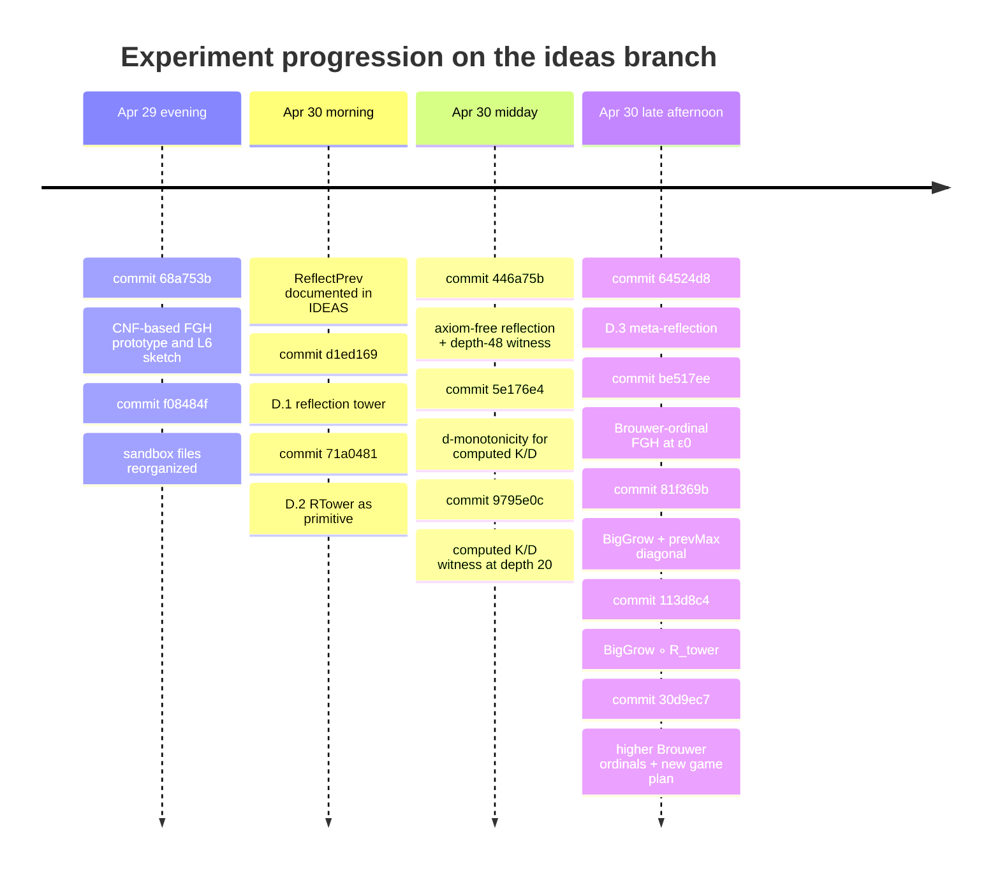

# Analytical Review of the Fork’s Post-`contender_5` Research

## Executive summary

This fork has already done much more than “brainstorm.” It has assembled a coherent research program, built a substantial sandbox suite, and mechanically proved multiple strict improvements over the current upstream champion `contender_5 := largest_STLCNatRec_nat_of_depth 42` while staying focused on the contest’s core constraints: constructive definitions, formal Coq proofs, and practical build budgets (`README.md`:7-27; `Contender.v`:319-332; `AGENTS.md`:301-460). The highest-value result so far is not any single sandbox file in isolation, but the emergence of two distinct lanes: an **oracle-based reflection lane** that already works mechanically, and a **fresh-engine Brouwer-FGH lane** that looks submission-grade but still lacks the final bridge to `contender_5` (`AGENTS.md`:87-179; `IDEAS.md`:1288-1439).

The strongest conclusion from the repository files is that the fork’s current planning is slightly too pessimistic about what must be proved next. The repo’s own “general framework” already describes a route that is cleaner than reflection and easier than a full proof-theoretic connector lemma: build a fresh language with a stronger primitive `Grow`, embed the unknown depth-42 maximizer into that language, and apply `Grow` to it existentially in the proof, not in the contender definition (`IDEAS.md`:648-674). That route appears materially underexploited in the later recommendations, which instead treat the connector lemma as the main gate for any fresh-engine contender (`AGENTS.md`:111-145; `IDEAS.md`:1374-1408).

Accordingly, the best near-term strategy is **not** to keep stacking reflection oracles, and **not** to jump immediately into the full reducibility proof for System T. The best near-term strategy is to implement a **fresh unary-growth shell**—an object language like STLC+NatRec plus `tGrow : Nat -> Nat`, interpreted as `Brouwer.BigGrow` or, even better, one of the already-defined stronger Brouwer engines such as `BigGrow_Gamma_0`—and then prove that its depth-bounded maximum dominates `Grow (S contender_5)` by embedding an existential witness for `contender_5` (`IDEAS.md`:648-674; `Contender.v`:682-713; `sandbox/Brouwer.v`:202-284; `sandbox/BrouwerHigh.v`:173-182). That would likely produce a contender definition that is definitionally clean, formally much stronger than the reflection line, and still well within the README typecheck budgets (`README.md`:15-23).

The current leading candidate therefore depends on what “leading” means. If it means **best already-proved research artifact**, the reflection/hybrid family leads: the repo has axiom-free reflection towers, compressed RTower witnesses, D.3 meta-reflection, and BigGrow–reflection hybrids, all with formal strict-inequality proofs (`IDEAS.md`:1290-1349; `AGENTS.md`:301-442). If it means **best path to a submission-quality `contender_6` that respects the fork’s own cleanliness rule**, the leader is the **Brouwer-FGH fresh-engine track**, especially when combined with the embedded-witness general framework rather than the more ambitious connector-lemma route (`AGENTS.md`:111-145; `IDEAS.md`:648-676, 1184-1233, 1374-1408).

The files also leave some important things unspecified. There is no formal cross-ranking among all sandbox candidates, no CI or wall-clock benchmark log beyond narrative timings, no memory profiling, no concrete numeric evaluations of the new contenders, and no documented maintainer judgment on whether proof-level use of the previous maximizer would be considered “lazy” even if the new contender’s definition is clean (`README.md`; `AGENTS.md`; `IDEAS.md`; `git.log`). Those are the main missing items.

## What the fork has already established

The repository rules are clear. Any promoted contender is supposed to be constructive, fully formalized in Coq, free of axioms, and practical to typecheck: roughly under 15 seconds for the definition and under 60 seconds for the proof (`README.md`:9-27). The current upstream champion remains `contender_5`, defined as the maximum value produced by any closed STLC+NatRec term of depth at most 42 (`Contender.v`:312-332). The fork’s sandbox work is explicitly separated from the official chain, and the fork’s current game plan says that most existing sandboxes are research artifacts rather than promotion targets (`AGENTS.md`:75-81, 87-124, 301-442).

The research history over April 29–30, 2026 is unusually compressed and coherent. In one short burst, the fork moved from initial FGH and L6 prototyping, to working reflection towers, to axiom-free cleanup, to computed witness compression, to Brouwer-ordinal FGH, to hybrid compositions, and finally to a reprioritized “fresh engine first” strategy (`git.log`:7-56, 58-161, 175-283, 429-449).



What has been tried falls into five clusters.

First, the fork probed the baseline. `sandbox/baseline.v` measured early term-count explosion and recorded that `term_depth ack_reified = 26` and `term_depth contender_4''_reified = 30`, which motivated the observation that depth 42 leaves nontrivial slack over the current Ackermann-based witness (`sandbox/baseline.v`:16-28; `IDEAS.md`:22-40).

Second, it explored **CNF-based FGH and an ordinal-typed language**. `sandbox/FGH.v` built a fuel-based fast-growing hierarchy over CNF ordinals below `epsilon_0`, while `sandbox/L6.v` demonstrated an STLC+NatRec extension with ordinal terms and `tFGH` (`git.log`:433-444; `AGENTS.md`:308-314; `IDEAS.md`:676-842). This was a real prototype, but not promotion-ready because totality still relied on fuel and the missing well-foundedness proof remained the key obstacle (`IDEAS.md`:776-842; `git.log`, commit `be517ee` at 119-156).

Third, it built the **reflection family**, which is the most mechanically mature lane in the repo. `sandbox/ReflectPrev.v` shows that a one-step reflective language with `tPrevMax` beats `contender_5` at depth 45 (`IDEAS.md`:43-82; `sandbox/ReflectPrev.v`:338-365). `sandbox/ReflectTower.v` generalizes that to `R_tower` and proves `contender_5 < R_tower 100 342`, while `sandbox/ReflectTowerNoAx.v` removes the remaining `FunctionalExtensionality` dependency and closes the theorem under the global context (`IDEAS.md`:84-195, 248-292; `git.log`, commits `d1ed169` and `446a75b`; `sandbox/ReflectTower.v`:548-619; `sandbox/ReflectTowerNoAx.v`:513-604). Then come the compressed second-order reflection variants: `ReflectRTower.v`, `ReflectRTowerSmall.v`, `ReflectRTowerComputed.v`, and `ReflectRTower3.v`, which reduce witness depth from 345 to 48 to 20 and then add D.3 meta-reflection at depth 23 (`IDEAS.md`:197-423, 615-647, 1300-1322; `git.log`, commits `71a0481`, `446a75b`, `5e176e4`, `9795e0c`, `64524d8`; `sandbox/ReflectRTowerComputed.v`:144-160; `sandbox/ReflectRTower3.v`:34-95).

Fourth, it built the **Brouwer-ordinal FGH lane**, which is the current clean-engine favorite inside the repo. `sandbox/Brouwer.v` replaces CNF-with-fuel by pure structural recursion on Brouwer ordinals, delivering total definitions of `FGH`, `Hardy`, and `BigGrow := FGH epsilon_0` with no axioms and no `Acc`/fuel machinery (`git.log`:115-156, commit `be517ee`; `AGENTS.md`:111-117, 377-390; `sandbox/Brouwer.v`:202-284). `sandbox/BrouwerHigh.v` then pushes beyond `epsilon_0` to `epsilon_omega`, `zeta_0`, and `Gamma_0`, again as total Coq functions (`git.log`:27-54, commit `30d9ec7`; `AGENTS.md`:411-418; `sandbox/BrouwerHigh.v`:173-182).

Fifth, it built **hybrids**. `sandbox/BigGrowPrevMax.v` proves a generic step `prevMax d < largest_BGPrev_nat_of_depth prevMax (d+4)` using the witness `tBigGrow (S (tPrevMax d))`, and instantiates that against the original contender at depth 46 (`sandbox/BigGrowPrevMax.v`:513-572; `AGENTS.md`:391-399; `IDEAS.md`:1334-1339). `sandbox/BigGrowRTower.v` then composes BigGrow with `R_tower`, giving a simple composition, a depth-bounded layered version, and a stacked version (`git.log`:62-99, commit `113d8c4`; `sandbox/BigGrowRTower.v`:74-127).

There is, however, **no globally proved total ordering among all sandbox candidates**. The repo proves local chains inside particular files—for example `contender_5 < R_tower 1 45 < contender_BG_RT_layered < contender_BG_RT_stacked` in `BigGrowRTower.v`—but it does not prove that, say, `contender_BG_RT_stacked` exceeds `contender_reflect_rtower3`, or vice versa (`sandbox/BigGrowRTower.v`:100-127; `sandbox/ReflectRTower3.v`:79-95). So the repository does **not** yet have a formally established single strongest sandbox number.

The best way to state the present leadership is therefore this:

- **Best already-proved laboratory lane:** the reflection plus hybrid lane, because it has the most end-to-end mechanical artifacts and the best practical compile story (`IDEAS.md`:1290-1349; `AGENTS.md`:301-442).
- **Best submission-grade direction according to the repo itself:** the Brouwer-FGH fresh-engine lane (`AGENTS.md`:111-145; `git.log`, commit `30d9ec7`).
- **Best immediate opportunity not yet operationalized:** a fresh `tGrow` language using the repo’s own general framework, which would combine the cleanliness of the Brouwer lane with the existential witness method already sketched in `IDEAS.md` (`IDEAS.md`:648-674).

## Assessment of experiments and gaps

The reflection family’s greatest strength is that it turned “could work” ideas into real facts. The repo now knows, not speculates, that it can rebuild the term language, evaluator, enumerator, and `maxBy` infrastructure around new primitives and still prove strict inequalities quickly and axiom-freely (`IDEAS.md`:43-195, 248-423; `AGENTS.md`:301-442). It also extracted several genuinely reusable engineering lemmas—`maxBy_subset`, monotonicity of reflective maxima, `R_tower_step`, depth-monotonicity for positive tower levels, and the crucial lesson about `Opaque` barriers preventing the kernel from trying to execute huge searches during conversion (`IDEAS.md`:148-176, 248-423; `git.log`, commits `d1ed169`, `446a75b`, `5e176e4`). That is excellent infrastructure work.

The reflection family’s main weakness is exactly the one the repo now recognizes: it is too close to using the previous contender’s engine as a runtime oracle. The “Current Game Plan” section says this plainly and repeatedly, and it is hard to disagree. Definitions that mention `largest_STLCNatRec_nat_of_depth`, `R_tower`, or a reflected version of them are mechanically clever, but still definitionally downstream of `contender_5`’s engine (`AGENTS.md`:87-179). As a result, further D.2/D.3-style escalation is now low-value work. It improves the lab notebook, not the submission story.

A second weakness of the reflection lane is that its **proof-level lower bounds are much weaker than its likely actual values**. Most of the key theorems only prove a one-step strict inequality, such as `prevMax d < ...` or `contender_5 < ...`; they do not quantify the huge gap one intuitively expects from iterated reflection or from feeding large arguments into `R_tower` (`IDEAS.md`:1290-1349; `git.log`, commit `113d8c4` at 95-99). For research exploration this is fine, but for a decisive submission it leaves too much rhetorical force on the table.

The Brouwer-FGH lane is almost the mirror image. Its main strength is conceptual cleanliness. `sandbox/Brouwer.v` solved the repo’s earlier FGH totality problem in exactly the right way: not by heavier proof automation, but by changing the ordinal representation so that Coq’s structural recursion accepts the hierarchy definitions directly (`git.log`, commit `be517ee`; `AGENTS.md`:377-390; `IDEAS.md`:424-511, 1323-1333). That is a qualitatively good result. The extension to `Gamma_0`-class engines in `BrouwerHigh.v` is also high leverage: once a fresh contender shell exists, stronger growth engines are now nearly “free” on the Coq side (`git.log`, commit `30d9ec7`; `sandbox/BrouwerHigh.v`:173-182).

The Brouwer lane’s weakness is not expressive power. It is **integration strategy**. The repo’s later recommendations increasingly frame the missing piece as a large connector theorem of the form “all depth-42 STLC+NatRec evaluations are bounded by `f_alpha(42)` for some `alpha < epsilon_0`” (`AGENTS.md`:111-145; `IDEAS.md`:1184-1233, 1374-1408). That theorem is mathematically natural, but it is not obviously the cheapest way to turn Brouwer-FGH into a clean contender. The repo itself already contains a cheaper idea in the “general framework”: existentially lift the unknown maximizing witness into a fresh language and apply `Grow` there (`IDEAS.md`:648-674). The later planning does not exploit that idea enough. This is the largest strategic gap in the current research program.

The hybrid files, especially `BigGrowPrevMax.v`, are valuable because they demonstrate a much stronger proof pattern than the reflection files alone. In particular, `sandbox/BigGrowPrevMax.v` proves a generic theorem whose witness evaluates to `BigGrow (S (prevMax d))`, not merely to `S (prevMax d)` (`sandbox/BigGrowPrevMax.v`:516-555). That is exactly the kind of proof-level gap amplification the submission story needs. The weakness, again, is definitional dependence on an oracle. The repo learned the right lesson from these files: the **proof pattern** is excellent, the **definition pattern** is not (`AGENTS.md`:118-124, 167-178).

There is also a process gap. The files contain only approximate compile-time claims such as “~1 s,” “~2 s,” and “~3 s,” but no reproducible benchmarking harness, no clean-build logs, no memory numbers, and no comparative profiling across candidates (`git.log`, commits `d1ed169`, `446a75b`, `5e176e4`, `be517ee`, `30d9ec7`; `AGENTS.md`:445-470). For most design decisions this is not fatal, but it does prevent confident ranking when two approaches are theoretically close.

A final gap is that the repo has not yet capitalized on the distinction between **definition cleanliness** and **proof cleanliness**. The README rule is phrased against using the previous contender in the *definition* of the next one (`README.md`:21-25). The general framework in `IDEAS.md` explicitly notes that the maximizing witness `t*` need not appear in the contender definition and can be conjured existentially via `maxBy` lemmas (`IDEAS.md`:662-674). That suggests a strategically important middle ground: a contender whose *definition* is clean and whose *proof* uses the prior maximizer only as an existential witness. The repo has all the ingredients for this, but has not yet built the corresponding file.

## Planned ideas and their real feasibility

The repo’s planned ideas are generally sound, and the mathematical hierarchy behind them is also well aligned with the literature. Girard’s *Proofs and Types* states that the functions representable in System T are exactly those provably total in first-order Peano arithmetic, and that the functions representable in System F are exactly those provably total in second-order Peano arithmetic `PA2`. That supports the repo’s judgment that a successful System F contender would be a genuine qualitative jump rather than just a bigger number. citeturn3view0turn3view1turn3view2

Likewise, the repo is right that bar recursion, Goodstein, hydra, and Kruskal/TREE-style routes are mathematically respectable but costlier. Modern treatments still present bar recursion as a substantial extension of System T rather than a trivial engineering add-on, while Goodstein and Kruskal-style results sit squarely in the classic ordinal-analysis and well-quasi-ordering literature. citeturn0search4turn0search8turn6search7turn6search3turn5search1turn5search2

The table below synthesizes the repository’s approaches with the most actionable next-generation variants that follow directly from the existing files.

| Approach name | Brief description | Expected magnitude improvement | Complexity | Dependencies | Estimated time |
|---|---|---|---|---|---|
| Reflection tower D.1 | Promote `R_tower k d` from `ReflectTowerNoAx` | Proven strict win over `contender_5`; likely huge actual value, but proof lower bound is only one-step strict | Low | `sandbox/ReflectTowerNoAx.v`; current `maxBy`/enumerator scaffold | 0.5–1 day |
| RTower reflection D.2/D.3 | Internalize `R_tower` and then reflect the D.2 maximum again | Stronger reflective artifacts at much smaller witness depth; still oracle-based | Low–Medium | `ReflectRTowerSmall`, `ReflectRTowerComputed`, `ReflectRTower3` | 1–3 days |
| **Embedded-witness `tGrow` shell** | New fresh language with `tGrow : Nat -> Nat`; proof uses existential depth-42 witness embedded into the new language | Can plausibly prove `candidate >= BigGrow (S contender_5)` while keeping the definition clean | **Medium** | `Contender.v` `maxBy_In`/`lowerbound_maxBy`; `Brouwer.v`; evaluator/enumerator scaffold | **2–4 days** |
| **Embedded-witness `tGrow` shell at `Gamma_0`** | Same as above, but `tGrow` is interpreted as `BigGrow_Gamma_0` from `BrouwerHigh.v` | Same proof shape, even larger formal lower bound, essentially no extra syntactic depth cost | **Medium** | previous row + `BrouwerHigh.v` | **+0.5–1 day after MVP** |
| Pure `BigGrow N` via connector lemma | `Definition contender_6 := BigGrow N` with no dependency on previous machinery anywhere in the definition | Cleanest possible submission shape; mathematically elegant; proof quality highest | High | `Brouwer.v`; logical-relations / reducibility formalization | 1–3 weeks |
| Full Brouwer-ordinal language | Expose ordinals as term-level objects (`tpOrd`, `tFGH`) | Very large headroom; more reusable platform than hard-coded `tGrow` | High | `L6` ideas + Brouwer ordinals; runtime ordinal syntax | 2–4 weeks |
| System F contender | Build depth-bounded enumeration/evaluation on top of `System_F.v` | Qualitative jump to a stronger proof-theoretic universe than System T | High | `System_F.v`; binder-aware `termsUpTo`; numeral decoding | 2–4 weeks |
| Bar recursion | Add Spector-style bar recursor | Mathematically principled “one step beyond T”; proof-theoretically strong | High | bar-recursion definition + termination infrastructure | 2–6 weeks |
| Goodstein/Hydra | Hard-code a canonical `epsilon_0`-strength primitive or shell | Excellent mathematical aesthetics; potentially very strong explicit lower bounds | High–Very High | hereditary base notation or hydra machinery | 2–6 weeks |
| TREE / SCG / WORM | Combinatorial growth via wqo / finite miniaturizations | Potentially far beyond all current ordinal-based lanes | Very High | substantial new formalization plus hard termination theorems | 1–3+ months |

Two repo-planned approaches should now be explicitly deprioritized.

Conway chained arrows are not attractive enough here. The repo itself notes that they stay below `epsilon_0` and inherit essentially the same connector problem as finite-ordinal FGH (`IDEAS.md`:1111-1136). They are smaller, less reusable, and less cleanly extensible than the Brouwer route.

Similarly, further pure reflection stacking after D.3 should be treated as saturated. The “Current Game Plan” says this directly: more `BigGrow (S contender_Y)` and more reflection-on-oracle layers are no longer a productive use of time (`AGENTS.md`:167-178). That judgment is correct.

## Recommended path to a decisive win

The best route now is a four-step priority order.

**Highest priority: implement the latent general-framework strategy as a fresh `tGrow` shell.** This is the repo’s most underexploited idea, and it is already explicitly present in `IDEAS.md` (`IDEAS.md`:648-674). The key insight is simple: the contender definition can be a clean fresh-language maximum, while the proof uses the previous maximizer only existentially. The needed base machinery already exists in `Contender.v`: `maxBy_In` and `lowerbound_maxBy` are enough to obtain a witness `t*` for `contender_5` without baking `contender_5` into the new definition (`Contender.v`:682-713).

A concrete implementation should look like this:

1. Create a new file such as `sandbox/GrowEmbed.v`.
2. Define an object language `L_Grow = STLC+NatRec+tGrow`, where `tGrow : Nat -> Nat`.
3. Interpret `tGrow` first as `sandbox.Brouwer.BigGrow`.
4. Rebuild the evaluator, `termsUpTo`, `largest_of_depth`, and `largest_Grow_nat_of_depth` by directly reusing the reflection-file scaffold, but **without** any `tPrevMax` or oracle parameter.
5. Define `embed_type` and `embed_term` from `Contender`’s language into `L_Grow`.
6. Prove typing, eval preservation, and depth preservation for the embedding.
7. Derive an existential witness for `contender_5`: `exists t, term_depth t <= 42 /\ Contender.eval t = contender_5`, using `Contender.maxBy_In`, `termsUpTo_correct`, and `lowerbound_maxBy` (`Contender.v`:220, 682-713).
8. Use the witness term `tApp tGrow (tApp tS (embed_term t))`. If `embed_term` preserves depth, this sits at depth at most 44, because the inner successor application costs one level and the outer `tGrow` application costs one more.
9. Conclude a theorem of the form `contender_5 < largest_Grow_nat_of_depth 44`, and ideally strengthen it to `BigGrow (S contender_5) <= largest_Grow_nat_of_depth 44`.

That strategy has four major advantages over both reflection and the connector theorem. First, the new contender’s **definition** is clean. Second, the proof lower bound becomes **explicitly huge**, not merely “strictly larger.” Third, it avoids the very heavy proof-theoretic development of Approach J. Fourth, it uses only technologies the repo has already shown it can implement. The resource requirement is modest: one contributor, no external libraries, and probably 300–500 lines of mostly familiar Coq engineering.

The main risk is aesthetic rather than technical. An upstream maintainer might still feel that using the previous maximizer in the proof is too derivative, even if the contender definition is clean. I think that risk is moderate, not high, because the README’s wording targets the *definition*, and the repo’s own general framework explicitly relies on existential witness lifting (`README.md`:21-25; `IDEAS.md`:662-674). Still, that taste judgment is not documented anywhere, so it remains a real uncertainty.

```mermaid
flowchart LR
    A[Derive existential witness t* for contender_5] --> B[Build fresh language L_Grow]
    B --> C[Prove embed_term preserves typing, eval, depth]
    C --> D[Use witness tGrow (S (embed t*)) at depth 44]
    D --> E[Prove contender_5 < largest_Grow_nat_of_depth 44]
    E --> F[Swap denotation of tGrow to stronger engines]
    E --> G[Optional long-term: pure BigGrow N via connector lemma]
```

**Second priority: immediately parameterize the shell over the growth engine and instantiate it above `epsilon_0`.** This is the fastest way to turn a successful MVP into a decisive margin. `sandbox/BrouwerHigh.v` already defines `BigGrow_eN`, `BigGrow_e_omega`, `BigGrow_zeta_0`, and `BigGrow_Gamma_0` (`sandbox/BrouwerHigh.v`:173-182; `git.log`, commit `30d9ec7`). Once the unary `tGrow` shell exists, swapping from `BigGrow` to, say, `BigGrow_Gamma_0` should cost almost nothing in object-language depth, since the ordinal choice lives on the Coq side rather than in the embedded term syntax. This directly addresses the README’s “defeat the previous contender by a large margin” preference (`README.md`:21-25).

**Third priority: keep the connector lemma as the medium-term purity project, not the immediate blocker.** The repo is right that a theorem yielding `Definition contender_6 := BigGrow N` would be the cleanest possible form (`IDEAS.md`:1184-1233). It is also right that the theorem is real work, probably a few hundred lines of careful reducibility bookkeeping (`git.log`, commit `30d9ec7`; `IDEAS.md`:1184-1233). But it should now be seen as the *second clean submission route*, not the only one. The fresh `tGrow` shell can likely ship sooner and generate stronger explicit lower bounds in the meantime.

**Fourth priority: treat System F as the long-term platform bet.** The repo already has the right instinct here. `System_F.v` contains a normalization proof, a well-founded evaluation relation, and an extracted evaluator `eval_f` (`System_F.v`:682-818). That means the difficult metatheory is not absent; the missing work is the contest-specific shell: depth accounting, term enumeration, and natural-number readout. Girard’s representation theorem makes the long-term payoff real. citeturn3view0turn3view1turn3view2 Even so, it remains a heavier project than a `tGrow` shell.

The strategies that should **not** receive near-term attention are: more oracle stacking, Conway chains, bar recursion as a first move, Goodstein/hydra before a fresh unary shell exists, and TREE/SCG/WORM before the repo has even one clean non-oracle contender. Those are interesting, but not the best next use of effort (`AGENTS.md`:167-178; `IDEAS.md`:1111-1163, 1165-1284).

## Experimental program and success criteria

The next experimental program should be explicit, measurable, and tightly tied to the README acceptance criteria.

**Experiment one: existential witness extraction for `contender_5`.**  
Goal: prove a local lemma of the form `exists t, term_depth t <= 42 /\ Contender.eval t = Contender.contender_5`.  
Why: it unlocks the clean proof shape sketched in `IDEAS.md` without naming the previous search term in the contender definition (`IDEAS.md`:662-674; `Contender.v`:682-713).  
Measure: proof compiles without unfolding `largest_of_depth 42` into a giant term.  
Success criterion: closed proof, no axioms, no manual reduction of the depth-42 search.

**Experiment two: fresh unary-growth language MVP.**  
Goal: implement `L_Grow` with `tGrow : Nat -> Nat` interpreted as `Brouwer.BigGrow`.  
Why: it is the shortest path from the repo’s existing Brouwer engine to a clean contender definition.  
Measure: `largest_Grow_nat_of_depth 44` typechecks comfortably, evaluator and enumerator compile, and `Print Assumptions` is closed.  
Success criterion: a theorem `Contender.contender_5 < contender_grow_6` with `Definition contender_grow_6 := largest_Grow_nat_of_depth 44`, all within the README’s ≤15s/≤60s budget target (`README.md`:15-23).

**Experiment three: strengthen the lower bound, not just the strict inequality.**  
Goal: prove `BigGrow (S Contender.contender_5) <= contender_grow_6`, not merely `Contender.contender_5 < contender_grow_6`.  
Why: the current reflection line wins mechanically but usually proves only a minimal strict inequality; this experiment would produce the first clearly decisive formal margin in a clean-definition setting (`IDEAS.md`:1290-1349; `sandbox/BigGrowPrevMax.v`:516-555).  
Measure: theorem statement itself.  
Success criterion: lower bound mentions a fresh growth engine applied to `S contender_5`.

**Experiment four: `Gamma_0` swap at fixed syntactic depth.**  
Goal: change the denotation of `tGrow` from `BigGrow` to `BigGrow_Gamma_0`.  
Why: it tests whether the MVP architecture scales immediately to a much stronger hard-coded engine.  
Measure: no increase in witness depth; only modest compile-time growth.  
Success criterion: same shape of theorem at the same depth budget, with `coqchk` still passing.

**Experiment five: kernel-conversion robustness audit.**  
Goal: ensure the new proofs do not accidentally trigger evaluation of large search terms.  
Why: this was the central engineering failure mode in the reflection files (`IDEAS.md`:148-176, 1309-1315; `git.log`, commits `d1ed169`, `446a75b`, `5e176e4`).  
Measure: clean rebuild time, repeated rebuild time, and whether the proof remains stable when `Opaque` boundaries are moved.  
Success criterion: no runaway conversion; a documented minimal set of `Opaque` barriers.

**Experiment six: fresh-definition cleanliness check.**  
Goal: mechanically verify that the promoted contender’s *definition* does not mention banned identifiers such as `largest_STLCNatRec_nat_of_depth`, `largest_of_depth`, `R_tower`, `tPrevMax`, or `tRTower`.  
Why: this is the real operationalization of the fork’s “don’t be lazy” rule (`README.md`:21-25; `AGENTS.md`:174-178).  
Measure: static grep on the definition line or its unfolded dependencies.  
Success criterion: zero matches for prior-engine identifiers inside the contender definition.

**Experiment seven: System F reconnaissance, but only as reconnaissance.**  
Goal: add `term_depth` and a small `termsUpTo` prototype for a restricted fragment around `System_F.v`, and measure enumeration blow-up.  
Why: it will turn Approach B from “plausible” into “costed.”  
Measure: term counts, compile time, proof complexity, and assumptions.  
Success criterion: an evidence-based estimate of whether full depth-bounded System F is a 2-week or 2-month task.

Across all these experiments, the core metrics should be the same:

- **Formal soundness:** `Print Assumptions` closed under the global context.
- **Validator confidence:** `coqchk` succeeds.
- **Contest practicality:** definition under 15 seconds and theorem under 60 seconds on the documented toolchain target (`README.md`:15-23; `AGENTS.md`:445-470).
- **Definition cleanliness:** no runtime reference to the previous contender’s engine.
- **Proof strength:** prefer explicit lower bounds like `Grow (S contender_5)` over mere strict inequality.
- **Maintenance quality:** documented `Opaque` boundaries and no brittle conversion tricks.

On the evidence in the supplied files, the repo is one well-chosen fresh-language implementation away from a substantially better position. The reflection lane has already paid for the evaluator/enumerator engineering. The Brouwer lane has already paid for the fresh total growth engine. The important next move is to combine those two achievements in the clean way the repo’s own general framework already suggested, rather than spending the next tranche of effort on more oracle stacking or on the full connector lemma before a lower-cost fresh contender has been tried (`IDEAS.md`:648-674; `AGENTS.md`:111-145).